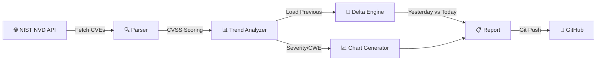
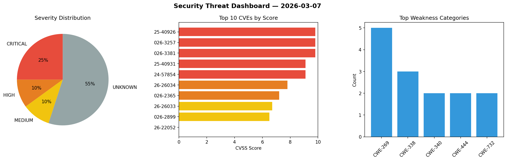

<div align="center">

# 🛡️ Daily Experiments

[](https://github.com/Atharv279/daily-experiments/actions/workflows/daily_run.yml)


**Automated security scanner pulling real CVEs from the NIST National Vulnerability Database with threat visualization.**

</div>

---

## Architecture



## Features

- **Real CVE Data** — Pulls from the official NIST National Vulnerability Database
- **CVSS Scoring** — Parses v2.0, v3.0, and v3.1 metrics
- **CWE Analysis** — Identifies top weakness categories
- **Threat Index** — Weighted composite score across all CVEs
- **Delta Tracking** — Compares today's threat landscape vs yesterday
- **Visual Dashboard** — Severity pie charts, top CVE bar charts, CWE frequency

## Live Dashboard Preview



## Output Structure

```
logs/
├── YYYY-MM-DD.json          # Raw CVE data + analysis
├── YYYY-MM-DD.md            # Markdown threat report
├── YYYY-MM-DD_dashboard.png # Severity & CWE charts
└── YYYY-MM-DD_trend.png     # 14-day threat trend
```

## Quick Start

```bash
pip install -r dev-requirements.txt
python main.py
```
