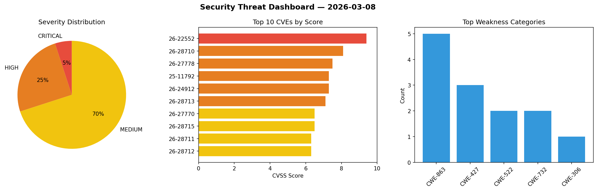
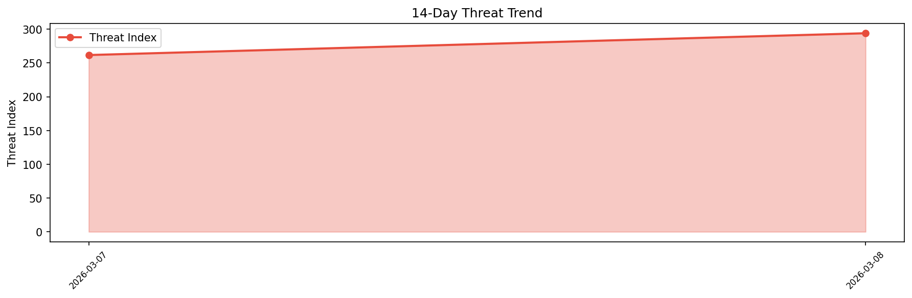

# Security Scan Report — 2026-03-08

**Scan ID:** `13dc5e84cb` | **CVEs:** 20 | **Threat Index:** 294.1

## Threat Overview

| Metric | Value |
|--------|-------|
| Threat Index | 294.1 |
| Critical CVEs | 1 |
| CRITICAL | 1 |
| HIGH | 5 |
| MEDIUM | 14 |

## Delta vs Yesterday

| Metric | Today | Yesterday | Change |
|--------|-------|-----------|--------|
| total_cves | 20 | 20 | ➡️ 0.0% |
| threat_index | 294.1 | 261.8 | 📈 12.3% |
| critical_count | 1 | 5 | 📉 -80.0% |

## Top Weakness Categories

| CWE | Count |
|-----|-------|
| CWE-863 | 5 |
| CWE-427 | 3 |
| CWE-522 | 2 |
| CWE-732 | 2 |
| CWE-306 | 1 |

## CVE Details

| CVE ID | Score | Severity | Description |
|--------|-------|----------|-------------|
| CVE-2026-22552 | 9.4 | CRITICAL | WebSocket endpoints lack proper authentication mechanisms, enabling attackers to... |
| CVE-2026-28710 | 8.1 | HIGH | Sensitive information disclosure and manipulation due to improper authentication... |
| CVE-2026-27778 | 7.5 | HIGH | The WebSocket Application Programming Interface lacks restrictions on the number... |
| CVE-2025-11792 | 7.3 | HIGH | Local privilege escalation due to DLL hijacking vulnerability. The following pro... |
| CVE-2026-24912 | 7.3 | HIGH | The WebSocket backend uses charging station identifiers to uniquely associate se... |
| CVE-2026-28713 | 7.1 | HIGH | Default credentials set for local privileged user in Virtual Appliance. The foll... |
| CVE-2026-27770 | 6.5 | MEDIUM | Charging station authentication identifiers are publicly accessible via web-base... |
| CVE-2026-28715 | 6.5 | MEDIUM | Sensitive information disclosure due to improper authorization checks. The follo... |
| CVE-2026-28711 | 6.3 | MEDIUM | Local privilege escalation due to DLL hijacking vulnerability. The following pro... |
| CVE-2026-28712 | 6.3 | MEDIUM | Local privilege escalation due to DLL hijacking vulnerability. The following pro... |
| CVE-2025-11791 | 5.5 | MEDIUM | Sensitive information disclosure and manipulation due to insufficient authorizat... |
| CVE-2026-28718 | 5.3 | MEDIUM | Denial of service due to insufficient input validation in authentication logging... |
| CVE-2026-28717 | 5.0 | MEDIUM | Local privilege escalation due to improper directory permissions. The following ... |
| CVE-2026-28714 | 4.8 | MEDIUM | Unnecessary transmission of sensitive cryptographic material. The following prod... |
| CVE-2025-11790 | 4.4 | MEDIUM | Credentials are not deleted from Acronis Agent after plan revocation. The follow... |