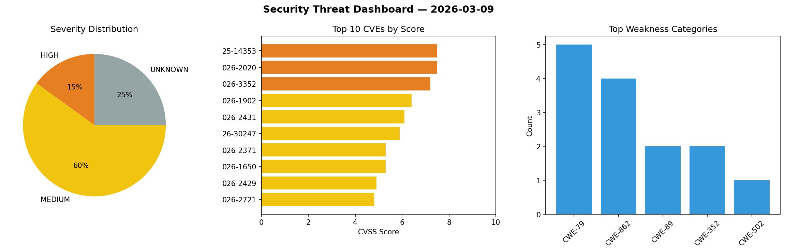
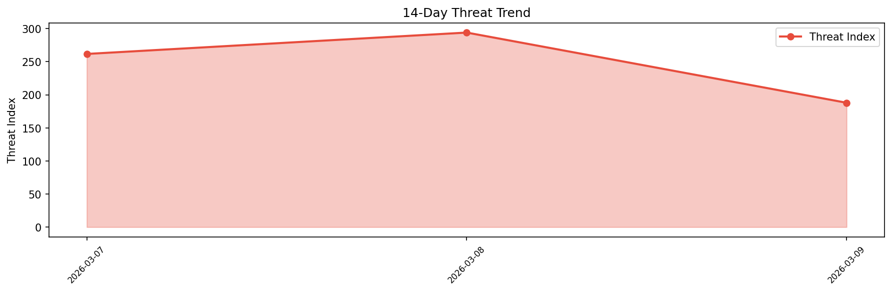

# Security Scan Report — 2026-03-09

**Scan ID:** `84fcff6aa1` | **CVEs:** 20 | **Threat Index:** 188.0

## Threat Overview

| Metric | Value |
|--------|-------|
| Threat Index | 188.0 |
| Critical CVEs | 0 |
| HIGH | 3 |
| MEDIUM | 12 |
| UNKNOWN | 5 |

## Delta vs Yesterday

| Metric | Today | Yesterday | Change |
|--------|-------|-----------|--------|
| total_cves | 20 | 20 | ➡️ 0.0% |
| threat_index | 188.0 | 294.1 | 📉 -36.1% |
| critical_count | 0 | 1 | 📉 -100.0% |

## Top Weakness Categories

| CWE | Count |
|-----|-------|
| CWE-79 | 5 |
| CWE-862 | 4 |
| CWE-89 | 2 |
| CWE-352 | 2 |
| CWE-502 | 1 |

## CVE Details

| CVE ID | Score | Severity | Description |
|--------|-------|----------|-------------|
| CVE-2025-14353 | 7.5 | HIGH | The ZIP Code Based Content Protection plugin for WordPress is vulnerable to SQL ... |
| CVE-2026-2020 | 7.5 | HIGH | The JS Archive List plugin for WordPress is vulnerable to PHP Object Injection i... |
| CVE-2026-3352 | 7.2 | HIGH | The Easy PHP Settings plugin for WordPress is vulnerable to PHP Code Injection i... |
| CVE-2026-1902 | 6.4 | MEDIUM | The Hammas Calendar plugin for WordPress is vulnerable to Stored Cross-Site Scri... |
| CVE-2026-2431 | 6.1 | MEDIUM | The CM Custom Reports plugin for WordPress is vulnerable to Reflected Cross-Site... |
| CVE-2026-30247 | 5.9 | MEDIUM | WeKnora is an LLM-powered framework designed for deep document understanding and... |
| CVE-2026-2371 | 5.3 | MEDIUM | The Greenshift – animation and page builder blocks plugin for WordPress is vulne... |
| CVE-2026-1650 | 5.3 | MEDIUM | The MDJM Event Management plugin for WordPress is vulnerable to unauthorized dat... |
| CVE-2026-2429 | 4.9 | MEDIUM | The Community Events plugin for WordPress is vulnerable to SQL Injection via the... |
| CVE-2026-2721 | 4.8 | MEDIUM | The MailArchiver plugin for WordPress is vulnerable to Stored Cross-Site Scripti... |
| CVE-2026-2722 | 4.8 | MEDIUM | The Stock Ticker plugin for WordPress is vulnerable to Stored Cross-Site Scripti... |
| CVE-2026-1644 | 4.3 | MEDIUM | The WP Frontend Profile plugin for WordPress is vulnerable to Cross-Site Request... |
| CVE-2026-1981 | 4.3 | MEDIUM | The HUMN-1 AI Website Scanner & Human Certification by Winston AI plugin for Wor... |
| CVE-2026-2488 | 4.3 | MEDIUM | The ProfileGrid – User Profiles, Groups and Communities plugin for WordPress is ... |
| CVE-2026-2494 | 4.3 | MEDIUM | The ProfileGrid – User Profiles, Groups and Communities plugin for WordPress is ... |