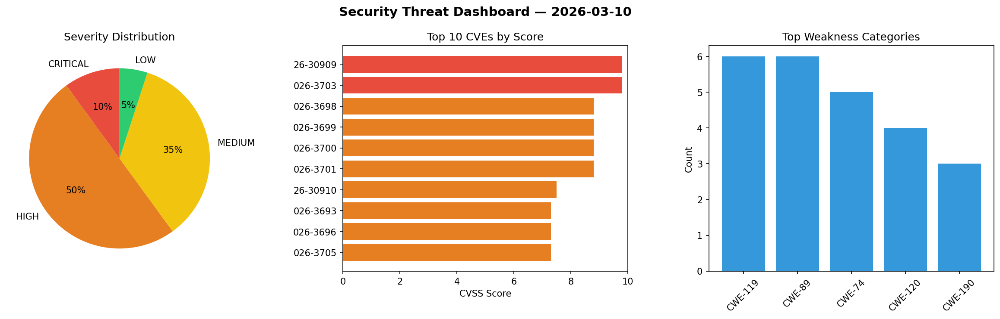
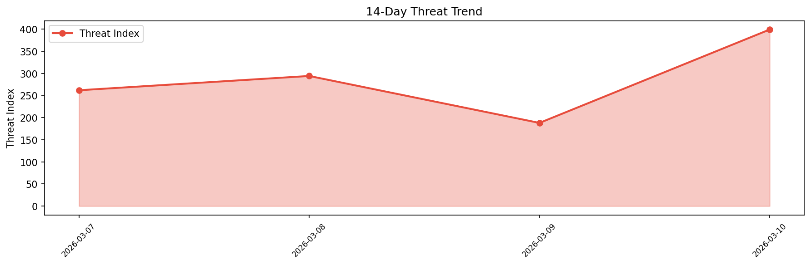

# Security Scan Report — 2026-03-10

**Scan ID:** `85f4ed2c55` | **CVEs:** 20 | **Threat Index:** 399.1

## Threat Overview

| Metric | Value |
|--------|-------|
| Threat Index | 399.1 |
| Critical CVEs | 2 |
| CRITICAL | 2 |
| HIGH | 10 |
| MEDIUM | 7 |
| LOW | 1 |

## Delta vs Yesterday

| Metric | Today | Yesterday | Change |
|--------|-------|-----------|--------|
| total_cves | 20 | 20 | ➡️ 0.0% |
| threat_index | 399.1 | 188.0 | 📈 112.3% |
| critical_count | 2 | 0 | ➡️ 0% |

## Top Weakness Categories

| CWE | Count |
|-----|-------|
| CWE-119 | 6 |
| CWE-89 | 6 |
| CWE-74 | 5 |
| CWE-120 | 4 |
| CWE-190 | 3 |

## CVE Details

| CVE ID | Score | Severity | Description |
|--------|-------|----------|-------------|
| CVE-2026-30909 | 9.8 | CRITICAL | Crypt::NaCl::Sodium versions through 2.002 for Perl has potential integer overfl... |
| CVE-2026-3703 | 9.8 | CRITICAL | A flaw has been found in Wavlink NU516U1 251208. This affects the function sub_4... |
| CVE-2026-3698 | 8.8 | HIGH | A vulnerability was identified in UTT HiPER 810G up to 1.7.7-171114. This affect... |
| CVE-2026-3699 | 8.8 | HIGH | A security flaw has been discovered in UTT HiPER 810G up to 1.7.7-171114. This i... |
| CVE-2026-3700 | 8.8 | HIGH | A weakness has been identified in UTT HiPER 810G up to 1.7.7-171114. Affected is... |
| CVE-2026-3701 | 8.8 | HIGH | A security vulnerability has been detected in H3C Magic B1 up to 100R004. Affect... |
| CVE-2026-30910 | 7.5 | HIGH | Crypt::Sodium::XS versions through 0.001000 for Perl has potential integer overf... |
| CVE-2026-3693 | 7.3 | HIGH | A flaw has been found in Shy2593666979 AgentChat up to 2.3.0. This issue affects... |
| CVE-2026-3696 | 7.3 | HIGH | A vulnerability was found in Totolink N300RH 6..1c.1353_B20190305. The affected ... |
| CVE-2026-3705 | 7.3 | HIGH | A vulnerability was found in code-projects Simple Flight Ticket Booking System 1... |
| CVE-2026-3708 | 7.3 | HIGH | A security flaw has been discovered in code-projects Simple Flight Ticket Bookin... |
| CVE-2026-3709 | 7.3 | HIGH | A weakness has been identified in code-projects Simple Flight Ticket Booking Sys... |
| CVE-2026-3695 | 6.5 | MEDIUM | A vulnerability has been found in SourceCodester Modern Image Gallery App 1.0. I... |
| CVE-2026-3682 | 6.3 | MEDIUM | A security vulnerability has been detected in welovemedia FFmate up to 2.0.15. T... |
| CVE-2026-3683 | 6.3 | MEDIUM | A vulnerability was detected in bufanyun HotGo up to 2.0. This issue affects the... |