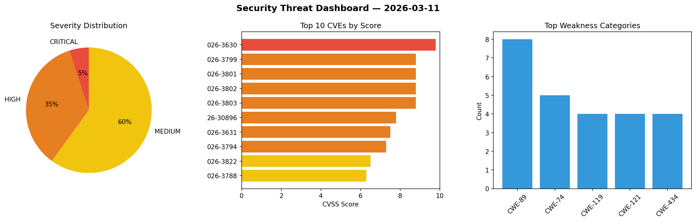
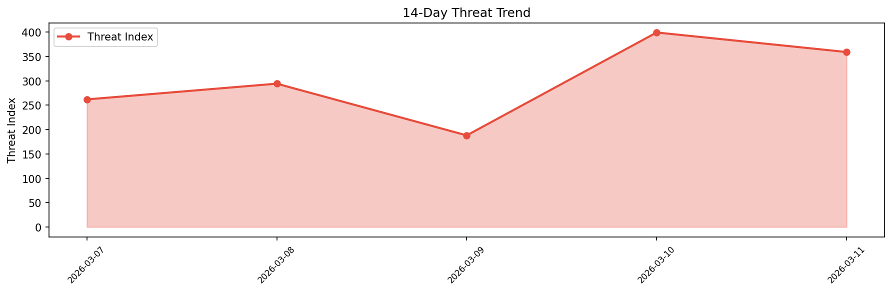

# Security Scan Report — 2026-03-11

**Scan ID:** `a863ff344e` | **CVEs:** 20 | **Threat Index:** 359.0

## Threat Overview

| Metric | Value |
|--------|-------|
| Threat Index | 359.0 |
| Critical CVEs | 1 |
| CRITICAL | 1 |
| HIGH | 7 |
| MEDIUM | 12 |

## Delta vs Yesterday

| Metric | Today | Yesterday | Change |
|--------|-------|-----------|--------|
| total_cves | 20 | 20 | ➡️ 0.0% |
| threat_index | 359.0 | 399.1 | 📉 -10.0% |
| critical_count | 1 | 2 | 📉 -50.0% |

## Top Weakness Categories

| CWE | Count |
|-----|-------|
| CWE-89 | 8 |
| CWE-74 | 5 |
| CWE-119 | 4 |
| CWE-121 | 4 |
| CWE-434 | 4 |

## CVE Details

| CVE ID | Score | Severity | Description |
|--------|-------|----------|-------------|
| CVE-2026-3630 | 9.8 | CRITICAL | Delta Electronics COMMGR2 has 

Stack-based Buffer Overflow vulnerability.... |
| CVE-2026-3799 | 8.8 | HIGH | A flaw has been found in Tenda i3 1.0.0.6(2204). This impacts the function formS... |
| CVE-2026-3801 | 8.8 | HIGH | A vulnerability was found in Tenda i3 1.0.0.6(2204). Affected by this vulnerabil... |
| CVE-2026-3802 | 8.8 | HIGH | A vulnerability was determined in Tenda i3 1.0.0.6(2204). Affected by this issue... |
| CVE-2026-3803 | 8.8 | HIGH | A vulnerability was identified in Tenda i3 1.0.0.6(2204). This affects the funct... |
| CVE-2026-30896 | 7.8 | HIGH | The installer for Qsee Client versions 1.0.1 and prior insecurely load Dynamic L... |
| CVE-2026-3631 | 7.5 | HIGH | Delta Electronics COMMGR2 has 

Buffer Over-read DoS vulnerability.... |
| CVE-2026-3794 | 7.3 | HIGH | A vulnerability was identified in doramart DoraCMS 3.0.x. This issue affects som... |
| CVE-2026-3822 | 6.5 | MEDIUM | Taipower APP for Andorid developed by Taipower has an Improper Certificate Valid... |
| CVE-2026-3788 | 6.3 | MEDIUM | A security vulnerability has been detected in Bytedesk up to 1.3.9. This impacts... |
| CVE-2026-3789 | 6.3 | MEDIUM | A vulnerability was detected in Bytedesk up to 1.3.9. Affected is the function g... |
| CVE-2026-3790 | 6.3 | MEDIUM | A flaw has been found in SourceCodester Sales and Inventory System 1.0. Affected... |
| CVE-2026-3791 | 6.3 | MEDIUM | A vulnerability has been found in SourceCodester Sales and Inventory System 1.0.... |
| CVE-2026-3792 | 6.3 | MEDIUM | A vulnerability was found in SourceCodester Sales and Inventory System 1.0. This... |
| CVE-2026-3793 | 6.3 | MEDIUM | A vulnerability was determined in SourceCodester Sales and Inventory System 1.0.... |