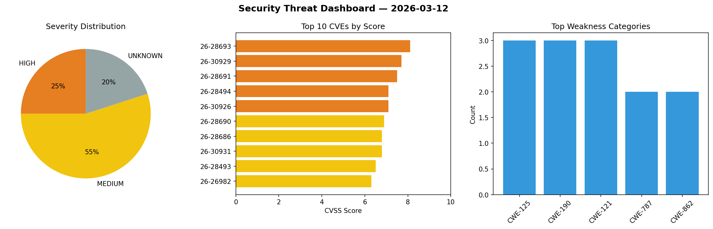
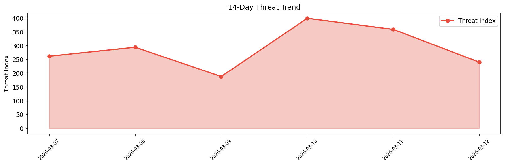

# Security Scan Report — 2026-03-12

**Scan ID:** `983abc2744` | **CVEs:** 20 | **Threat Index:** 240.1

## Threat Overview

| Metric | Value |
|--------|-------|
| Threat Index | 240.1 |
| Critical CVEs | 0 |
| HIGH | 5 |
| MEDIUM | 11 |
| UNKNOWN | 4 |

## Delta vs Yesterday

| Metric | Today | Yesterday | Change |
|--------|-------|-----------|--------|
| total_cves | 20 | 20 | ➡️ 0.0% |
| threat_index | 240.1 | 359.0 | 📉 -33.1% |
| critical_count | 0 | 1 | 📉 -100.0% |

## Top Weakness Categories

| CWE | Count |
|-----|-------|
| CWE-125 | 3 |
| CWE-190 | 3 |
| CWE-121 | 3 |
| CWE-787 | 2 |
| CWE-862 | 2 |

## CVE Details

| CVE ID | Score | Severity | Description |
|--------|-------|----------|-------------|
| CVE-2026-28693 | 8.1 | HIGH | ImageMagick is free and open-source software used for editing and manipulating d... |
| CVE-2026-30929 | 7.7 | HIGH | ImageMagick is free and open-source software used for editing and manipulating d... |
| CVE-2026-28691 | 7.5 | HIGH | ImageMagick is free and open-source software used for editing and manipulating d... |
| CVE-2026-28494 | 7.1 | HIGH | ImageMagick is free and open-source software used for editing and manipulating d... |
| CVE-2026-30926 | 7.1 | HIGH | SiYuan is a personal knowledge management system. Prior to 3.5.10, a privilege e... |
| CVE-2026-28690 | 6.9 | MEDIUM | ImageMagick is free and open-source software used for editing and manipulating d... |
| CVE-2026-28686 | 6.8 | MEDIUM | ImageMagick is free and open-source software used for editing and manipulating d... |
| CVE-2026-30931 | 6.8 | MEDIUM | ImageMagick is free and open-source software used for editing and manipulating d... |
| CVE-2026-28493 | 6.5 | MEDIUM | ImageMagick is free and open-source software used for editing and manipulating d... |
| CVE-2026-26982 | 6.3 | MEDIUM | Ghostty is a cross-platform terminal emulator. Ghostty allows control characters... |
| CVE-2026-28689 | 6.3 | MEDIUM | ImageMagick is free and open-source software used for editing and manipulating d... |
| CVE-2026-30883 | 5.7 | MEDIUM | ImageMagick is free and open-source software used for editing and manipulating d... |
| CVE-2026-28687 | 5.3 | MEDIUM | ImageMagick is free and open-source software used for editing and manipulating d... |
| CVE-2026-28692 | 4.8 | MEDIUM | ImageMagick is free and open-source software used for editing and manipulating d... |
| CVE-2026-30935 | 4.4 | MEDIUM | ImageMagick is free and open-source software used for editing and manipulating d... |