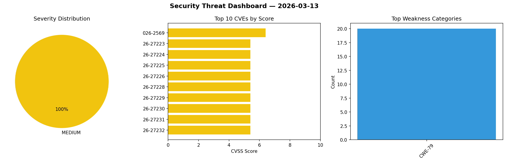
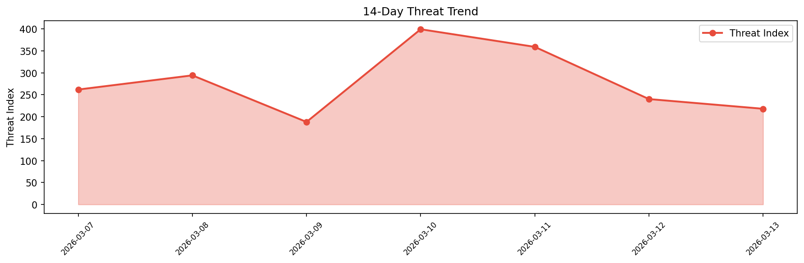

# Security Scan Report — 2026-03-13

**Scan ID:** `deb2b678fd` | **CVEs:** 20 | **Threat Index:** 218.0

## Threat Overview

| Metric | Value |
|--------|-------|
| Threat Index | 218.0 |
| Critical CVEs | 0 |
| MEDIUM | 20 |

## Delta vs Yesterday

| Metric | Today | Yesterday | Change |
|--------|-------|-----------|--------|
| total_cves | 20 | 20 | ➡️ 0.0% |
| threat_index | 218.0 | 240.1 | 📉 -9.2% |
| critical_count | 0 | 0 | ➡️ 0% |

## Top Weakness Categories

| CWE | Count |
|-----|-------|
| CWE-79 | 20 |

## CVE Details

| CVE ID | Score | Severity | Description |
|--------|-------|----------|-------------|
| CVE-2026-2569 | 6.4 | MEDIUM | The Dear Flipbook – PDF Flipbook, 3D Flipbook, PDF embed, PDF viewer plugin for ... |
| CVE-2026-27223 | 5.4 | MEDIUM | Adobe Experience Manager versions 6.5.23 and earlier are affected by a stored Cr... |
| CVE-2026-27224 | 5.4 | MEDIUM | Adobe Experience Manager versions 6.5.23 and earlier are affected by a stored Cr... |
| CVE-2026-27225 | 5.4 | MEDIUM | Adobe Experience Manager versions 6.5.23 and earlier are affected by a stored Cr... |
| CVE-2026-27226 | 5.4 | MEDIUM | Adobe Experience Manager versions 6.5.23 and earlier are affected by a stored Cr... |
| CVE-2026-27228 | 5.4 | MEDIUM | Adobe Experience Manager versions 6.5.23 and earlier are affected by a stored Cr... |
| CVE-2026-27229 | 5.4 | MEDIUM | Adobe Experience Manager versions 6.5.23 and earlier are affected by a stored Cr... |
| CVE-2026-27230 | 5.4 | MEDIUM | Adobe Experience Manager versions 6.5.23 and earlier are affected by a stored Cr... |
| CVE-2026-27231 | 5.4 | MEDIUM | Adobe Experience Manager versions 6.5.23 and earlier are affected by a stored Cr... |
| CVE-2026-27232 | 5.4 | MEDIUM | Adobe Experience Manager versions 6.5.23 and earlier are affected by a stored Cr... |
| CVE-2026-27233 | 5.4 | MEDIUM | Adobe Experience Manager versions 6.5.23 and earlier are affected by a stored Cr... |
| CVE-2026-27234 | 5.4 | MEDIUM | Adobe Experience Manager versions 6.5.23 and earlier are affected by a stored Cr... |
| CVE-2026-27235 | 5.4 | MEDIUM | Adobe Experience Manager versions 6.5.23 and earlier are affected by a stored Cr... |
| CVE-2026-27236 | 5.4 | MEDIUM | Adobe Experience Manager versions 6.5.23 and earlier are affected by a stored Cr... |
| CVE-2026-27237 | 5.4 | MEDIUM | Adobe Experience Manager versions 6.5.23 and earlier are affected by a stored Cr... |