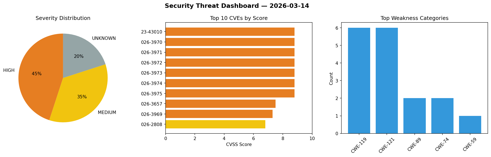
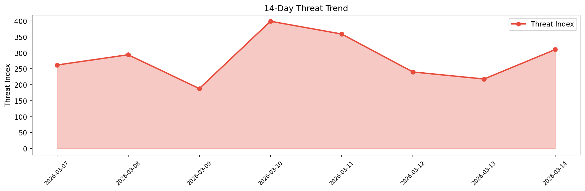

# Security Scan Report — 2026-03-14

**Scan ID:** `bd51f7ca6f` | **CVEs:** 20 | **Threat Index:** 310.4

## Threat Overview

| Metric | Value |
|--------|-------|
| Threat Index | 310.4 |
| Critical CVEs | 0 |
| HIGH | 9 |
| MEDIUM | 7 |
| UNKNOWN | 4 |

## Delta vs Yesterday

| Metric | Today | Yesterday | Change |
|--------|-------|-----------|--------|
| total_cves | 20 | 20 | ➡️ 0.0% |
| threat_index | 310.4 | 218.0 | 📈 42.4% |
| critical_count | 0 | 0 | ➡️ 0% |

## Top Weakness Categories

| CWE | Count |
|-----|-------|
| CWE-119 | 6 |
| CWE-121 | 6 |
| CWE-89 | 2 |
| CWE-74 | 2 |
| CWE-59 | 1 |

## CVE Details

| CVE ID | Score | Severity | Description |
|--------|-------|----------|-------------|
| CVE-2023-43010 | 8.8 | HIGH | The issue was addressed with improved memory handling. This issue is fixed in iO... |
| CVE-2026-3970 | 8.8 | HIGH | A flaw has been found in Tenda i3 1.0.0.6(2204). Affected is the function formwr... |
| CVE-2026-3971 | 8.8 | HIGH | A vulnerability has been found in Tenda i3 1.0.0.6(2204). Affected by this vulne... |
| CVE-2026-3972 | 8.8 | HIGH | A vulnerability was found in Tenda W3 1.0.0.3(2204). Affected by this issue is t... |
| CVE-2026-3973 | 8.8 | HIGH | A vulnerability was determined in Tenda W3 1.0.0.3(2204). This affects the funct... |
| CVE-2026-3974 | 8.8 | HIGH | A vulnerability was identified in Tenda W3 1.0.0.3(2204). This vulnerability aff... |
| CVE-2026-3975 | 8.8 | HIGH | A security flaw has been discovered in Tenda W3 1.0.0.3(2204). This issue affect... |
| CVE-2026-3657 | 7.5 | HIGH | The My Sticky Bar plugin for WordPress is vulnerable to SQL injection via the `s... |
| CVE-2026-3969 | 7.3 | HIGH | A vulnerability was detected in FeMiner wms up to 1.0. This impacts an unknown f... |
| CVE-2026-2808 | 6.8 | MEDIUM | HashiCorp Consul and Consul Enterprise 1.18.20 up to 1.21.10 and 1.22.4 are vuln... |
| CVE-2026-3965 | 6.3 | MEDIUM | A security vulnerability has been detected in whyour qinglong up to 2.20.1. Affe... |
| CVE-2026-3966 | 6.3 | MEDIUM | A vulnerability was detected in 648540858 wvp-GB28181-pro up to 2.7.4-20260107. ... |
| CVE-2026-3967 | 6.3 | MEDIUM | A flaw has been found in Alfresco Activiti up to 7.19/8.8.0. Affected by this is... |
| CVE-2026-3968 | 6.3 | MEDIUM | A vulnerability has been found in AutohomeCorp frostmourne up to 1.0. This affec... |
| CVE-2026-1182 | 4.3 | MEDIUM | GitLab has remediated an issue in GitLab CE/EE affecting all versions from 8.14 ... |