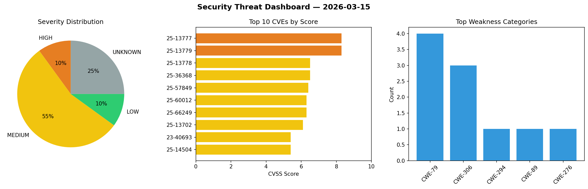
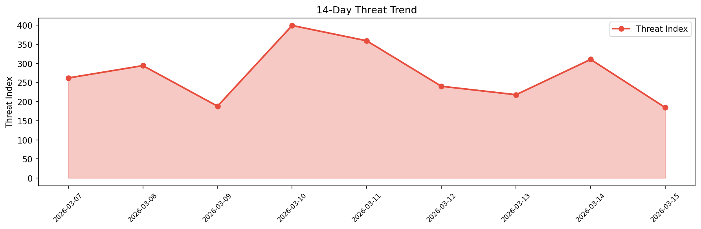

# Security Scan Report — 2026-03-15

**Scan ID:** `6f2ed087c2` | **CVEs:** 20 | **Threat Index:** 184.2

## Threat Overview

| Metric | Value |
|--------|-------|
| Threat Index | 184.2 |
| Critical CVEs | 0 |
| HIGH | 2 |
| MEDIUM | 11 |
| LOW | 2 |
| UNKNOWN | 5 |

## Delta vs Yesterday

| Metric | Today | Yesterday | Change |
|--------|-------|-----------|--------|
| total_cves | 20 | 20 | ➡️ 0.0% |
| threat_index | 184.2 | 310.4 | 📉 -40.7% |
| critical_count | 0 | 0 | ➡️ 0% |

## Top Weakness Categories

| CWE | Count |
|-----|-------|
| CWE-79 | 4 |
| CWE-306 | 3 |
| CWE-294 | 1 |
| CWE-89 | 1 |
| CWE-276 | 1 |

## CVE Details

| CVE ID | Score | Severity | Description |
|--------|-------|----------|-------------|
| CVE-2025-13777 | 8.3 | HIGH | Authentication bypass by capture-replay vulnerability in ABB AWIN GW100 rev.2, A... |
| CVE-2025-13779 | 8.3 | HIGH | Missing authentication for critical function vulnerability in ABB AWIN GW100 rev... |
| CVE-2025-13778 | 6.5 | MEDIUM | Missing authentication for critical function vulnerability in ABB AWIN GW100 rev... |
| CVE-2025-36368 | 6.5 | MEDIUM | IBM Sterling B2B Integrator and IBM Sterling File Gateway 6.1.0.0 through 6.1.2.... |
| CVE-2025-57849 | 6.4 | MEDIUM | A container privilege escalation flaw was found in certain Fuse images. This iss... |
| CVE-2025-60012 | 6.3 | MEDIUM | Malicious configuration can lead to unauthorized file access in Apache Livy.

Th... |
| CVE-2025-66249 | 6.3 | MEDIUM | Improper Limitation of a Pathname to a Restricted Directory ('Path Traversal') v... |
| CVE-2025-13702 | 6.1 | MEDIUM | IBM Sterling Partner Engagement Manager 6.2.3.0 through 6.2.3.5 and 6.2.4.0 thro... |
| CVE-2023-40693 | 5.4 | MEDIUM | IBM Sterling B2B Integrator and IBM Sterling File Gateway 6.1.0.0 through 6.1.2.... |
| CVE-2025-14504 | 5.4 | MEDIUM | IBM Sterling B2B Integrator and IBM Sterling File Gateway 6.1.0.0 through 6.1.2.... |
| CVE-2025-13723 | 5.3 | MEDIUM | IBM Sterling Partner Engagement Manager 6.2.3.0 through 6.2.3.5 and 6.2.4.0 thro... |
| CVE-2025-13726 | 5.3 | MEDIUM | IBM Sterling Partner Engagement Manager 6.2.3.0 through 6.2.3.5 and 6.2.4.0 thro... |
| CVE-2025-14483 | 4.3 | MEDIUM | IBM Sterling B2B Integrator and IBM Sterling File Gateway 6.1.0.0 through 6.1.2.... |
| CVE-2025-13718 | 3.7 | LOW | IBM Sterling Partner Engagement Manager 6.2.3.0 through 6.2.3.5 and 6.2.4.0 thro... |
| CVE-2025-14811 | 3.1 | LOW | IBM Sterling Partner Engagement Manager 6.2.3.0 through 6.2.3.5 and 6.2.4.0 thro... |