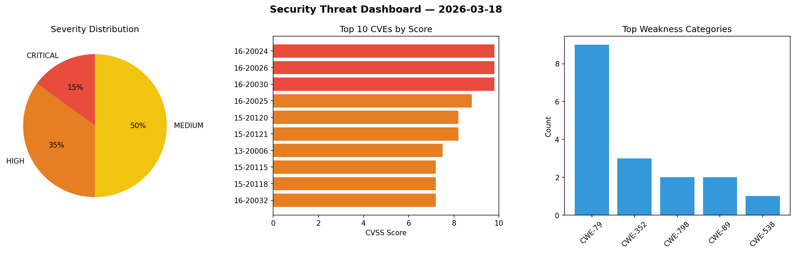
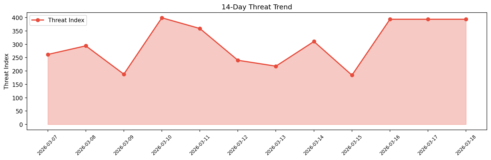

# Security Scan Report — 2026-03-18

**Scan ID:** `c529747055` | **CVEs:** 20 | **Threat Index:** 393.7

## Threat Overview

| Metric | Value |
|--------|-------|
| Threat Index | 393.7 |
| Critical CVEs | 3 |
| CRITICAL | 3 |
| HIGH | 7 |
| MEDIUM | 10 |

## Delta vs Yesterday

| Metric | Today | Yesterday | Change |
|--------|-------|-----------|--------|
| total_cves | 20 | 20 | ➡️ 0.0% |
| threat_index | 393.7 | 393.7 | ➡️ 0.0% |
| critical_count | 3 | 3 | ➡️ 0.0% |

## Top Weakness Categories

| CWE | Count |
|-----|-------|
| CWE-79 | 9 |
| CWE-352 | 3 |
| CWE-798 | 2 |
| CWE-89 | 2 |
| CWE-538 | 1 |

## CVE Details

| CVE ID | Score | Severity | Description |
|--------|-------|----------|-------------|
| CVE-2016-20024 | 9.8 | CRITICAL | ZKTeco ZKTime.Net 3.0.1.6 contains an insecure file permissions vulnerability th... |
| CVE-2016-20026 | 9.8 | CRITICAL | ZKTeco ZKBioSecurity 3.0 contains hardcoded credentials in the bundled Apache To... |
| CVE-2016-20030 | 9.8 | CRITICAL | ZKTeco ZKBioSecurity 3.0 contains a user enumeration vulnerability that allows u... |
| CVE-2016-20025 | 8.8 | HIGH | ZKTeco ZKAccess Professional 3.5.3 contains an insecure file permissions vulnera... |
| CVE-2015-20120 | 8.2 | HIGH | Next Click Ventures RealtyScript 4.0.2 contains multiple time-based blind SQL in... |
| CVE-2015-20121 | 8.2 | HIGH | Next Click Ventures RealtyScript 4.0.2 contains SQL injection vulnerabilities th... |
| CVE-2013-20006 | 7.5 | HIGH | Qool CMS contains multiple persistent cross-site scripting vulnerabilities in se... |
| CVE-2015-20115 | 7.2 | HIGH | Next Click Ventures RealtyScript 4.0.2 fails to properly sanitize file uploads, ... |
| CVE-2015-20118 | 7.2 | HIGH | Next Click Ventures RealtyScript 4.0.2 contains a stored cross-site scripting vu... |
| CVE-2016-20032 | 7.2 | HIGH | ZKTeco ZKAccess Security System 5.3.1 contains a stored cross-site scripting vul... |
| CVE-2015-20119 | 6.4 | MEDIUM | Next Click Ventures RealtyScript 4.0.2 contains a stored cross-site scripting vu... |
| CVE-2016-20029 | 6.2 | MEDIUM | ZKTeco ZKBioSecurity 3.0 contains a file path manipulation vulnerability that al... |
| CVE-2015-20114 | 6.1 | MEDIUM | Next Click Ventures RealtyScript 4.0.2 contains a cross-site scripting vulnerabi... |
| CVE-2015-20116 | 6.1 | MEDIUM | Next Click Ventures RealtyScript 4.0.2 fails to properly sanitize CSV file uploa... |
| CVE-2016-20027 | 6.1 | MEDIUM | ZKTeco ZKBioSecurity 3.0 contains multiple reflected cross-site scripting vulner... |