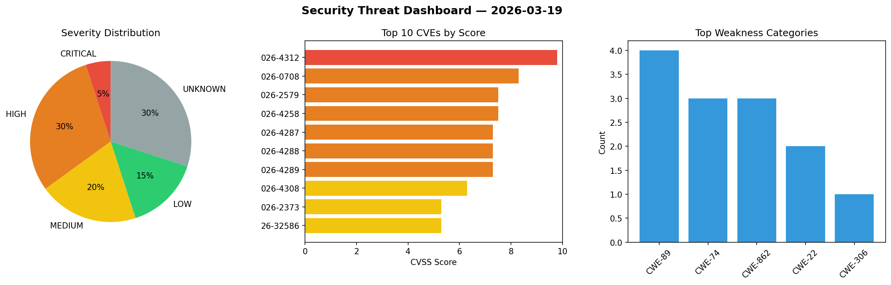
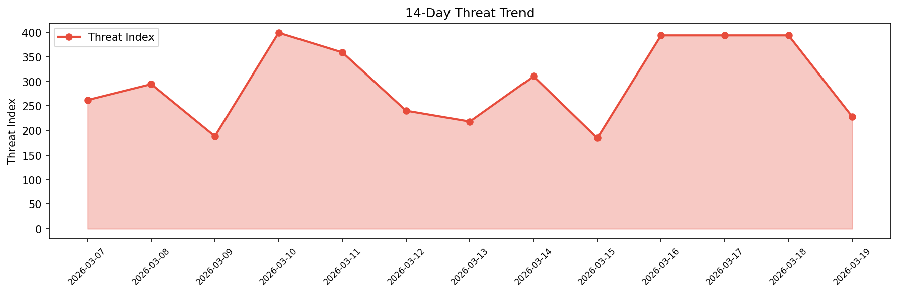

# Security Scan Report — 2026-03-19

**Scan ID:** `b380ebba5e` | **CVEs:** 20 | **Threat Index:** 227.7

## Threat Overview

| Metric | Value |
|--------|-------|
| Threat Index | 227.7 |
| Critical CVEs | 1 |
| CRITICAL | 1 |
| HIGH | 6 |
| MEDIUM | 4 |
| LOW | 3 |
| UNKNOWN | 6 |

## Delta vs Yesterday

| Metric | Today | Yesterday | Change |
|--------|-------|-----------|--------|
| total_cves | 20 | 20 | ➡️ 0.0% |
| threat_index | 227.7 | 393.7 | 📉 -42.2% |
| critical_count | 1 | 3 | 📉 -66.7% |

## Top Weakness Categories

| CWE | Count |
|-----|-------|
| CWE-89 | 4 |
| CWE-74 | 3 |
| CWE-862 | 3 |
| CWE-22 | 2 |
| CWE-306 | 1 |

## CVE Details

| CVE ID | Score | Severity | Description |
|--------|-------|----------|-------------|
| CVE-2026-4312 | 9.8 | CRITICAL | GCB/FCB Audit Software developed by DrangSoft has a Missing Authentication vulne... |
| CVE-2026-0708 | 8.3 | HIGH | A flaw was found in libucl. A remote attacker could exploit this by providing a ... |
| CVE-2026-2579 | 7.5 | HIGH | The WowStore – Store Builder & Product Blocks for WooCommerce plugin for WordPre... |
| CVE-2026-4258 | 7.5 | HIGH | All versions of the package sjcl are vulnerable to Improper Verification of Cryp... |
| CVE-2026-4287 | 7.3 | HIGH | A security flaw has been discovered in Tiandy Easy7 Integrated Management Platfo... |
| CVE-2026-4288 | 7.3 | HIGH | A weakness has been identified in Tiandy Easy7 Integrated Management Platform 7.... |
| CVE-2026-4289 | 7.3 | HIGH | A security vulnerability has been detected in Tiandy Easy7 Integrated Management... |
| CVE-2026-4308 | 6.3 | MEDIUM | A weakness has been identified in frdel/agent0ai agent-zero 0.9.7. This affects ... |
| CVE-2026-2373 | 5.3 | MEDIUM | The Royal Addons for Elementor – Addons and Templates Kit for Elementor plugin f... |
| CVE-2026-32586 | 5.3 | MEDIUM | Missing Authorization vulnerability in Pluggabl Booster for WooCommerce allows E... |
| CVE-2026-4307 | 4.3 | MEDIUM | A security flaw has been discovered in frdel/agent0ai agent-zero 0.9.7-10. The i... |
| CVE-2026-3632 | 3.9 | LOW | A flaw was found in libsoup, a library used by applications to send network requ... |
| CVE-2026-3633 | 3.9 | LOW | A flaw was found in libsoup. A remote attacker, by controlling the method parame... |
| CVE-2026-4285 | 2.7 | LOW | A vulnerability was identified in taoofagi easegen-admin up to 8f87936ac774065b9... |
| CVE-2026-3237 | 0.0 | UNKNOWN | In affected versions of Octopus Server it was possible for a low privileged user... |