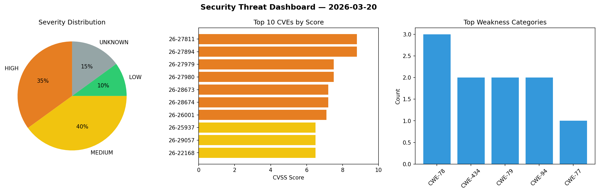
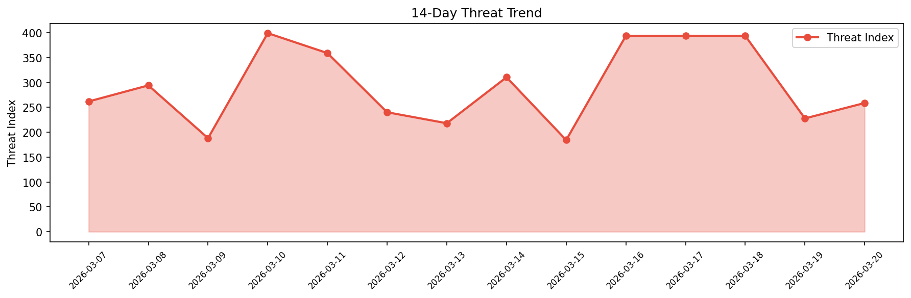

# Security Scan Report — 2026-03-20

**Scan ID:** `2f44ed6b88` | **CVEs:** 20 | **Threat Index:** 258.7

## Threat Overview

| Metric | Value |
|--------|-------|
| Threat Index | 258.7 |
| Critical CVEs | 0 |
| HIGH | 7 |
| MEDIUM | 8 |
| LOW | 2 |
| UNKNOWN | 3 |

## Delta vs Yesterday

| Metric | Today | Yesterday | Change |
|--------|-------|-----------|--------|
| total_cves | 20 | 20 | ➡️ 0.0% |
| threat_index | 258.7 | 227.7 | 📈 13.6% |
| critical_count | 0 | 1 | 📉 -100.0% |

## Top Weakness Categories

| CWE | Count |
|-----|-------|
| CWE-78 | 3 |
| CWE-434 | 2 |
| CWE-79 | 2 |
| CWE-94 | 2 |
| CWE-77 | 1 |

## CVE Details

| CVE ID | Score | Severity | Description |
|--------|-------|----------|-------------|
| CVE-2026-27811 | 8.8 | HIGH | Roxy-WI is a web interface for managing Haproxy, Nginx, Apache and Keepalived se... |
| CVE-2026-27894 | 8.8 | HIGH | LDAP Account Manager (LAM) is a webfrontend for managing entries (e.g. users, gr... |
| CVE-2026-27979 | 7.5 | HIGH | Next.js is a React framework for building full-stack web applications. Starting ... |
| CVE-2026-27980 | 7.5 | HIGH | Next.js is a React framework for building full-stack web applications. Starting ... |
| CVE-2026-28673 | 7.2 | HIGH | xiaoheiFS is a self-hosted financial and operational system for cloud service bu... |
| CVE-2026-28674 | 7.2 | HIGH | xiaoheiFS is a self-hosted financial and operational system for cloud service bu... |
| CVE-2026-26001 | 7.1 | HIGH | The GLPI Inventory Plugin handles network discovery, inventory, software deploym... |
| CVE-2026-25937 | 6.5 | MEDIUM | GLPI is a free Asset and IT management software package. Starting in version 11.... |
| CVE-2026-29057 | 6.5 | MEDIUM | Next.js is a React framework for building full-stack web applications. Starting ... |
| CVE-2026-22168 | 6.5 | MEDIUM | OpenClaw versions prior to 2026.2.21 contain an approval-integrity mismatch vuln... |
| CVE-2026-22169 | 6.4 | MEDIUM | OpenClaw versions prior to 2026.2.22 contain an allowlist bypass vulnerability i... |
| CVE-2026-27977 | 5.4 | MEDIUM | Next.js is a React framework for building full-stack web applications. Starting ... |
| CVE-2026-22170 | 4.8 | MEDIUM | OpenClaw versions prior to 2026.2.22 with the optional BlueBubbles plugin contai... |
| CVE-2026-27895 | 4.3 | MEDIUM | LDAP Account Manager (LAM) is a webfrontend for managing entries (e.g. users, gr... |
| CVE-2026-27978 | 4.3 | MEDIUM | Next.js is a React framework for building full-stack web applications. Starting ... |