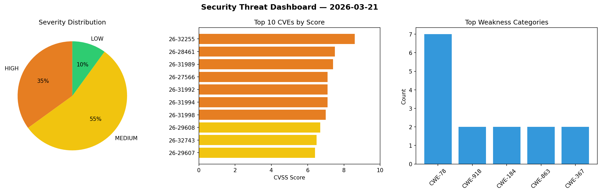
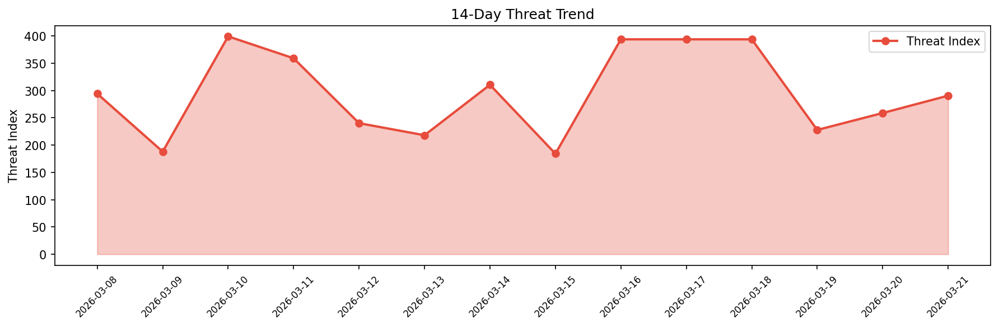

# Security Scan Report — 2026-03-21

**Scan ID:** `0b48567dfa` | **CVEs:** 20 | **Threat Index:** 290.5

## Threat Overview

| Metric | Value |
|--------|-------|
| Threat Index | 290.5 |
| Critical CVEs | 0 |
| HIGH | 7 |
| MEDIUM | 11 |
| LOW | 2 |

## Delta vs Yesterday

| Metric | Today | Yesterday | Change |
|--------|-------|-----------|--------|
| total_cves | 20 | 20 | ➡️ 0.0% |
| threat_index | 290.5 | 258.7 | 📈 12.3% |
| critical_count | 0 | 0 | ➡️ 0% |

## Top Weakness Categories

| CWE | Count |
|-----|-------|
| CWE-78 | 7 |
| CWE-918 | 2 |
| CWE-184 | 2 |
| CWE-863 | 2 |
| CWE-367 | 2 |

## CVE Details

| CVE ID | Score | Severity | Description |
|--------|-------|----------|-------------|
| CVE-2026-32255 | 8.6 | HIGH | Kan is an open-source project management tool. In versions 0.5.4 and below, the ... |
| CVE-2026-28461 | 7.5 | HIGH | OpenClaw versions prior to 2026.3.1 contain an unbounded memory growth vulnerabi... |
| CVE-2026-31989 | 7.4 | HIGH | OpenClaw versions prior to 2026.3.1 contain a server-side request forgery vulner... |
| CVE-2026-27566 | 7.1 | HIGH | OpenClaw versions prior to 2026.2.22 contain an allowlist bypass vulnerability i... |
| CVE-2026-31992 | 7.1 | HIGH | OpenClaw versions prior to 2026.2.23 contain an allowlist bypass vulnerability i... |
| CVE-2026-31994 | 7.1 | HIGH | OpenClaw versions prior to 2026.2.19 contain a local command injection vulnerabi... |
| CVE-2026-31998 | 7.0 | HIGH | OpenClaw versions 2026.2.22 and 2026.2.23 contain an authorization bypass vulner... |
| CVE-2026-29608 | 6.7 | MEDIUM | OpenClaw 2026.3.1 contains an approval integrity vulnerability in system.run nod... |
| CVE-2026-32743 | 6.5 | MEDIUM | PX4 is an open-source autopilot stack for drones and unmanned vehicles. Versions... |
| CVE-2026-29607 | 6.4 | MEDIUM | OpenClaw versions prior to 2026.2.22 contain an authorization bypass vulnerabili... |
| CVE-2026-22176 | 6.1 | MEDIUM | OpenClaw versions prior to 2026.2.19 contain a command injection vulnerability i... |
| CVE-2026-31990 | 6.1 | MEDIUM | OpenClaw versions prior to 2026.3.2 contain a vulnerability in the stageSandboxM... |
| CVE-2026-31997 | 6.0 | MEDIUM | OpenClaw versions prior to 2026.3.1 fail to pin executable identity for non-path... |
| CVE-2026-28460 | 5.9 | MEDIUM | OpenClaw versions prior to 2026.2.22 contain an allowlist bypass vulnerability i... |
| CVE-2026-27670 | 5.3 | MEDIUM | OpenClaw versions prior to 2026.3.2 contain a race condition vulnerability in ZI... |