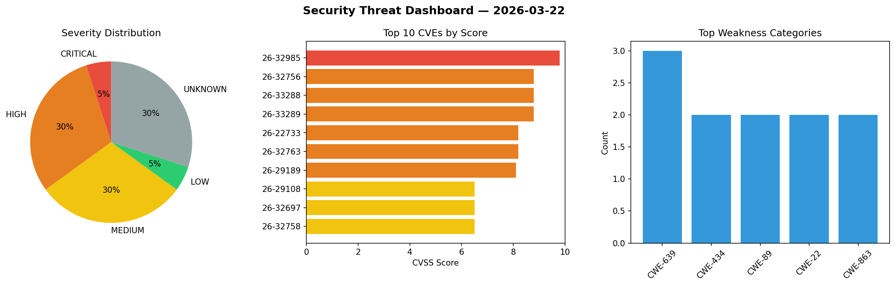
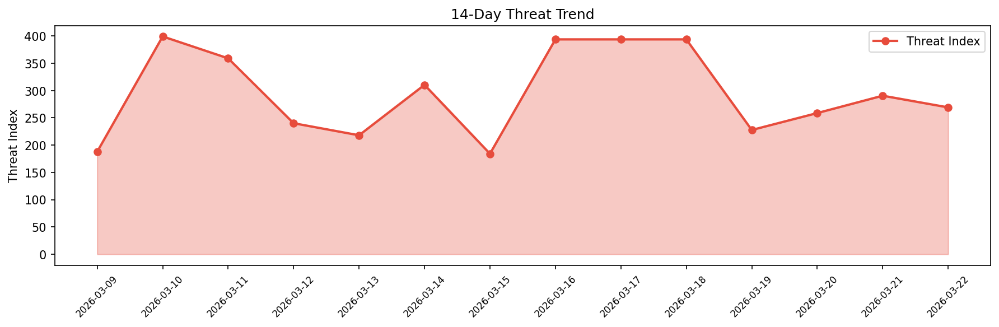

# Security Scan Report — 2026-03-22

**Scan ID:** `a092b7c034` | **CVEs:** 20 | **Threat Index:** 269.1

## Threat Overview

| Metric | Value |
|--------|-------|
| Threat Index | 269.1 |
| Critical CVEs | 1 |
| CRITICAL | 1 |
| HIGH | 6 |
| MEDIUM | 6 |
| LOW | 1 |
| UNKNOWN | 6 |

## Delta vs Yesterday

| Metric | Today | Yesterday | Change |
|--------|-------|-----------|--------|
| total_cves | 20 | 20 | ➡️ 0.0% |
| threat_index | 269.1 | 290.5 | 📉 -7.4% |
| critical_count | 1 | 0 | ➡️ 0% |

## Top Weakness Categories

| CWE | Count |
|-----|-------|
| CWE-639 | 3 |
| CWE-434 | 2 |
| CWE-89 | 2 |
| CWE-22 | 2 |
| CWE-863 | 2 |

## CVE Details

| CVE ID | Score | Severity | Description |
|--------|-------|----------|-------------|
| CVE-2026-32985 | 9.8 | CRITICAL | Xerte Online Toolkits versions 3.14 and earlier contain an unauthenticated arbit... |
| CVE-2026-32756 | 8.8 | HIGH | Admidio is an open-source user management solution. Versions 5.0.6 and below con... |
| CVE-2026-33288 | 8.8 | HIGH | SuiteCRM is an open-source, enterprise-ready Customer Relationship Management (C... |
| CVE-2026-33289 | 8.8 | HIGH | SuiteCRM is an open-source, enterprise-ready Customer Relationship Management (C... |
| CVE-2026-22733 | 8.2 | HIGH | Spring Boot applications with Actuator can be vulnerable to an "Authentication B... |
| CVE-2026-32763 | 8.2 | HIGH | Kysely is a type-safe TypeScript SQL query builder. Versions up to and including... |
| CVE-2026-29189 | 8.1 | HIGH | SuiteCRM is an open-source, enterprise-ready Customer Relationship Management (C... |
| CVE-2026-29108 | 6.5 | MEDIUM | SuiteCRM is an open-source, enterprise-ready Customer Relationship Management (C... |
| CVE-2026-32697 | 6.5 | MEDIUM | SuiteCRM is an open-source, enterprise-ready Customer Relationship Management (C... |
| CVE-2026-32758 | 6.5 | MEDIUM | File Browser is a file managing interface for uploading, deleting, previewing, r... |
| CVE-2026-32761 | 6.5 | MEDIUM | File Browser is a file managing interface for uploading, deleting, previewing, r... |
| CVE-2026-22737 | 5.9 | MEDIUM | Use of Java scripting engine enabled (e.g. JRuby, Jython) template views in Spri... |
| CVE-2026-32757 | 5.4 | MEDIUM | Admidio is an open-source user management solution. In versions 5.0.6 and below,... |
| CVE-2026-22735 | 2.6 | LOW | Spring MVC and WebFlux applications are vulnerable to stream corruption when usi... |
| CVE-2026-29109 | 0.0 | UNKNOWN | SuiteCRM is an open-source, enterprise-ready Customer Relationship Management (C... |