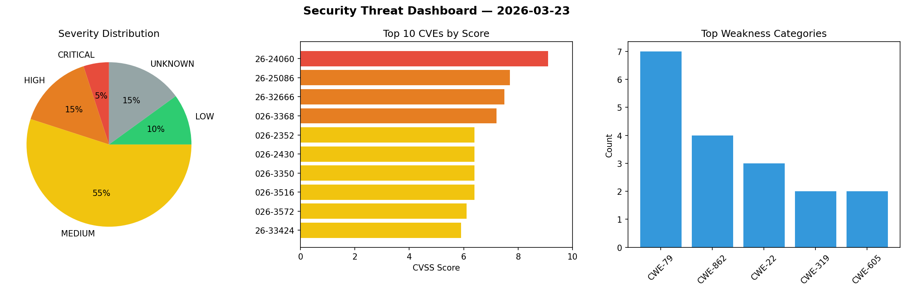
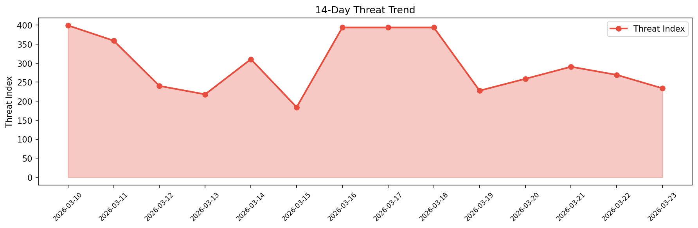

# Security Scan Report — 2026-03-23

**Scan ID:** `09db2cbfcb` | **CVEs:** 20 | **Threat Index:** 233.8

## Threat Overview

| Metric | Value |
|--------|-------|
| Threat Index | 233.8 |
| Critical CVEs | 1 |
| CRITICAL | 1 |
| HIGH | 3 |
| MEDIUM | 11 |
| LOW | 2 |
| UNKNOWN | 3 |

## Delta vs Yesterday

| Metric | Today | Yesterday | Change |
|--------|-------|-----------|--------|
| total_cves | 20 | 20 | ➡️ 0.0% |
| threat_index | 233.8 | 269.1 | 📉 -13.1% |
| critical_count | 1 | 1 | ➡️ 0.0% |

## Top Weakness Categories

| CWE | Count |
|-----|-------|
| CWE-79 | 7 |
| CWE-862 | 4 |
| CWE-22 | 3 |
| CWE-319 | 2 |
| CWE-605 | 2 |

## CVE Details

| CVE ID | Score | Severity | Description |
|--------|-------|----------|-------------|
| CVE-2026-24060 | 9.1 | CRITICAL | Service information is not encrypted when transmitted as BACnet packets 
over th... |
| CVE-2026-25086 | 7.7 | HIGH | Under certain conditions, an attacker could bind to the same port used 
by WebCT... |
| CVE-2026-32666 | 7.5 | HIGH | WebCTRL systems that communicate over BACnet inherit the protocol's lack
 of net... |
| CVE-2026-3368 | 7.2 | HIGH | The Injection Guard plugin for WordPress is vulnerable to Stored Cross-Site Scri... |
| CVE-2026-2352 | 6.4 | MEDIUM | The Autoptimize plugin for WordPress is vulnerable to Stored Cross-Site Scriptin... |
| CVE-2026-2430 | 6.4 | MEDIUM | The Autoptimize plugin for WordPress is vulnerable to Stored Cross-Site Scriptin... |
| CVE-2026-3350 | 6.4 | MEDIUM | The Image Alt Text Manager plugin for WordPress is vulnerable to Stored Cross-Si... |
| CVE-2026-3516 | 6.4 | MEDIUM | The Contact List plugin for WordPress is vulnerable to Stored Cross-Site Scripti... |
| CVE-2026-3572 | 6.1 | MEDIUM | The iTracker360 plugin for WordPress is vulnerable to Cross-Site Request Forgery... |
| CVE-2026-33424 | 5.9 | MEDIUM | Discourse is an open-source discussion platform. Prior to versions 2026.3.0-late... |
| CVE-2026-33237 | 5.5 | MEDIUM | WWBN AVideo is an open source video platform. Prior to version 26.0, the Schedul... |
| CVE-2026-3567 | 5.3 | MEDIUM | The RepairBuddy – Repair Shop CRM & Booking Plugin for WordPress is vulnerable t... |
| CVE-2026-3474 | 4.9 | MEDIUM | The EmailKit – Email Customizer for WooCommerce & WP plugin for WordPress is vul... |
| CVE-2026-3577 | 4.4 | MEDIUM | The Keep Backup Daily plugin for WordPress is vulnerable to Stored Cross-Site Sc... |
| CVE-2026-33238 | 4.3 | MEDIUM | WWBN AVideo is an open source video platform. Prior to version 26.0, the `listFi... |