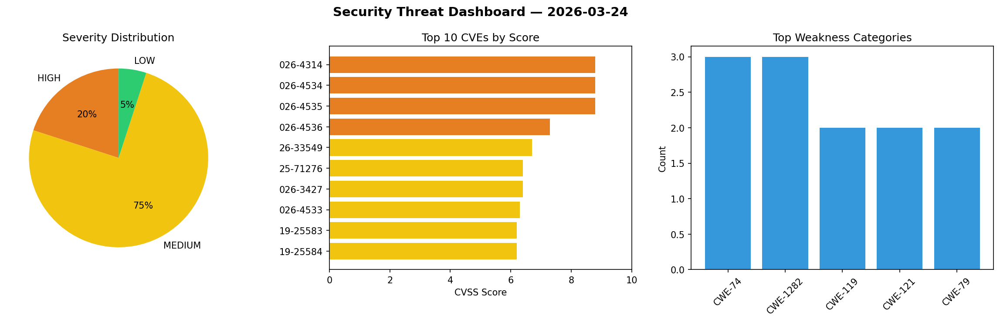
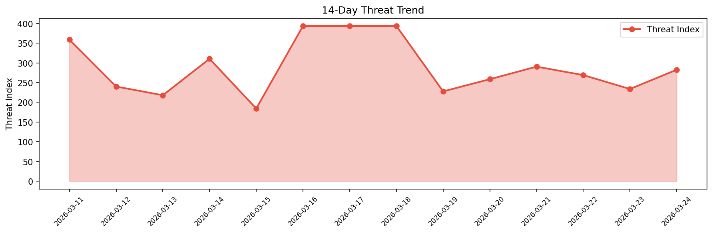

# Security Scan Report — 2026-03-24

**Scan ID:** `950c58fc58` | **CVEs:** 20 | **Threat Index:** 282.7

## Threat Overview

| Metric | Value |
|--------|-------|
| Threat Index | 282.7 |
| Critical CVEs | 0 |
| HIGH | 4 |
| MEDIUM | 15 |
| LOW | 1 |

## Delta vs Yesterday

| Metric | Today | Yesterday | Change |
|--------|-------|-----------|--------|
| total_cves | 20 | 20 | ➡️ 0.0% |
| threat_index | 282.7 | 233.8 | 📈 20.9% |
| critical_count | 0 | 1 | 📉 -100.0% |

## Top Weakness Categories

| CWE | Count |
|-----|-------|
| CWE-74 | 3 |
| CWE-1282 | 3 |
| CWE-119 | 2 |
| CWE-121 | 2 |
| CWE-79 | 2 |

## CVE Details

| CVE ID | Score | Severity | Description |
|--------|-------|----------|-------------|
| CVE-2026-4314 | 8.8 | HIGH | The 'The Ultimate WordPress Toolkit – WP Extended' plugin for WordPress is vulne... |
| CVE-2026-4534 | 8.8 | HIGH | A flaw has been found in Tenda FH451 1.0.0.9. This affects the function formWrlE... |
| CVE-2026-4535 | 8.8 | HIGH | A vulnerability has been found in Tenda FH451 1.0.0.9. This vulnerability affect... |
| CVE-2026-4536 | 7.3 | HIGH | A vulnerability was found in Acrel Environmental Monitoring Cloud Platform 1.1.0... |
| CVE-2026-33549 | 6.7 | MEDIUM | SPIP 4.4.10 through 4.4.12 before 4.4.13 allows unintended privilege assignment ... |
| CVE-2025-71276 | 6.4 | MEDIUM | SOGo before 5.12.5 is prone to a XSS vulnerability with events, tasks, and conta... |
| CVE-2026-3427 | 6.4 | MEDIUM | The Yoast SEO – Advanced SEO with real-time guidance and built-in AI plugin for ... |
| CVE-2026-4533 | 6.3 | MEDIUM | A vulnerability was detected in code-projects Simple Food Ordering System 1.0. A... |
| CVE-2019-25583 | 6.2 | MEDIUM | RarmaRadio 2.72.3 contains a denial of service vulnerability in the Username fie... |
| CVE-2019-25584 | 6.2 | MEDIUM | RarmaRadio 2.72.3 contains a buffer overflow vulnerability in the Server field o... |
| CVE-2019-25585 | 6.2 | MEDIUM | Deluge 1.3.15 contains a denial of service vulnerability that allows local attac... |
| CVE-2019-25586 | 6.2 | MEDIUM | Deluge 1.3.15 contains a denial of service vulnerability that allows local attac... |
| CVE-2019-25587 | 6.2 | MEDIUM | BulletProof FTP Server 2019.0.0.50 contains a denial of service vulnerability in... |
| CVE-2019-25588 | 6.2 | MEDIUM | BulletProof FTP Server 2019.0.0.50 contains a denial of service vulnerability in... |
| CVE-2019-25589 | 6.2 | MEDIUM | ZOC Terminal 7.23.4 contains a buffer overflow vulnerability in the Shell field ... |