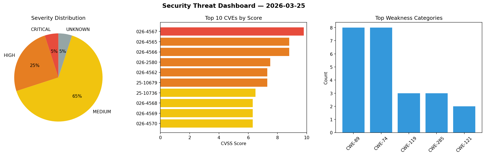
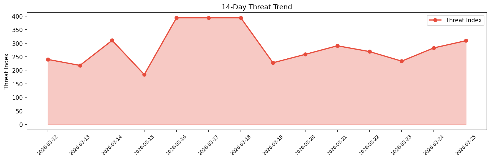

# Security Scan Report — 2026-03-25

**Scan ID:** `de45c44b1f` | **CVEs:** 20 | **Threat Index:** 309.3

## Threat Overview

| Metric | Value |
|--------|-------|
| Threat Index | 309.3 |
| Critical CVEs | 1 |
| CRITICAL | 1 |
| HIGH | 5 |
| MEDIUM | 13 |
| UNKNOWN | 1 |

## Delta vs Yesterday

| Metric | Today | Yesterday | Change |
|--------|-------|-----------|--------|
| total_cves | 20 | 20 | ➡️ 0.0% |
| threat_index | 309.3 | 282.7 | 📈 9.4% |
| critical_count | 1 | 0 | ➡️ 0% |

## Top Weakness Categories

| CWE | Count |
|-----|-------|
| CWE-89 | 8 |
| CWE-74 | 8 |
| CWE-119 | 3 |
| CWE-285 | 3 |
| CWE-121 | 2 |

## CVE Details

| CVE ID | Score | Severity | Description |
|--------|-------|----------|-------------|
| CVE-2026-4567 | 9.8 | CRITICAL | A vulnerability has been found in Tenda A15 15.13.07.13. The impacted element is... |
| CVE-2026-4565 | 8.8 | HIGH | A vulnerability was detected in Tenda AC21 16.03.08.16. Impacted is the function... |
| CVE-2026-4566 | 8.8 | HIGH | A flaw has been found in Belkin F9K1122 1.00.33. The affected element is the fun... |
| CVE-2026-2580 | 7.5 | HIGH | The WP Maps – Store Locator,Google Maps,OpenStreetMap,Mapbox,Listing,Directory &... |
| CVE-2026-4562 | 7.3 | HIGH | A security flaw has been discovered in MacCMS 2025.1000.4052. This affects an un... |
| CVE-2025-10679 | 7.3 | HIGH | The ReviewX – WooCommerce Product Reviews with Multi-Criteria, Reminder Emails, ... |
| CVE-2025-10736 | 6.5 | MEDIUM | The ReviewX – WooCommerce Product Reviews with Multi-Criteria, Reminder Emails, ... |
| CVE-2026-4568 | 6.3 | MEDIUM | A vulnerability was found in SourceCodester Sales and Inventory System 1.0. This... |
| CVE-2026-4569 | 6.3 | MEDIUM | A vulnerability was determined in SourceCodester Sales and Inventory System 1.0.... |
| CVE-2026-4570 | 6.3 | MEDIUM | A vulnerability was identified in SourceCodester Sales and Inventory System 1.0.... |
| CVE-2026-4571 | 6.3 | MEDIUM | A security flaw has been discovered in SourceCodester Sales and Inventory System... |
| CVE-2026-4572 | 6.3 | MEDIUM | A weakness has been identified in SourceCodester Sales and Inventory System 1.0.... |
| CVE-2026-4573 | 6.3 | MEDIUM | A security vulnerability has been detected in SourceCodester Simple E-learning S... |
| CVE-2026-4574 | 6.3 | MEDIUM | A vulnerability was detected in SourceCodester Simple E-learning System 1.0. Thi... |
| CVE-2025-10731 | 5.3 | MEDIUM | The ReviewX – WooCommerce Product Reviews with Multi-Criteria, Reminder Emails, ... |