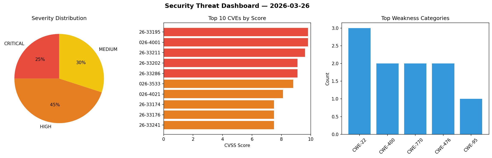
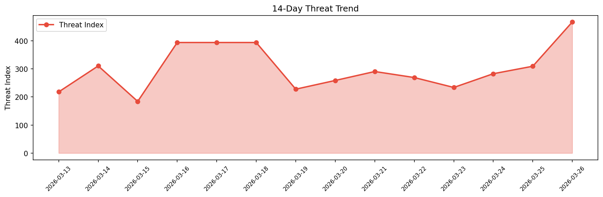

# Security Scan Report — 2026-03-26

**Scan ID:** `4afd74577d` | **CVEs:** 20 | **Threat Index:** 466.8

## Threat Overview

| Metric | Value |
|--------|-------|
| Threat Index | 466.8 |
| Critical CVEs | 5 |
| CRITICAL | 5 |
| HIGH | 9 |
| MEDIUM | 6 |

## Delta vs Yesterday

| Metric | Today | Yesterday | Change |
|--------|-------|-----------|--------|
| total_cves | 20 | 20 | ➡️ 0.0% |
| threat_index | 466.8 | 309.3 | 📈 50.9% |
| critical_count | 5 | 1 | 📈 400.0% |

## Top Weakness Categories

| CWE | Count |
|-----|-------|
| CWE-22 | 3 |
| CWE-400 | 2 |
| CWE-770 | 2 |
| CWE-476 | 2 |
| CWE-95 | 1 |

## CVE Details

| CVE ID | Score | Severity | Description |
|--------|-------|----------|-------------|
| CVE-2026-33195 | 9.8 | CRITICAL | Active Storage allows users to attach cloud and local files in Rails application... |
| CVE-2026-4001 | 9.8 | CRITICAL | The Woocommerce Custom Product Addons Pro plugin for WordPress is vulnerable to ... |
| CVE-2026-33211 | 9.6 | CRITICAL | Tekton Pipelines project provides k8s-style resources for declaring CI/CD-style ... |
| CVE-2026-33202 | 9.1 | CRITICAL | Active Storage allows users to attach cloud and local files in Rails application... |
| CVE-2026-33286 | 9.1 | CRITICAL | Graphiti is a framework that sits on top of models and exposes them via a JSON:A... |
| CVE-2026-3533 | 8.8 | HIGH | The Jupiter X Core plugin for WordPress is vulnerable to limited file uploads du... |
| CVE-2026-4021 | 8.1 | HIGH | The Contest Gallery plugin for WordPress is vulnerable to an authentication bypa... |
| CVE-2026-33174 | 7.5 | HIGH | Active Storage allows users to attach cloud and local files in Rails application... |
| CVE-2026-33176 | 7.5 | HIGH | Active Support is a toolkit of support libraries and Ruby core extensions extrac... |
| CVE-2026-33241 | 7.5 | HIGH | Salvo is a Rust web framework. Prior to version 0.89.3, Salvo's form data parsin... |
| CVE-2026-33242 | 7.5 | HIGH | Salvo is a Rust web framework. Versions 0.39.0 through 0.89.2 have a Path Traver... |
| CVE-2026-33250 | 7.5 | HIGH | Freeciv21 is a free open source, turn-based, empire-building strategy game. Vers... |
| CVE-2026-33282 | 7.5 | HIGH | Ella Core is a 5G core designed for private networks. Versions prior to 1.6.0 pa... |
| CVE-2026-33252 | 7.1 | HIGH | The Go MCP SDK used Go's standard encoding/json. Prior to version 1.4.1, the Go ... |
| CVE-2026-33281 | 6.5 | MEDIUM | Ella Core is a 5G core designed for private networks. Versions prior to 1.6.0 pa... |