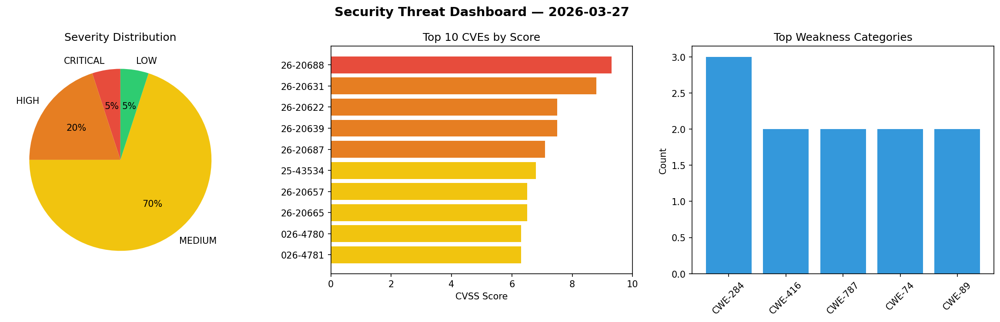
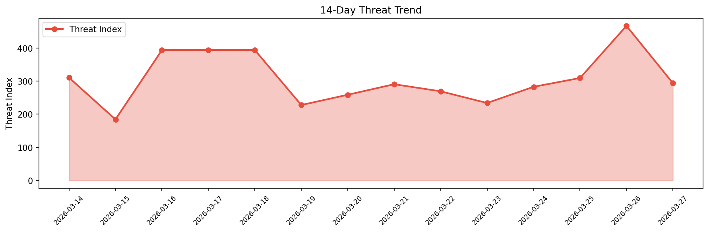

# Security Scan Report — 2026-03-27

**Scan ID:** `190741c90b` | **CVEs:** 20 | **Threat Index:** 293.6

## Threat Overview

| Metric | Value |
|--------|-------|
| Threat Index | 293.6 |
| Critical CVEs | 1 |
| CRITICAL | 1 |
| HIGH | 4 |
| MEDIUM | 14 |
| LOW | 1 |

## Delta vs Yesterday

| Metric | Today | Yesterday | Change |
|--------|-------|-----------|--------|
| total_cves | 20 | 20 | ➡️ 0.0% |
| threat_index | 293.6 | 466.8 | 📉 -37.1% |
| critical_count | 1 | 5 | 📉 -80.0% |

## Top Weakness Categories

| CWE | Count |
|-----|-------|
| CWE-284 | 3 |
| CWE-416 | 2 |
| CWE-787 | 2 |
| CWE-74 | 2 |
| CWE-89 | 2 |

## CVE Details

| CVE ID | Score | Severity | Description |
|--------|-------|----------|-------------|
| CVE-2026-20688 | 9.3 | CRITICAL | A path handling issue was addressed with improved validation. This issue is fixe... |
| CVE-2026-20631 | 8.8 | HIGH | A logic issue was addressed with improved checks. This issue is fixed in macOS T... |
| CVE-2026-20622 | 7.5 | HIGH | A privacy issue was addressed with improved handling of temporary files. This is... |
| CVE-2026-20639 | 7.5 | HIGH | An integer overflow was addressed with improved input validation. This issue is ... |
| CVE-2026-20687 | 7.1 | HIGH | A use after free issue was addressed with improved memory management. This issue... |
| CVE-2025-43534 | 6.8 | MEDIUM | A path handling issue was addressed with improved validation. This issue is fixe... |
| CVE-2026-20657 | 6.5 | MEDIUM | The issue was addressed with improved memory handling. This issue is fixed in iO... |
| CVE-2026-20665 | 6.5 | MEDIUM | This issue was addressed through improved state management. This issue is fixed ... |
| CVE-2026-4780 | 6.3 | MEDIUM | A vulnerability was detected in SourceCodester Sales and Inventory System 1.0. I... |
| CVE-2026-4781 | 6.3 | MEDIUM | A flaw has been found in SourceCodester Sales and Inventory System 1.0. The affe... |
| CVE-2026-20637 | 6.2 | MEDIUM | A use after free issue was addressed with improved memory management. This issue... |
| CVE-2026-20651 | 6.2 | MEDIUM | A privacy issue was addressed with improved handling of temporary files. This is... |
| CVE-2026-20633 | 5.5 | MEDIUM | This issue was addressed with improved handling of symlinks. This issue is fixed... |
| CVE-2026-20668 | 5.5 | MEDIUM | A logging issue was addressed with improved data redaction. This issue is fixed ... |
| CVE-2026-20670 | 5.5 | MEDIUM | An authorization issue was addressed with improved state management. This issue ... |