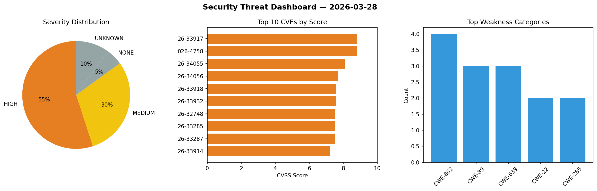
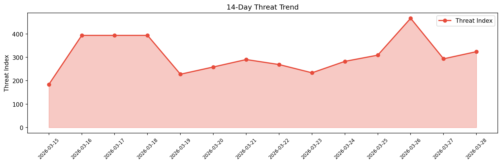

# Security Scan Report — 2026-03-28

**Scan ID:** `16c91eeea9` | **CVEs:** 20 | **Threat Index:** 324.2

## Threat Overview

| Metric | Value |
|--------|-------|
| Threat Index | 324.2 |
| Critical CVEs | 0 |
| HIGH | 11 |
| MEDIUM | 6 |
| NONE | 1 |
| UNKNOWN | 2 |

## Delta vs Yesterday

| Metric | Today | Yesterday | Change |
|--------|-------|-----------|--------|
| total_cves | 20 | 20 | ➡️ 0.0% |
| threat_index | 324.2 | 293.6 | 📈 10.4% |
| critical_count | 0 | 1 | 📉 -100.0% |

## Top Weakness Categories

| CWE | Count |
|-----|-------|
| CWE-862 | 4 |
| CWE-89 | 3 |
| CWE-639 | 3 |
| CWE-22 | 2 |
| CWE-285 | 2 |

## CVE Details

| CVE ID | Score | Severity | Description |
|--------|-------|----------|-------------|
| CVE-2026-33917 | 8.8 | HIGH | OpenEMR is a free and open source electronic health records and medical practice... |
| CVE-2026-4758 | 8.8 | HIGH | The WP Job Portal plugin for WordPress is vulnerable to arbitrary file deletion ... |
| CVE-2026-34055 | 8.1 | HIGH | OpenEMR is a free and open source electronic health records and medical practice... |
| CVE-2026-34056 | 7.7 | HIGH | OpenEMR is a free and open source electronic health records and medical practice... |
| CVE-2026-33918 | 7.6 | HIGH | OpenEMR is a free and open source electronic health records and medical practice... |
| CVE-2026-33932 | 7.6 | HIGH | OpenEMR is a free and open source electronic health records and medical practice... |
| CVE-2026-32748 | 7.5 | HIGH | Squid is a caching proxy for the Web. Prior to version 7.5, due to premature rel... |
| CVE-2026-33285 | 7.5 | HIGH | LiquidJS is a Shopify / GitHub Pages compatible template engine in pure JavaScri... |
| CVE-2026-33287 | 7.5 | HIGH | LiquidJS is a Shopify / GitHub Pages compatible template engine in pure JavaScri... |
| CVE-2026-33914 | 7.2 | HIGH | OpenEMR is a free and open source electronic health records and medical practice... |
| CVE-2026-34053 | 7.1 | HIGH | OpenEMR is a free and open source electronic health records and medical practice... |
| CVE-2026-33931 | 6.5 | MEDIUM | OpenEMR is a free and open source electronic health records and medical practice... |
| CVE-2026-4826 | 6.3 | MEDIUM | A vulnerability was determined in SourceCodester Sales and Inventory System 1.0.... |
| CVE-2026-33933 | 6.1 | MEDIUM | OpenEMR is a free and open source electronic health records and medical practice... |
| CVE-2026-33915 | 5.4 | MEDIUM | OpenEMR is a free and open source electronic health records and medical practice... |