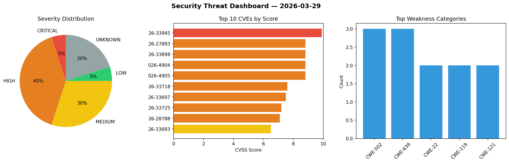
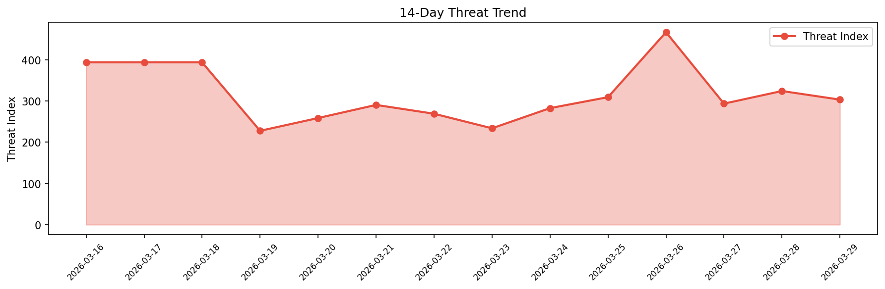

# Security Scan Report — 2026-03-29

**Scan ID:** `d0480f251e` | **CVEs:** 20 | **Threat Index:** 303.3

## Threat Overview

| Metric | Value |
|--------|-------|
| Threat Index | 303.3 |
| Critical CVEs | 1 |
| CRITICAL | 1 |
| HIGH | 8 |
| MEDIUM | 6 |
| LOW | 1 |
| UNKNOWN | 4 |

## Delta vs Yesterday

| Metric | Today | Yesterday | Change |
|--------|-------|-----------|--------|
| total_cves | 20 | 20 | ➡️ 0.0% |
| threat_index | 303.3 | 324.2 | 📉 -6.4% |
| critical_count | 1 | 0 | ➡️ 0% |

## Top Weakness Categories

| CWE | Count |
|-----|-------|
| CWE-502 | 3 |
| CWE-639 | 3 |
| CWE-22 | 2 |
| CWE-119 | 2 |
| CWE-121 | 2 |

## CVE Details

| CVE ID | Score | Severity | Description |
|--------|-------|----------|-------------|
| CVE-2026-33945 | 9.9 | CRITICAL | Incus is a system container and virtual machine manager. Incus instances have an... |
| CVE-2026-27893 | 8.8 | HIGH | vLLM is an inference and serving engine for large language models (LLMs). Starti... |
| CVE-2026-33898 | 8.8 | HIGH | Incus is a system container and virtual machine manager. Prior to version 6.23.0... |
| CVE-2026-4904 | 8.8 | HIGH | A vulnerability has been found in Tenda AC5 15.03.06.47. This issue affects the ... |
| CVE-2026-4905 | 8.8 | HIGH | A vulnerability was found in Tenda AC5 15.03.06.47. Impacted is the function for... |
| CVE-2026-33718 | 7.6 | HIGH | OpenHands is software for AI-driven development. Starting in version 1.5.0, a Co... |
| CVE-2026-33697 | 7.5 | HIGH | Cocos AI is a confidential computing system for AI. The current implementation o... |
| CVE-2026-33725 | 7.2 | HIGH | Metabase is an open source business intelligence and embedded analytics tool. In... |
| CVE-2026-28788 | 7.1 | HIGH | Open WebUI is a self-hosted artificial intelligence platform designed to operate... |
| CVE-2026-33693 | 6.5 | MEDIUM | Lemmy is a link aggregator and forum for the fediverse. Prior to version 0.7.0-b... |
| CVE-2026-33730 | 6.5 | MEDIUM | Open Source Point of Sale (opensourcepos) is a web based point of sale applicati... |
| CVE-2026-29070 | 5.4 | MEDIUM | Open WebUI is a self-hosted artificial intelligence platform designed to operate... |
| CVE-2026-33726 | 5.4 | MEDIUM | Cilium is a networking, observability, and security solution with an eBPF-based ... |
| CVE-2026-33721 | 5.3 | MEDIUM | MapServer is a system for developing web-based GIS applications. Starting in ver... |
| CVE-2026-28786 | 4.3 | MEDIUM | Open WebUI is a self-hosted artificial intelligence platform designed to operate... |