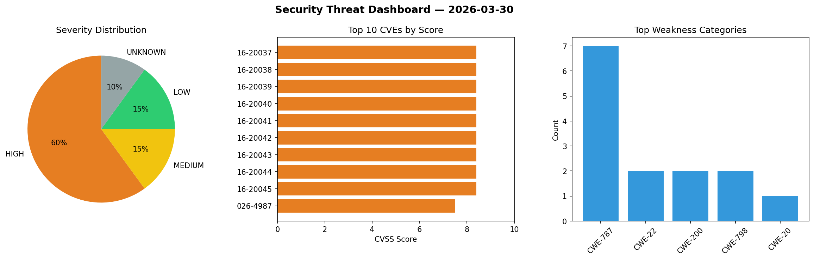
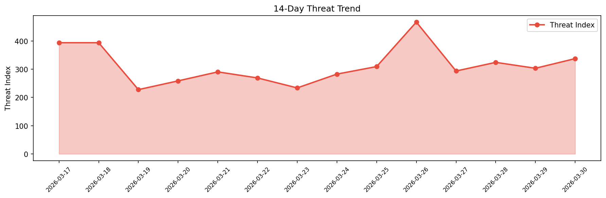

# Security Scan Report — 2026-03-30

**Scan ID:** `68bee3fe39` | **CVEs:** 20 | **Threat Index:** 337.5

## Threat Overview

| Metric | Value |
|--------|-------|
| Threat Index | 337.5 |
| Critical CVEs | 0 |
| HIGH | 12 |
| MEDIUM | 3 |
| LOW | 3 |
| UNKNOWN | 2 |

## Delta vs Yesterday

| Metric | Today | Yesterday | Change |
|--------|-------|-----------|--------|
| total_cves | 20 | 20 | ➡️ 0.0% |
| threat_index | 337.5 | 303.3 | 📈 11.3% |
| critical_count | 0 | 1 | 📉 -100.0% |

## Top Weakness Categories

| CWE | Count |
|-----|-------|
| CWE-787 | 7 |
| CWE-22 | 2 |
| CWE-200 | 2 |
| CWE-798 | 2 |
| CWE-20 | 1 |

## CVE Details

| CVE ID | Score | Severity | Description |
|--------|-------|----------|-------------|
| CVE-2016-20037 | 8.4 | HIGH | xwpe 1.5.30a-2.1 and prior contains a stack-based buffer overflow vulnerability ... |
| CVE-2016-20038 | 8.4 | HIGH | yTree 1.94-1.1 contains a stack-based buffer overflow vulnerability that allows ... |
| CVE-2016-20039 | 8.4 | HIGH | Multi Emulator Super System 0.154-3.1 contains a buffer overflow vulnerability i... |
| CVE-2016-20040 | 8.4 | HIGH | TiEmu 3.03-nogdb+dfsg-3 contains a buffer overflow vulnerability in the ROM para... |
| CVE-2016-20041 | 8.4 | HIGH | Yasr 0.6.9-5 contains a buffer overflow vulnerability that allows local attacker... |
| CVE-2016-20042 | 8.4 | HIGH | TRN 3.6-23 contains a stack buffer overflow vulnerability that allows local atta... |
| CVE-2016-20043 | 8.4 | HIGH | NRSS RSS Reader 0.3.9-1 contains a stack buffer overflow vulnerability that allo... |
| CVE-2016-20044 | 8.4 | HIGH | PInfo 0.6.9-5.1 contains a local buffer overflow vulnerability that allows local... |
| CVE-2016-20045 | 8.4 | HIGH | HNB Organizer 1.9.18-10 contains a local buffer overflow vulnerability that allo... |
| CVE-2026-4987 | 7.5 | HIGH | The SureForms – Contact Form, Payment Form & Other Custom Form Builder plugin fo... |
| CVE-2026-1679 | 7.3 | HIGH | The eswifi socket offload driver copies user-provided payloads into a fixed buff... |
| CVE-2025-12886 | 7.2 | HIGH | The Oxygen Theme theme for WordPress is vulnerable to Server-Side Request Forger... |
| CVE-2026-1307 | 6.5 | MEDIUM | The Ninja Forms - The Contact Form Builder That Grows With You plugin for WordPr... |
| CVE-2025-15445 | 5.4 | MEDIUM | The Restaurant Cafeteria WordPress theme through 0.4.6 exposes insecure admin-aj... |
| CVE-2026-2442 | 5.3 | MEDIUM | The Page Builder: Pagelayer – Drag and Drop website builder plugin for WordPress... |