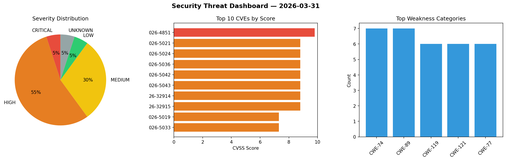
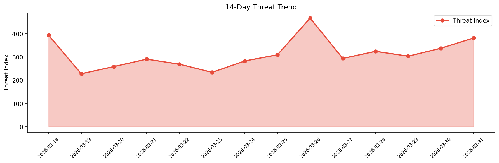

# Security Scan Report — 2026-03-31

**Scan ID:** `3733c41a87` | **CVEs:** 20 | **Threat Index:** 381.5

## Threat Overview

| Metric | Value |
|--------|-------|
| Threat Index | 381.5 |
| Critical CVEs | 1 |
| CRITICAL | 1 |
| HIGH | 11 |
| MEDIUM | 6 |
| LOW | 1 |
| UNKNOWN | 1 |

## Delta vs Yesterday

| Metric | Today | Yesterday | Change |
|--------|-------|-----------|--------|
| total_cves | 20 | 20 | ➡️ 0.0% |
| threat_index | 381.5 | 337.5 | 📈 13.0% |
| critical_count | 1 | 0 | ➡️ 0% |

## Top Weakness Categories

| CWE | Count |
|-----|-------|
| CWE-74 | 7 |
| CWE-89 | 7 |
| CWE-119 | 6 |
| CWE-121 | 6 |
| CWE-77 | 6 |

## CVE Details

| CVE ID | Score | Severity | Description |
|--------|-------|----------|-------------|
| CVE-2026-4851 | 9.8 | CRITICAL | GRID::Machine versions through 0.127 for Perl allows arbitrary code execution vi... |
| CVE-2026-5021 | 8.8 | HIGH | A flaw has been found in Tenda F453 1.0.0.3. This affects the function fromPPTPU... |
| CVE-2026-5024 | 8.8 | HIGH | A vulnerability was found in D-Link DIR-513 1.10. This issue affects the functio... |
| CVE-2026-5036 | 8.8 | HIGH | A vulnerability was found in Tenda 4G06 04.06.01.29. This vulnerability affects ... |
| CVE-2026-5042 | 8.8 | HIGH | A security flaw has been discovered in Belkin F9K1122 1.00.33. The affected elem... |
| CVE-2026-5043 | 8.8 | HIGH | A weakness has been identified in Belkin F9K1122 1.00.33. The impacted element i... |
| CVE-2026-32914 | 8.8 | HIGH | OpenClaw before 2026.3.12 contains an insufficient access control vulnerability ... |
| CVE-2026-32915 | 8.8 | HIGH | OpenClaw before 2026.3.11 contains a sandbox boundary bypass vulnerability allow... |
| CVE-2026-5019 | 7.3 | HIGH | A security vulnerability has been detected in code-projects Simple Food Order Sy... |
| CVE-2026-5033 | 7.3 | HIGH | A vulnerability was detected in code-projects Accounting System 1.0. Affected by... |
| CVE-2026-5034 | 7.3 | HIGH | A flaw has been found in code-projects Accounting System 1.0. Affected by this i... |
| CVE-2026-5035 | 7.3 | HIGH | A vulnerability has been found in code-projects Accounting System 1.0. This affe... |
| CVE-2026-2602 | 6.4 | MEDIUM | The Twentig plugin for WordPress is vulnerable to Stored Cross-Site Scripting vi... |
| CVE-2026-5020 | 6.3 | MEDIUM | A vulnerability was detected in Totolink A3600R 4.1.2cu.5182_B20201102. Affected... |
| CVE-2026-5030 | 6.3 | MEDIUM | A vulnerability has been found in Totolink NR1800X 9.1.0u.6279_B20210910. This i... |