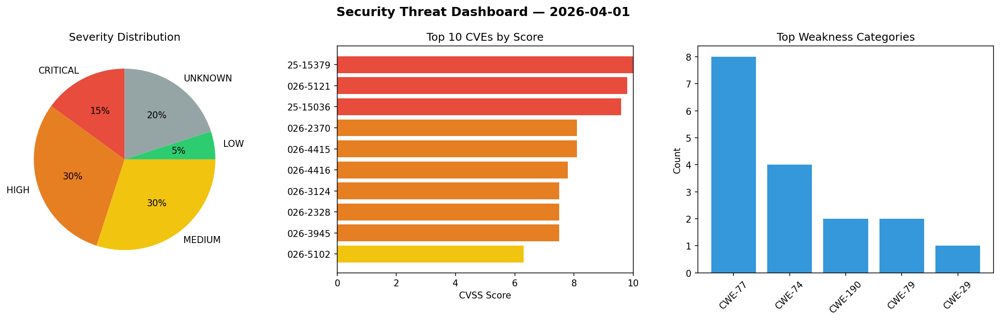
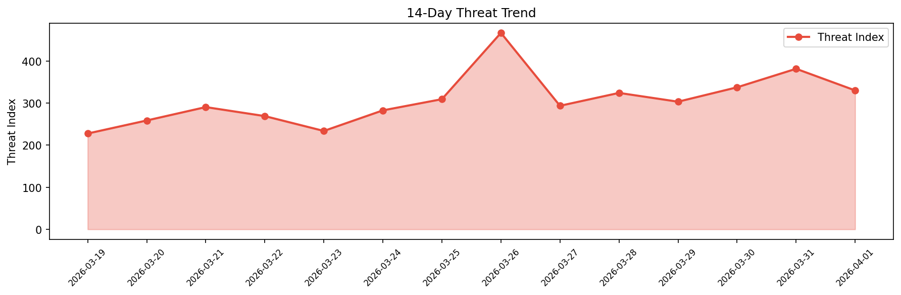

# Security Scan Report — 2026-04-01

**Scan ID:** `9007e1d6c3` | **CVEs:** 20 | **Threat Index:** 330.1

## Threat Overview

| Metric | Value |
|--------|-------|
| Threat Index | 330.1 |
| Critical CVEs | 3 |
| CRITICAL | 3 |
| HIGH | 6 |
| MEDIUM | 6 |
| LOW | 1 |
| UNKNOWN | 4 |

## Delta vs Yesterday

| Metric | Today | Yesterday | Change |
|--------|-------|-----------|--------|
| total_cves | 20 | 20 | ➡️ 0.0% |
| threat_index | 330.1 | 381.5 | 📉 -13.5% |
| critical_count | 3 | 1 | 📈 200.0% |

## Top Weakness Categories

| CWE | Count |
|-----|-------|
| CWE-77 | 8 |
| CWE-74 | 4 |
| CWE-190 | 2 |
| CWE-79 | 2 |
| CWE-29 | 1 |

## CVE Details

| CVE ID | Score | Severity | Description |
|--------|-------|----------|-------------|
| CVE-2025-15379 | 10.0 | CRITICAL | A command injection vulnerability exists in MLflow's model serving container ini... |
| CVE-2026-5121 | 9.8 | CRITICAL | A flaw was found in libarchive. On 32-bit systems, an integer overflow vulnerabi... |
| CVE-2025-15036 | 9.6 | CRITICAL | A path traversal vulnerability exists in the `extract_archive_to_dir` function w... |
| CVE-2026-2370 | 8.1 | HIGH | GitLab has remediated an issue in GitLab CE/EE affecting all versions from 14.3 ... |
| CVE-2026-4415 | 8.1 | HIGH | Gigabyte Control Center developed by GIGABYTE has an Arbitrary File Write vulner... |
| CVE-2026-4416 | 7.8 | HIGH | The Performance Library component of Gigabyte Control Center has an Insecure Des... |
| CVE-2026-3124 | 7.5 | HIGH | The Download Monitor plugin for WordPress is vulnerable to Insecure Direct Objec... |
| CVE-2026-2328 | 7.5 | HIGH | An unauthenticated remote attacker can exploit insufficient input validation to ... |
| CVE-2026-3945 | 7.5 | HIGH | An integer overflow vulnerability in the HTTP chunked transfer encoding parser i... |
| CVE-2026-5102 | 6.3 | MEDIUM | A security flaw has been discovered in Totolink A3300R 17.0.0cu.557_b20221024. T... |
| CVE-2026-5103 | 6.3 | MEDIUM | A weakness has been identified in Totolink A3300R 17.0.0cu.557_b20221024. This i... |
| CVE-2026-5104 | 6.3 | MEDIUM | A security vulnerability has been detected in Totolink A3300R 17.0.0cu.557_b2022... |
| CVE-2026-5105 | 6.3 | MEDIUM | A vulnerability was detected in Totolink A3300R 17.0.0cu.557_b20221024. The affe... |
| CVE-2026-5119 | 5.9 | MEDIUM | A flaw was found in libsoup. When establishing HTTPS tunnels through a configure... |
| CVE-2026-5107 | 4.2 | MEDIUM | A vulnerability has been found in FRRouting FRR up to 10.5.1. This affects the f... |