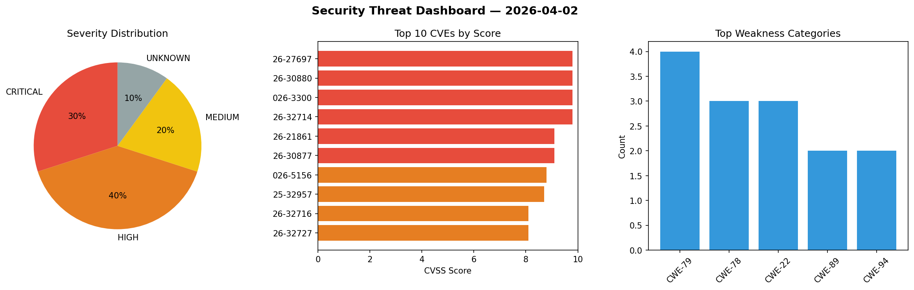
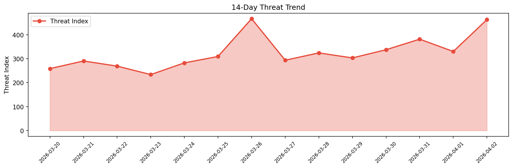

# Security Scan Report — 2026-04-02

**Scan ID:** `db76baab16` | **CVEs:** 20 | **Threat Index:** 463.0

## Threat Overview

| Metric | Value |
|--------|-------|
| Threat Index | 463.0 |
| Critical CVEs | 6 |
| CRITICAL | 6 |
| HIGH | 8 |
| MEDIUM | 4 |
| UNKNOWN | 2 |

## Delta vs Yesterday

| Metric | Today | Yesterday | Change |
|--------|-------|-----------|--------|
| total_cves | 20 | 20 | ➡️ 0.0% |
| threat_index | 463.0 | 330.1 | 📈 40.3% |
| critical_count | 6 | 3 | 📈 100.0% |

## Top Weakness Categories

| CWE | Count |
|-----|-------|
| CWE-79 | 4 |
| CWE-78 | 3 |
| CWE-22 | 3 |
| CWE-89 | 2 |
| CWE-94 | 2 |

## CVE Details

| CVE ID | Score | Severity | Description |
|--------|-------|----------|-------------|
| CVE-2026-27697 | 9.8 | CRITICAL | baserCMS is a website development framework. Prior to version 5.2.3, baserCMS ha... |
| CVE-2026-30880 | 9.8 | CRITICAL | baserCMS is a website development framework. Prior to version 5.2.3, baserCMS ha... |
| CVE-2026-3300 | 9.8 | CRITICAL | The Everest Forms Pro plugin for WordPress is vulnerable to Remote Code Executio... |
| CVE-2026-32714 | 9.8 | CRITICAL | SciTokens is a reference library for generating and using SciTokens. Prior to ve... |
| CVE-2026-21861 | 9.1 | CRITICAL | baserCMS is a website development framework. Prior to version 5.2.3, baserCMS co... |
| CVE-2026-30877 | 9.1 | CRITICAL | baserCMS is a website development framework. Prior to version 5.2.3, there is an... |
| CVE-2026-5156 | 8.8 | HIGH | A vulnerability was determined in Tenda CH22 1.0.0.1. This impacts the function ... |
| CVE-2025-32957 | 8.7 | HIGH | baserCMS is a website development framework. Prior to version 5.2.3, the applica... |
| CVE-2026-32716 | 8.1 | HIGH | SciTokens is a reference library for generating and using SciTokens. Prior to ve... |
| CVE-2026-32727 | 8.1 | HIGH | SciTokens is a reference library for generating and using SciTokens. Prior to ve... |
| CVE-2026-4020 | 7.5 | HIGH | The Gravity SMTP plugin for WordPress is vulnerable to Sensitive Information Exp... |
| CVE-2026-5176 | 7.3 | HIGH | A security flaw has been discovered in Totolink A3300R 17.0.0cu.557_b20221024. A... |
| CVE-2026-30940 | 7.2 | HIGH | baserCMS is a website development framework. Prior to version 5.2.3, a path trav... |
| CVE-2026-32734 | 7.1 | HIGH | baserCMS is a website development framework. Prior to version 5.2.3, baserCMS ha... |
| CVE-2026-33997 | 6.8 | MEDIUM | Moby is an open source container framework. Prior to version 29.3.1, a security ... |