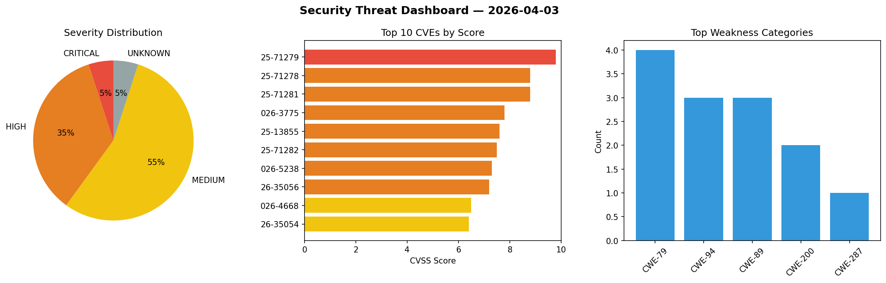
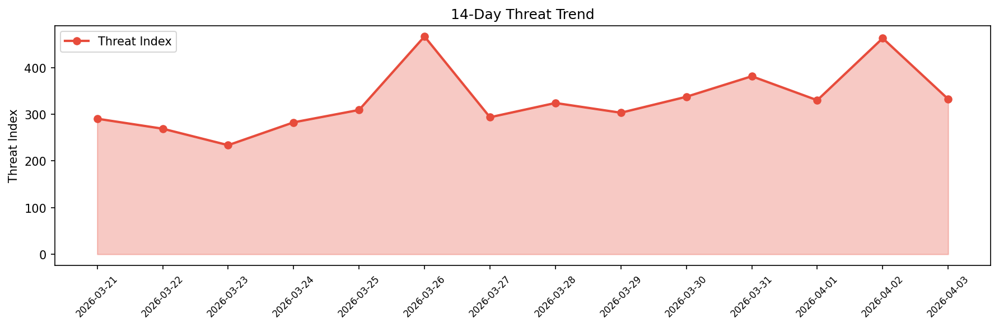

# Security Scan Report — 2026-04-03

**Scan ID:** `e0e3622d5d` | **CVEs:** 20 | **Threat Index:** 332.6

## Threat Overview

| Metric | Value |
|--------|-------|
| Threat Index | 332.6 |
| Critical CVEs | 1 |
| CRITICAL | 1 |
| HIGH | 7 |
| MEDIUM | 11 |
| UNKNOWN | 1 |

## Delta vs Yesterday

| Metric | Today | Yesterday | Change |
|--------|-------|-----------|--------|
| total_cves | 20 | 20 | ➡️ 0.0% |
| threat_index | 332.6 | 463.0 | 📉 -28.2% |
| critical_count | 1 | 6 | 📉 -83.3% |

## Top Weakness Categories

| CWE | Count |
|-----|-------|
| CWE-79 | 4 |
| CWE-94 | 3 |
| CWE-89 | 3 |
| CWE-200 | 2 |
| CWE-287 | 1 |

## CVE Details

| CVE ID | Score | Severity | Description |
|--------|-------|----------|-------------|
| CVE-2025-71279 | 9.8 | CRITICAL | XenForo before 2.3.7 contains a security issue affecting Passkeys that have been... |
| CVE-2025-71278 | 8.8 | HIGH | XenForo before 2.3.5 allows OAuth2 client applications to request unauthorized s... |
| CVE-2025-71281 | 8.8 | HIGH | XenForo before 2.3.7 does not properly restrict methods callable from within tem... |
| CVE-2026-3775 | 7.8 | HIGH | The application's update service, when checking for updates, loads certain syste... |
| CVE-2025-13855 | 7.6 | HIGH | IBM Storage Protect Server 8.2.0 IBM Storage Protect Plus Server is vulnerable t... |
| CVE-2025-71282 | 7.5 | HIGH | XenForo before 2.3.7 discloses filesystem paths through exception messages trigg... |
| CVE-2026-5238 | 7.3 | HIGH | A weakness has been identified in itsourcecode Payroll Management System 1.0. Af... |
| CVE-2026-35056 | 7.2 | HIGH | XenForo before 2.3.9 and before 2.2.18 allows remote code execution (RCE) by aut... |
| CVE-2026-4668 | 6.5 | MEDIUM | The Booking for Appointments and Events Calendar - Amelia plugin for WordPress i... |
| CVE-2026-35054 | 6.4 | MEDIUM | XenForo before 2.3.9 is vulnerable to stored cross-site scripting (XSS) related ... |
| CVE-2026-35057 | 6.4 | MEDIUM | XenForo before 2.3.10 and before 2.2.19 is vulnerable to stored cross-site scrip... |
| CVE-2024-58342 | 6.3 | MEDIUM | XenForo before 2.2.17 and 2.3.1 allows open redirect via a specially crafted URL... |
| CVE-2026-5248 | 6.3 | MEDIUM | A vulnerability has been found in gougucms 4.08.18. This affects the function re... |
| CVE-2025-71280 | 6.2 | MEDIUM | XenForo before 2.3.7 allows information disclosure via local account page cachin... |
| CVE-2026-35055 | 6.1 | MEDIUM | XenForo before 2.3.9 and before 2.2.18 is vulnerable to cross-site scripting (XS... |