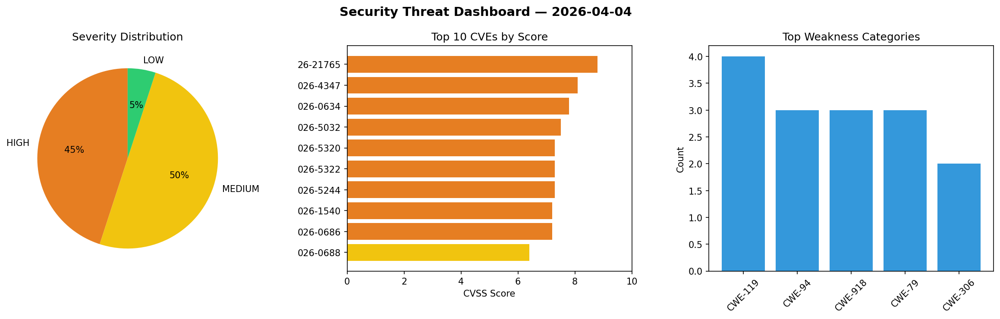
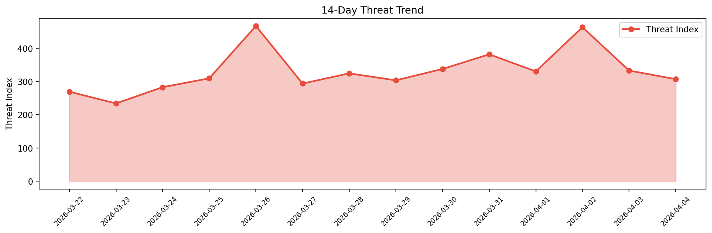

# Security Scan Report — 2026-04-04

**Scan ID:** `f4d14c7735` | **CVEs:** 20 | **Threat Index:** 306.8

## Threat Overview

| Metric | Value |
|--------|-------|
| Threat Index | 306.8 |
| Critical CVEs | 0 |
| HIGH | 9 |
| MEDIUM | 10 |
| LOW | 1 |

## Delta vs Yesterday

| Metric | Today | Yesterday | Change |
|--------|-------|-----------|--------|
| total_cves | 20 | 20 | ➡️ 0.0% |
| threat_index | 306.8 | 332.6 | 📉 -7.8% |
| critical_count | 0 | 1 | 📉 -100.0% |

## Top Weakness Categories

| CWE | Count |
|-----|-------|
| CWE-119 | 4 |
| CWE-94 | 3 |
| CWE-918 | 3 |
| CWE-79 | 3 |
| CWE-306 | 2 |

## CVE Details

| CVE ID | Score | Severity | Description |
|--------|-------|----------|-------------|
| CVE-2026-21765 | 8.8 | HIGH | HCL BigFix Platform is affected by insecure permissions on private cryptographic... |
| CVE-2026-4347 | 8.1 | HIGH | The MW WP Form plugin for WordPress is vulnerable to arbitrary file moving due t... |
| CVE-2026-0634 | 7.8 | HIGH | Code execution in AssistFeedbackService of TECNO Pova7 Pro 5G on Android allows ... |
| CVE-2026-5032 | 7.5 | HIGH | The W3 Total Cache plugin for WordPress is vulnerable to information exposure in... |
| CVE-2026-5320 | 7.3 | HIGH | A vulnerability was detected in vanna-ai vanna up to 2.0.2. Affected by this vul... |
| CVE-2026-5322 | 7.3 | HIGH | A vulnerability has been found in AlejandroArciniegas mcp-data-vis bc597e391f184... |
| CVE-2026-5244 | 7.3 | HIGH | A vulnerability has been found in Cesanta Mongoose up to 7.20. This affects the ... |
| CVE-2026-1540 | 7.2 | HIGH | The Spam Protect for Contact Form 7 WordPress plugin before 1.2.10 allows loggin... |
| CVE-2026-0686 | 7.2 | HIGH | The Webmention plugin for WordPress is vulnerable to Server-Side Request Forgery... |
| CVE-2026-0688 | 6.4 | MEDIUM | The Webmention plugin for WordPress is vulnerable to Server-Side Request Forgery... |
| CVE-2026-5317 | 6.3 | MEDIUM | A security flaw has been discovered in Nothings stb up to 1.22. This affects the... |
| CVE-2026-1243 | 5.4 | MEDIUM | IBM Content Navigator 3.0.15, 3.1.0, and 3.2.0 is vulnerable to cross-site scrip... |
| CVE-2026-5323 | 5.3 | MEDIUM | A vulnerability was found in priyankark a11y-mcp up to 1.0.5. This vulnerability... |
| CVE-2026-5315 | 4.3 | MEDIUM | A vulnerability was determined in Nothings stb up to 1.26. The affected element ... |
| CVE-2026-5316 | 4.3 | MEDIUM | A vulnerability was identified in Nothings stb up to 1.22. The impacted element ... |