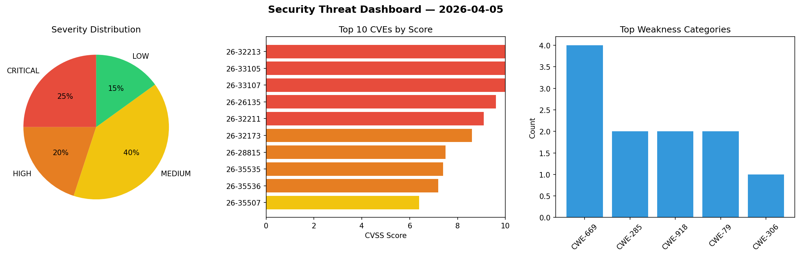
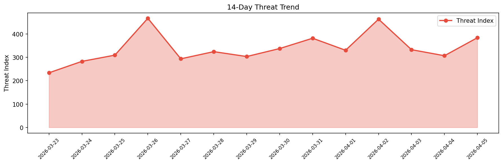

# Security Scan Report — 2026-04-05

**Scan ID:** `430103697f` | **CVEs:** 20 | **Threat Index:** 383.8

## Threat Overview

| Metric | Value |
|--------|-------|
| Threat Index | 383.8 |
| Critical CVEs | 5 |
| CRITICAL | 5 |
| HIGH | 4 |
| MEDIUM | 8 |
| LOW | 3 |

## Delta vs Yesterday

| Metric | Today | Yesterday | Change |
|--------|-------|-----------|--------|
| total_cves | 20 | 20 | ➡️ 0.0% |
| threat_index | 383.8 | 306.8 | 📈 25.1% |
| critical_count | 5 | 0 | ➡️ 0% |

## Top Weakness Categories

| CWE | Count |
|-----|-------|
| CWE-669 | 4 |
| CWE-285 | 2 |
| CWE-918 | 2 |
| CWE-79 | 2 |
| CWE-306 | 1 |

## CVE Details

| CVE ID | Score | Severity | Description |
|--------|-------|----------|-------------|
| CVE-2026-32213 | 10.0 | CRITICAL | Improper authorization in Azure AI Foundry allows an unauthorized attacker to el... |
| CVE-2026-33105 | 10.0 | CRITICAL | Improper authorization in Microsoft Azure Kubernetes Service allows an unauthori... |
| CVE-2026-33107 | 10.0 | CRITICAL | Server-side request forgery (ssrf) in Azure Databricks allows an unauthorized at... |
| CVE-2026-26135 | 9.6 | CRITICAL | Server-side request forgery (ssrf) in Azure Custom Locations Resource Provider (... |
| CVE-2026-32211 | 9.1 | CRITICAL | Missing authentication for critical function in Azure MCP Server allows an unaut... |
| CVE-2026-32173 | 8.6 | HIGH | Improper authentication in Azure SRE Agent allows an unauthorized attacker to di... |
| CVE-2026-28815 | 7.5 | HIGH | A remote attacker can supply a short X-Wing HPKE encapsulated key and trigger an... |
| CVE-2026-35535 | 7.4 | HIGH | In Sudo through 1.9.17p2 before 3e474c2, a failure of a setuid, setgid, or setgr... |
| CVE-2026-35536 | 7.2 | HIGH | In Tornado before 6.5.5, cookie attribute injection could occur because the doma... |
| CVE-2026-35507 | 6.4 | MEDIUM | Shynet before 0.14.0 allows Host header injection in the password reset flow.... |
| CVE-2026-35539 | 6.1 | MEDIUM | An issue was discovered in Roundcube Webmail before 1.5.14 and 1.6.14. XSS exist... |
| CVE-2026-35508 | 5.4 | MEDIUM | Shynet before 0.14.0 allows XSS in urldisplay and iconify template filters,... |
| CVE-2026-35540 | 5.4 | MEDIUM | An issue was discovered in Roundcube Webmail 1.6.0 before 1.6.14. Insufficient C... |
| CVE-2026-35542 | 5.3 | MEDIUM | An issue was discovered in Roundcube Webmail before 1.5.14 and 1.6.14. The remot... |
| CVE-2026-35543 | 5.3 | MEDIUM | An issue was discovered in Roundcube Webmail before 1.5.14 and 1.6.14. The remot... |