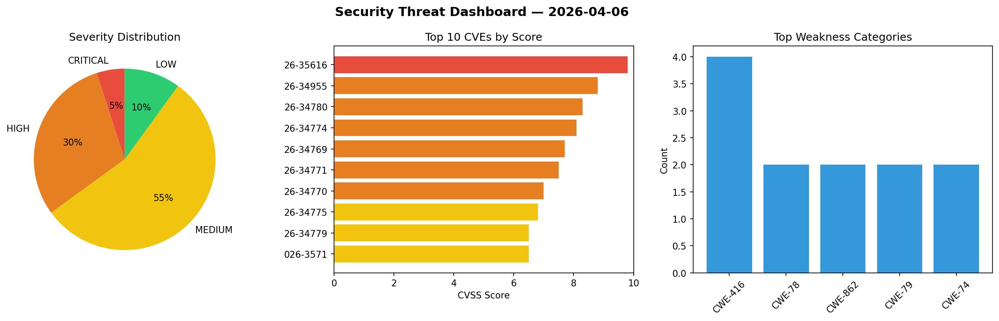
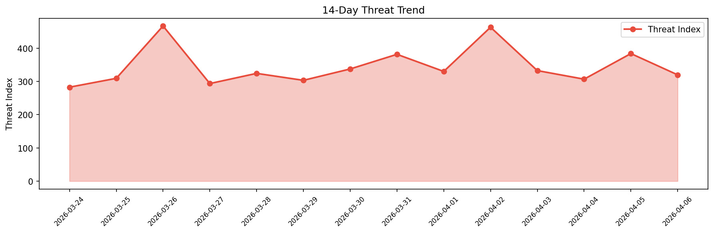

# Security Scan Report — 2026-04-06

**Scan ID:** `2879b14538` | **CVEs:** 20 | **Threat Index:** 319.8

## Threat Overview

| Metric | Value |
|--------|-------|
| Threat Index | 319.8 |
| Critical CVEs | 1 |
| CRITICAL | 1 |
| HIGH | 6 |
| MEDIUM | 11 |
| LOW | 2 |

## Delta vs Yesterday

| Metric | Today | Yesterday | Change |
|--------|-------|-----------|--------|
| total_cves | 20 | 20 | ➡️ 0.0% |
| threat_index | 319.8 | 383.8 | 📉 -16.7% |
| critical_count | 1 | 5 | 📉 -80.0% |

## Top Weakness Categories

| CWE | Count |
|-----|-------|
| CWE-416 | 4 |
| CWE-78 | 2 |
| CWE-862 | 2 |
| CWE-79 | 2 |
| CWE-74 | 2 |

## CVE Details

| CVE ID | Score | Severity | Description |
|--------|-------|----------|-------------|
| CVE-2026-35616 | 9.8 | CRITICAL | A improper access control vulnerability in Fortinet FortiClientEMS 7.4.5 through... |
| CVE-2026-34955 | 8.8 | HIGH | PraisonAI is a multi-agent teams system. Prior to version 4.5.97, SubprocessSand... |
| CVE-2026-34780 | 8.3 | HIGH | Electron is a framework for writing cross-platform desktop applications using Ja... |
| CVE-2026-34774 | 8.1 | HIGH | Electron is a framework for writing cross-platform desktop applications using Ja... |
| CVE-2026-34769 | 7.7 | HIGH | Electron is a framework for writing cross-platform desktop applications using Ja... |
| CVE-2026-34771 | 7.5 | HIGH | Electron is a framework for writing cross-platform desktop applications using Ja... |
| CVE-2026-34770 | 7.0 | HIGH | Electron is a framework for writing cross-platform desktop applications using Ja... |
| CVE-2026-34775 | 6.8 | MEDIUM | Electron is a framework for writing cross-platform desktop applications using Ja... |
| CVE-2026-34779 | 6.5 | MEDIUM | Electron is a framework for writing cross-platform desktop applications using Ja... |
| CVE-2026-3571 | 6.5 | MEDIUM | The Pie Register – User Registration, Profiles & Content Restriction plugin for ... |
| CVE-2026-2924 | 6.4 | MEDIUM | The Gutenverse – Ultimate WordPress FSE Blocks Addons & Ecosystem plugin for Wor... |
| CVE-2026-2949 | 6.4 | MEDIUM | The Xpro Addons — 140+ Widgets for Elementor plugin for WordPress is vulnerable ... |
| CVE-2026-34767 | 5.9 | MEDIUM | Electron is a framework for writing cross-platform desktop applications using Ja... |
| CVE-2026-34778 | 5.9 | MEDIUM | Electron is a framework for writing cross-platform desktop applications using Ja... |
| CVE-2026-34772 | 5.8 | MEDIUM | Electron is a framework for writing cross-platform desktop applications using Ja... |