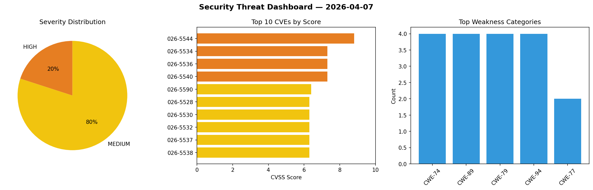
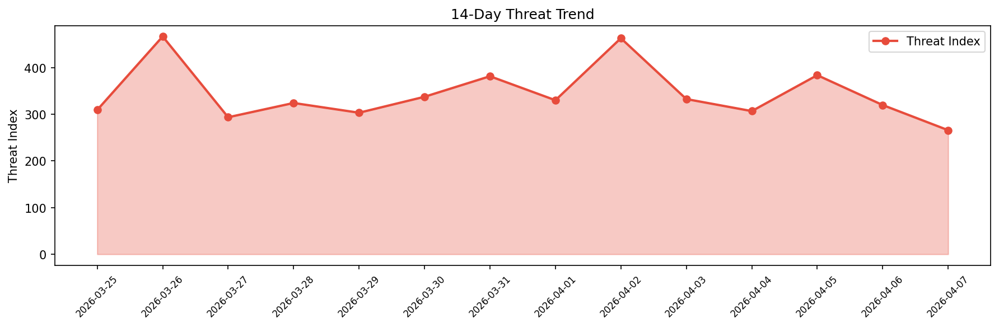

# Security Scan Report — 2026-04-07

**Scan ID:** `d7e72d5433` | **CVEs:** 20 | **Threat Index:** 265.9

## Threat Overview

| Metric | Value |
|--------|-------|
| Threat Index | 265.9 |
| Critical CVEs | 0 |
| HIGH | 4 |
| MEDIUM | 16 |

## Delta vs Yesterday

| Metric | Today | Yesterday | Change |
|--------|-------|-----------|--------|
| total_cves | 20 | 20 | ➡️ 0.0% |
| threat_index | 265.9 | 319.8 | 📉 -16.9% |
| critical_count | 0 | 1 | 📉 -100.0% |

## Top Weakness Categories

| CWE | Count |
|-----|-------|
| CWE-74 | 4 |
| CWE-89 | 4 |
| CWE-79 | 4 |
| CWE-94 | 4 |
| CWE-77 | 2 |

## CVE Details

| CVE ID | Score | Severity | Description |
|--------|-------|----------|-------------|
| CVE-2026-5544 | 8.8 | HIGH | A security flaw has been discovered in UTT HiPER 1250GW up to 3.2.7-210907-18053... |
| CVE-2026-5534 | 7.3 | HIGH | A vulnerability was identified in itsourcecode Online Enrollment System 1.0. Thi... |
| CVE-2026-5536 | 7.3 | HIGH | A weakness has been identified in FedML-AI FedML up to 0.8.9. Affected is the fu... |
| CVE-2026-5540 | 7.3 | HIGH | A vulnerability has been found in code-projects Simple Laundry System 1.0. This ... |
| CVE-2026-5590 | 6.4 | MEDIUM | A race condition during TCP connection teardown can cause tcp_recv() to operate ... |
| CVE-2026-5528 | 6.3 | MEDIUM | A security vulnerability has been detected in MoussaabBadla code-screenshot-mcp ... |
| CVE-2026-5530 | 6.3 | MEDIUM | A flaw has been found in Ollama up to 18.1. This issue affects some unknown proc... |
| CVE-2026-5532 | 6.3 | MEDIUM | A vulnerability was found in ScrapeGraphAI scrapegraph-ai up to 1.74.0. The affe... |
| CVE-2026-5537 | 6.3 | MEDIUM | A security vulnerability has been detected in halex CourseSEL up to 1.1.0. Affec... |
| CVE-2026-5538 | 6.3 | MEDIUM | A vulnerability was detected in QingdaoU OnlineJudge up to 1.6.1. Affected by th... |
| CVE-2026-5543 | 6.3 | MEDIUM | A vulnerability was identified in PHPGurukul User Registration & Login and User ... |
| CVE-2026-5546 | 6.3 | MEDIUM | A flaw has been found in Campcodes Complete Online Learning Management System 1.... |
| CVE-2026-5527 | 5.3 | MEDIUM | A weakness has been identified in Tenda 4G03 Pro 1.0/1.0re/01.bin/04.03.01.53. A... |
| CVE-2026-5531 | 5.3 | MEDIUM | A vulnerability has been found in SourceCodester Student Result Management Syste... |
| CVE-2026-5529 | 4.3 | MEDIUM | A vulnerability was detected in Dromara lamp-cloud up to 5.8.1. This vulnerabili... |