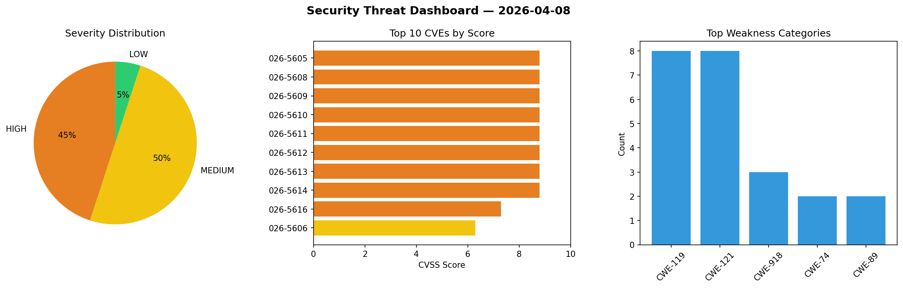
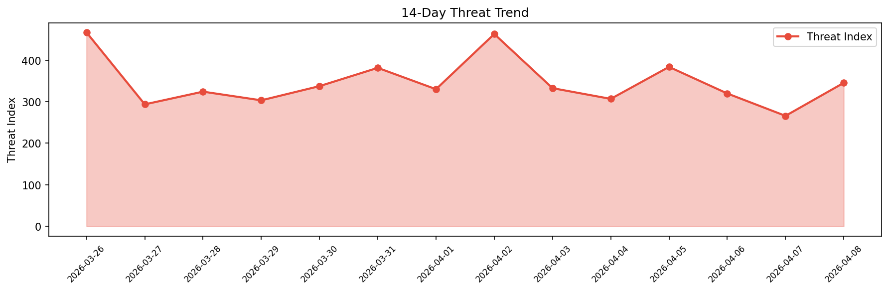

# Security Scan Report — 2026-04-08

**Scan ID:** `0f5f320485` | **CVEs:** 20 | **Threat Index:** 345.4

## Threat Overview

| Metric | Value |
|--------|-------|
| Threat Index | 345.4 |
| Critical CVEs | 0 |
| HIGH | 9 |
| MEDIUM | 10 |
| LOW | 1 |

## Delta vs Yesterday

| Metric | Today | Yesterday | Change |
|--------|-------|-----------|--------|
| total_cves | 20 | 20 | ➡️ 0.0% |
| threat_index | 345.4 | 265.9 | 📈 29.9% |
| critical_count | 0 | 0 | ➡️ 0% |

## Top Weakness Categories

| CWE | Count |
|-----|-------|
| CWE-119 | 8 |
| CWE-121 | 8 |
| CWE-918 | 3 |
| CWE-74 | 2 |
| CWE-89 | 2 |

## CVE Details

| CVE ID | Score | Severity | Description |
|--------|-------|----------|-------------|
| CVE-2026-5605 | 8.8 | HIGH | A weakness has been identified in Tenda CH22 1.0.0.1. This affects the function ... |
| CVE-2026-5608 | 8.8 | HIGH | A vulnerability was detected in Belkin F9K1122 1.00.33. Affected is the function... |
| CVE-2026-5609 | 8.8 | HIGH | A flaw has been found in Tenda i12 1.0.0.11(3862). Affected by this vulnerabilit... |
| CVE-2026-5610 | 8.8 | HIGH | A vulnerability has been found in Belkin F9K1015 1.00.10. Affected by this issue... |
| CVE-2026-5611 | 8.8 | HIGH | A vulnerability was found in Belkin F9K1015 1.00.10. This affects the function f... |
| CVE-2026-5612 | 8.8 | HIGH | A vulnerability was determined in Belkin F9K1015 1.00.10. This vulnerability aff... |
| CVE-2026-5613 | 8.8 | HIGH | A vulnerability was identified in Belkin F9K1015 1.00.10. This issue affects the... |
| CVE-2026-5614 | 8.8 | HIGH | A security flaw has been discovered in Belkin F9K1015 1.00.10. Impacted is the f... |
| CVE-2026-5616 | 7.3 | HIGH | A security vulnerability has been detected in JeecgBoot 3.9.0/3.9.1. The impacte... |
| CVE-2026-5606 | 6.3 | MEDIUM | A security flaw has been discovered in PHPGurukul Online Shopping Portal Project... |
| CVE-2026-5607 | 6.3 | MEDIUM | A security vulnerability has been detected in imprvhub mcp-browser-agent up to 0... |
| CVE-2026-5620 | 6.3 | MEDIUM | A vulnerability has been found in itsourcecode Construction Management System 1.... |
| CVE-2026-5623 | 6.3 | MEDIUM | A vulnerability was identified in hcengineering Huly Platform 0.7.382. This affe... |
| CVE-2026-5618 | 5.6 | MEDIUM | A vulnerability was detected in kalcaddle kodbox up to 1.64. This affects an unk... |
| CVE-2026-5619 | 5.3 | MEDIUM | A flaw has been found in Braffolk mcp-summarization-functions up to 0.1.5. This ... |