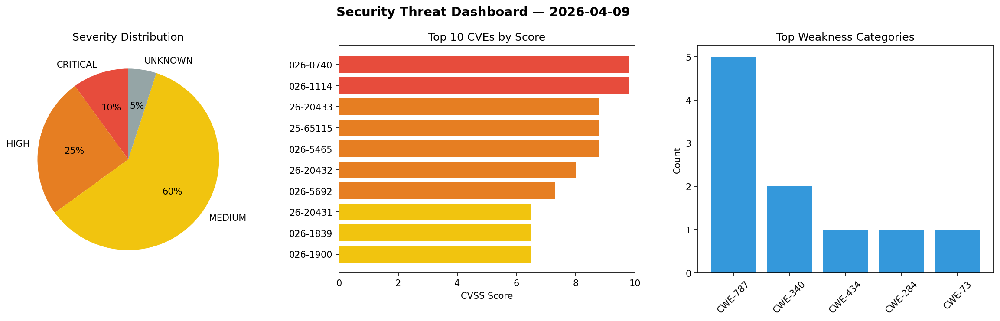
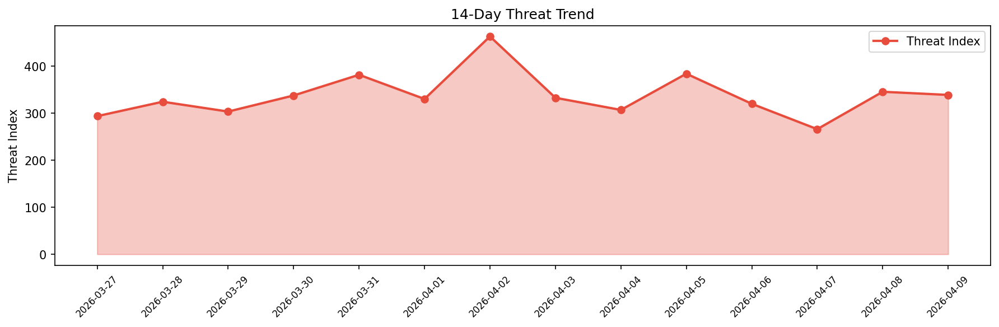

# Security Scan Report — 2026-04-09

**Scan ID:** `d046233e70` | **CVEs:** 20 | **Threat Index:** 338.7

## Threat Overview

| Metric | Value |
|--------|-------|
| Threat Index | 338.7 |
| Critical CVEs | 2 |
| CRITICAL | 2 |
| HIGH | 5 |
| MEDIUM | 12 |
| UNKNOWN | 1 |

## Delta vs Yesterday

| Metric | Today | Yesterday | Change |
|--------|-------|-----------|--------|
| total_cves | 20 | 20 | ➡️ 0.0% |
| threat_index | 338.7 | 345.4 | 📉 -1.9% |
| critical_count | 2 | 0 | ➡️ 0% |

## Top Weakness Categories

| CWE | Count |
|-----|-------|
| CWE-787 | 5 |
| CWE-340 | 2 |
| CWE-434 | 1 |
| CWE-284 | 1 |
| CWE-73 | 1 |

## CVE Details

| CVE ID | Score | Severity | Description |
|--------|-------|----------|-------------|
| CVE-2026-0740 | 9.8 | CRITICAL | The Ninja Forms - File Uploads plugin for WordPress is vulnerable to arbitrary f... |
| CVE-2026-1114 | 9.8 | CRITICAL | In parisneo/lollms version 2.1.0, the application's session management is vulner... |
| CVE-2026-20433 | 8.8 | HIGH | In Modem, there is a possible out of bounds write due to a missing bounds check.... |
| CVE-2025-65115 | 8.8 | HIGH | Remote Code Execution Vulnerability in JP1/IT Desktop Management 2 - Manager on ... |
| CVE-2026-5465 | 8.8 | HIGH | The Booking for Appointments and Events Calendar – Amelia plugin for WordPress i... |
| CVE-2026-20432 | 8.0 | HIGH | In Modem, there is a possible out of bounds write due to a missing bounds check.... |
| CVE-2026-5692 | 7.3 | HIGH | A vulnerability was found in Totolink A7100RU 7.4cu.2313_b20191024. This impacts... |
| CVE-2026-20431 | 6.5 | MEDIUM | In Modem, there is a possible system crash due to a logic error. This could lead... |
| CVE-2026-1839 | 6.5 | MEDIUM | A vulnerability in the HuggingFace Transformers library, specifically in the `Tr... |
| CVE-2026-1900 | 6.5 | MEDIUM | The Link Whisper Free WordPress plugin before 0.9.1 has a publicly accessible RE... |
| CVE-2026-4079 | 6.5 | MEDIUM | The SQL Chart Builder WordPress plugin before 2.3.8 does not properly escape use... |
| CVE-2026-5719 | 6.3 | MEDIUM | A flaw has been found in itsourcecode Construction Management System 1.0. This a... |
| CVE-2025-13044 | 6.2 | MEDIUM | IBM Concert 1.0.0 through 2.2.0 creates temporary files with predictable names, ... |
| CVE-2025-65116 | 5.5 | MEDIUM | Buffer Overflow Vulnerability in JP1/IT Desktop Management 2 - Manager on Window... |
| CVE-2025-15611 | 5.4 | MEDIUM | The Popup Box  WordPress plugin before 5.5.0 does not properly validate nonces i... |