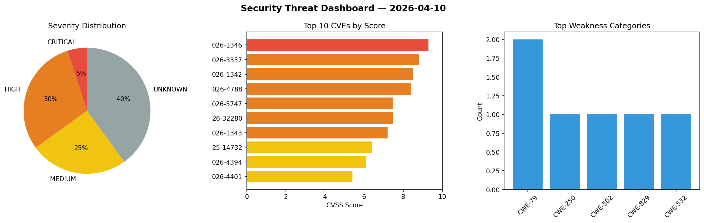
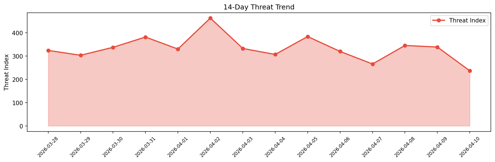

# Security Scan Report — 2026-04-10

**Scan ID:** `e338d23a94` | **CVEs:** 20 | **Threat Index:** 236.7

## Threat Overview

| Metric | Value |
|--------|-------|
| Threat Index | 236.7 |
| Critical CVEs | 1 |
| CRITICAL | 1 |
| HIGH | 6 |
| MEDIUM | 5 |
| UNKNOWN | 8 |

## Delta vs Yesterday

| Metric | Today | Yesterday | Change |
|--------|-------|-----------|--------|
| total_cves | 20 | 20 | ➡️ 0.0% |
| threat_index | 236.7 | 338.7 | 📉 -30.1% |
| critical_count | 1 | 2 | 📉 -50.0% |

## Top Weakness Categories

| CWE | Count |
|-----|-------|
| CWE-79 | 2 |
| CWE-250 | 1 |
| CWE-502 | 1 |
| CWE-829 | 1 |
| CWE-532 | 1 |

## CVE Details

| CVE ID | Score | Severity | Description |
|--------|-------|----------|-------------|
| CVE-2026-1346 | 9.3 | CRITICAL | IBM Verify Identity Access Container 11.0 through 11.0.2 and IBM Security Verify... |
| CVE-2026-3357 | 8.8 | HIGH | IBM Langflow Desktop 1.6.0 through 1.8.2 Langflow could allow an authenticated u... |
| CVE-2026-1342 | 8.5 | HIGH | IBM Verify Identity Access Container 11.0 through 11.0.2 and IBM Security Verify... |
| CVE-2026-4788 | 8.4 | HIGH | IBM Tivoli Netcool Impact 7.1.0.0 through 7.1.0.37 stores sensitive information ... |
| CVE-2026-5747 | 7.5 | HIGH | An out-of-bounds write issue in the virtio PCI transport in Amazon Firecracker 1... |
| CVE-2026-32280 | 7.5 | HIGH | During chain building, the amount of work that is done is not correctly limited ... |
| CVE-2026-1343 | 7.2 | HIGH | IBM Verify Identity Access Container 11.0 through 11.0.2 and IBM Security Verify... |
| CVE-2025-14732 | 6.4 | MEDIUM | The Elementor Website Builder – More Than Just a Page Builder plugin for WordPre... |
| CVE-2026-4394 | 6.1 | MEDIUM | The Gravity Forms plugin for WordPress is vulnerable to Stored Cross-Site Script... |
| CVE-2026-4401 | 5.4 | MEDIUM | The Download Monitor plugin for WordPress is vulnerable to Cross-Site Request Fo... |
| CVE-2026-2263 | 5.3 | MEDIUM | The Hustle – Email Marketing, Lead Generation, Optins, Popups plugin for WordPre... |
| CVE-2026-4406 | 4.7 | MEDIUM | The Gravity Forms plugin for WordPress is vulnerable to Reflected Cross-Site Scr... |
| CVE-2026-27140 | 0.0 | UNKNOWN | SWIG file names containing 'cgo' and well-crafted payloads could lead to code sm... |
| CVE-2026-27143 | 0.0 | UNKNOWN | Arithmetic over induction variables in loops were not correctly checked for unde... |
| CVE-2026-27144 | 0.0 | UNKNOWN | The compiler is meant to unwrap pointers which are the operands of a memory move... |