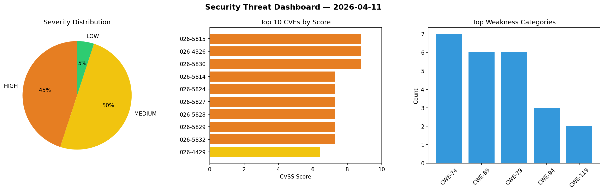
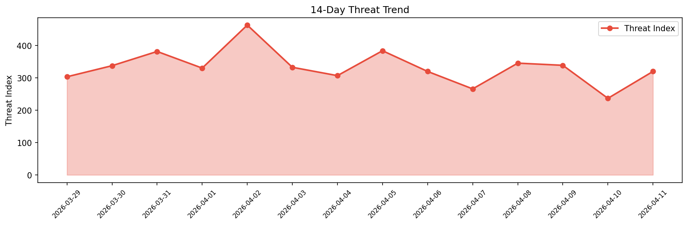

# Security Scan Report — 2026-04-11

**Scan ID:** `ee001fbc94` | **CVEs:** 20 | **Threat Index:** 319.8

## Threat Overview

| Metric | Value |
|--------|-------|
| Threat Index | 319.8 |
| Critical CVEs | 0 |
| HIGH | 9 |
| MEDIUM | 10 |
| LOW | 1 |

## Delta vs Yesterday

| Metric | Today | Yesterday | Change |
|--------|-------|-----------|--------|
| total_cves | 20 | 20 | ➡️ 0.0% |
| threat_index | 319.8 | 236.7 | 📈 35.1% |
| critical_count | 0 | 1 | 📉 -100.0% |

## Top Weakness Categories

| CWE | Count |
|-----|-------|
| CWE-74 | 7 |
| CWE-89 | 6 |
| CWE-79 | 6 |
| CWE-94 | 3 |
| CWE-119 | 2 |

## CVE Details

| CVE ID | Score | Severity | Description |
|--------|-------|----------|-------------|
| CVE-2026-5815 | 8.8 | HIGH | A vulnerability was detected in D-Link DIR-645 1.01/1.02/1.03. Impacted is the f... |
| CVE-2026-4326 | 8.8 | HIGH | The Vertex Addons for Elementor plugin for WordPress is vulnerable to Missing Au... |
| CVE-2026-5830 | 8.8 | HIGH | A vulnerability was identified in Tenda AC15 15.03.05.18. This affects the funct... |
| CVE-2026-5814 | 7.3 | HIGH | A security vulnerability has been detected in PHPGurukul Online Course Registrat... |
| CVE-2026-5824 | 7.3 | HIGH | A security vulnerability has been detected in code-projects Simple Laundry Syste... |
| CVE-2026-5827 | 7.3 | HIGH | A vulnerability has been found in code-projects Simple IT Discussion Forum 1.0. ... |
| CVE-2026-5828 | 7.3 | HIGH | A vulnerability was found in code-projects Simple IT Discussion Forum 1.0. The a... |
| CVE-2026-5829 | 7.3 | HIGH | A vulnerability was determined in code-projects Simple IT Discussion Forum 1.0. ... |
| CVE-2026-5832 | 7.3 | HIGH | A weakness has been identified in atototo api-lab-mcp up to 0.2.1. This affects ... |
| CVE-2026-4429 | 6.4 | MEDIUM | The OSM – OpenStreetMap plugin for WordPress is vulnerable to Stored Cross-Site ... |
| CVE-2026-5357 | 6.4 | MEDIUM | The Download Manager plugin for WordPress is vulnerable to Stored Cross-Site Scr... |
| CVE-2026-5823 | 6.3 | MEDIUM | A weakness has been identified in itsourcecode Construction Management System 1.... |
| CVE-2026-5831 | 6.3 | MEDIUM | A security flaw has been discovered in Agions taskflow-ai up to 2.1.8. This impa... |
| CVE-2026-4124 | 5.4 | MEDIUM | The Ziggeo plugin for WordPress is vulnerable to Missing Authorization in all ve... |
| CVE-2026-5833 | 5.3 | MEDIUM | A security vulnerability has been detected in awwaiid mcp-server-taskwarrior up ... |