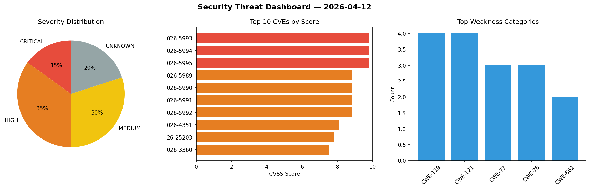
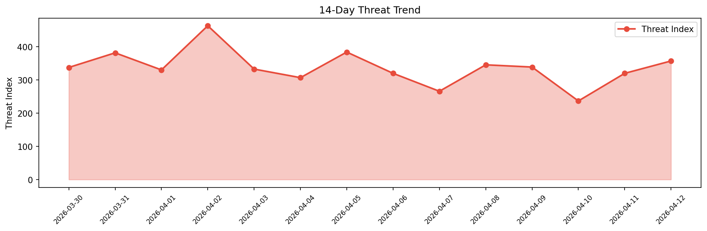

# Security Scan Report — 2026-04-12

**Scan ID:** `ab74987acf` | **CVEs:** 20 | **Threat Index:** 357.0

## Threat Overview

| Metric | Value |
|--------|-------|
| Threat Index | 357.0 |
| Critical CVEs | 3 |
| CRITICAL | 3 |
| HIGH | 7 |
| MEDIUM | 6 |
| UNKNOWN | 4 |

## Delta vs Yesterday

| Metric | Today | Yesterday | Change |
|--------|-------|-----------|--------|
| total_cves | 20 | 20 | ➡️ 0.0% |
| threat_index | 357.0 | 319.8 | 📈 11.6% |
| critical_count | 3 | 0 | ➡️ 0% |

## Top Weakness Categories

| CWE | Count |
|-----|-------|
| CWE-119 | 4 |
| CWE-121 | 4 |
| CWE-77 | 3 |
| CWE-78 | 3 |
| CWE-862 | 2 |

## CVE Details

| CVE ID | Score | Severity | Description |
|--------|-------|----------|-------------|
| CVE-2026-5993 | 9.8 | CRITICAL | A vulnerability was identified in Totolink A7100RU 7.4cu.2313_b20191024. This vu... |
| CVE-2026-5994 | 9.8 | CRITICAL | A security flaw has been discovered in Totolink A7100RU 7.4cu.2313_b20191024. Th... |
| CVE-2026-5995 | 9.8 | CRITICAL | A weakness has been identified in Totolink A7100RU 7.4cu.2313_b20191024. Impacte... |
| CVE-2026-5989 | 8.8 | HIGH | A flaw has been found in Tenda F451 1.0.0.7. Affected is the function fromRouteS... |
| CVE-2026-5990 | 8.8 | HIGH | A vulnerability has been found in Tenda F451 1.0.0.7. Affected by this vulnerabi... |
| CVE-2026-5991 | 8.8 | HIGH | A vulnerability was found in Tenda F451 1.0.0.7. Affected by this issue is the f... |
| CVE-2026-5992 | 8.8 | HIGH | A vulnerability was determined in Tenda F451 1.0.0.7. This affects the function ... |
| CVE-2026-4351 | 8.1 | HIGH | The Perfmatters plugin for WordPress is vulnerable to arbitrary file overwrite v... |
| CVE-2026-25203 | 7.8 | HIGH | Samsung MagicINFO 9 Server Incorrect Default Permissions Local Privilege Escalat... |
| CVE-2026-3360 | 7.5 | HIGH | The Tutor LMS – eLearning and online course solution plugin for WordPress is vul... |
| CVE-2026-1263 | 6.4 | MEDIUM | The Webling plugin for WordPress is vulnerable to Stored Cross-Site Scripting in... |
| CVE-2026-4305 | 6.1 | MEDIUM | The Royal WordPress Backup & Restore Plugin plugin for WordPress is vulnerable t... |
| CVE-2026-2712 | 5.4 | MEDIUM | The WP-Optimize plugin for WordPress is vulnerable to unauthorized access of fun... |
| CVE-2026-4664 | 5.3 | MEDIUM | The Customer Reviews for WooCommerce plugin for WordPress is vulnerable to authe... |
| CVE-2026-1924 | 4.3 | MEDIUM | The Aruba HiSpeed Cache plugin for WordPress is vulnerable to Cross-Site Request... |