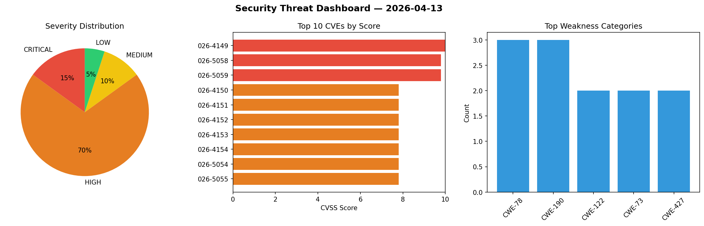
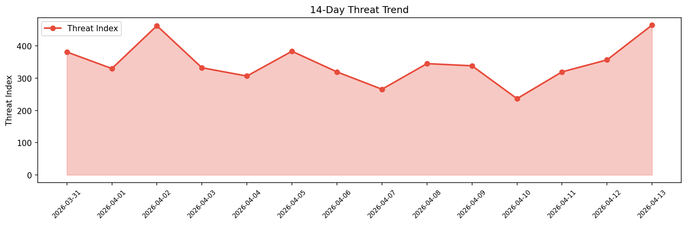

# Security Scan Report — 2026-04-13

**Scan ID:** `cee6bf2d44` | **CVEs:** 20 | **Threat Index:** 465.0

## Threat Overview

| Metric | Value |
|--------|-------|
| Threat Index | 465.0 |
| Critical CVEs | 3 |
| CRITICAL | 3 |
| HIGH | 14 |
| MEDIUM | 2 |
| LOW | 1 |

## Delta vs Yesterday

| Metric | Today | Yesterday | Change |
|--------|-------|-----------|--------|
| total_cves | 20 | 20 | ➡️ 0.0% |
| threat_index | 465.0 | 357.0 | 📈 30.3% |
| critical_count | 3 | 3 | ➡️ 0.0% |

## Top Weakness Categories

| CWE | Count |
|-----|-------|
| CWE-78 | 3 |
| CWE-190 | 3 |
| CWE-122 | 2 |
| CWE-73 | 2 |
| CWE-427 | 2 |

## CVE Details

| CVE ID | Score | Severity | Description |
|--------|-------|----------|-------------|
| CVE-2026-4149 | 10.0 | CRITICAL | Sonos Era 300 SMB Response Out-Of-Bounds Access Remote Code Execution Vulnerabil... |
| CVE-2026-5058 | 9.8 | CRITICAL | aws-mcp-server Command Injection Remote Code Execution Vulnerability. This vulne... |
| CVE-2026-5059 | 9.8 | CRITICAL | aws-mcp-server AWS CLI Command Injection Remote Code Execution Vulnerability. Th... |
| CVE-2026-4150 | 7.8 | HIGH | GIMP PSD File Parsing Integer Overflow Remote Code Execution Vulnerability. This... |
| CVE-2026-4151 | 7.8 | HIGH | GIMP ANI File Parsing Integer Overflow Remote Code Execution Vulnerability. This... |
| CVE-2026-4152 | 7.8 | HIGH | GIMP JP2 File Parsing Heap-based Buffer Overflow Remote Code Execution Vulnerabi... |
| CVE-2026-4153 | 7.8 | HIGH | GIMP PSP File Parsing Heap-based Buffer Overflow Remote Code Execution Vulnerabi... |
| CVE-2026-4154 | 7.8 | HIGH | GIMP XPM File Parsing Integer Overflow Remote Code Execution Vulnerability. This... |
| CVE-2026-5054 | 7.8 | HIGH | NoMachine External Control of File Path Local Privilege Escalation Vulnerability... |
| CVE-2026-5055 | 7.8 | HIGH | NoMachine Uncontrolled Search Path Element Local Privilege Escalation Vulnerabil... |
| CVE-2026-5493 | 7.8 | HIGH | Labcenter Electronics Proteus PDSPRJ File Parsing Out-Of-Bounds Write Remote Cod... |
| CVE-2026-4155 | 7.5 | HIGH | ChargePoint Home Flex Inclusion of Sensitive Information in Source Code Informat... |
| CVE-2026-4156 | 7.5 | HIGH | ChargePoint Home Flex OCPP getpreq Stack-based Buffer Overflow Remote Code Execu... |
| CVE-2026-4157 | 7.5 | HIGH | ChargePoint Home Flex revssh Service Command Injection Remote Code Execution Vul... |
| CVE-2026-3690 | 7.4 | HIGH | OpenClaw Canvas Authentication Bypass Vulnerability. This vulnerability allows r... |