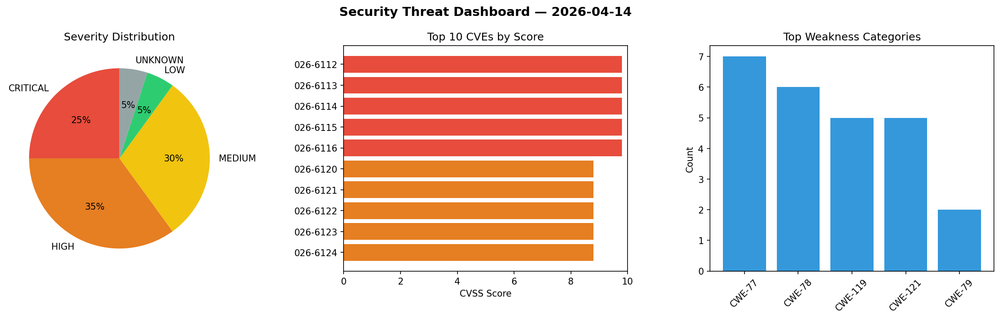
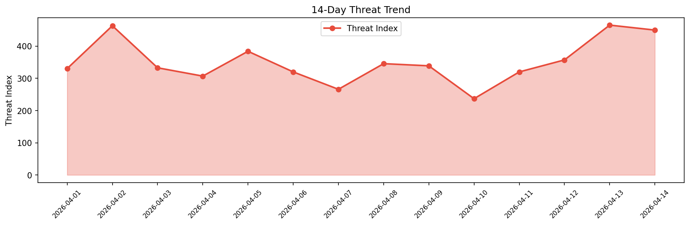

# Security Scan Report — 2026-04-14

**Scan ID:** `5b6eff6978` | **CVEs:** 20 | **Threat Index:** 449.6

## Threat Overview

| Metric | Value |
|--------|-------|
| Threat Index | 449.6 |
| Critical CVEs | 5 |
| CRITICAL | 5 |
| HIGH | 7 |
| MEDIUM | 6 |
| LOW | 1 |
| UNKNOWN | 1 |

## Delta vs Yesterday

| Metric | Today | Yesterday | Change |
|--------|-------|-----------|--------|
| total_cves | 20 | 20 | ➡️ 0.0% |
| threat_index | 449.6 | 465.0 | 📉 -3.3% |
| critical_count | 5 | 3 | 📈 66.7% |

## Top Weakness Categories

| CWE | Count |
|-----|-------|
| CWE-77 | 7 |
| CWE-78 | 6 |
| CWE-119 | 5 |
| CWE-121 | 5 |
| CWE-79 | 2 |

## CVE Details

| CVE ID | Score | Severity | Description |
|--------|-------|----------|-------------|
| CVE-2026-6112 | 9.8 | CRITICAL | A weakness has been identified in Totolink A7100RU 7.4cu.2313_b20191024. Affecte... |
| CVE-2026-6113 | 9.8 | CRITICAL | A security vulnerability has been detected in Totolink A7100RU 7.4cu.2313_b20191... |
| CVE-2026-6114 | 9.8 | CRITICAL | A vulnerability was detected in Totolink A7100RU 7.4cu.2313_b20191024. Affected ... |
| CVE-2026-6115 | 9.8 | CRITICAL | A flaw has been found in Totolink A7100RU 7.4cu.2313_b20191024. This affects the... |
| CVE-2026-6116 | 9.8 | CRITICAL | A vulnerability has been found in Totolink A7100RU 7.4cu.2313_b20191024. This vu... |
| CVE-2026-6120 | 8.8 | HIGH | A vulnerability was detected in Tenda F451 1.0.0.7. Affected is the function fro... |
| CVE-2026-6121 | 8.8 | HIGH | A flaw has been found in Tenda F451 1.0.0.7. Affected by this vulnerability is t... |
| CVE-2026-6122 | 8.8 | HIGH | A vulnerability has been found in Tenda F451 1.0.0.7. Affected by this issue is ... |
| CVE-2026-6123 | 8.8 | HIGH | A vulnerability was found in Tenda F451 1.0.0.7. This affects the function fromA... |
| CVE-2026-6124 | 8.8 | HIGH | A vulnerability was determined in Tenda F451 1.0.0.7. This vulnerability affects... |
| CVE-2026-1116 | 8.2 | HIGH | A Cross-site Scripting (XSS) vulnerability was identified in the `from_dict` met... |
| CVE-2026-6110 | 7.3 | HIGH | A vulnerability was identified in FoundationAgents MetaGPT up to 0.8.1. This aff... |
| CVE-2026-6108 | 6.3 | MEDIUM | A vulnerability was found in 1Panel-dev MaxKB up to 2.6.1. The affected element ... |
| CVE-2026-6111 | 6.3 | MEDIUM | A security flaw has been discovered in FoundationAgents MetaGPT up to 0.8.1. Thi... |
| CVE-2026-6117 | 6.3 | MEDIUM | A vulnerability was found in AstrBotDevs AstrBot up to 4.22.1. This issue affect... |