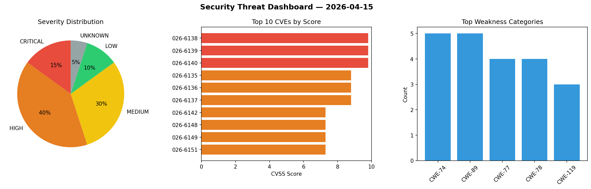
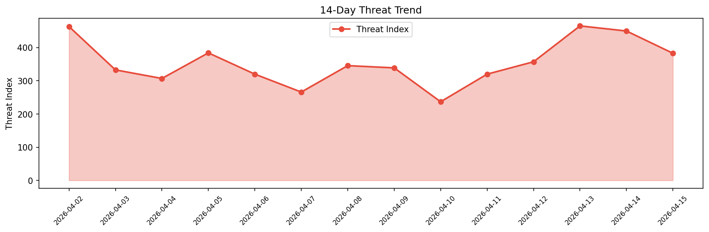

# Security Scan Report — 2026-04-15

**Scan ID:** `39c1c25c87` | **CVEs:** 20 | **Threat Index:** 382.6

## Threat Overview

| Metric | Value |
|--------|-------|
| Threat Index | 382.6 |
| Critical CVEs | 3 |
| CRITICAL | 3 |
| HIGH | 8 |
| MEDIUM | 6 |
| LOW | 2 |
| UNKNOWN | 1 |

## Delta vs Yesterday

| Metric | Today | Yesterday | Change |
|--------|-------|-----------|--------|
| total_cves | 20 | 20 | ➡️ 0.0% |
| threat_index | 382.6 | 449.6 | 📉 -14.9% |
| critical_count | 3 | 5 | 📉 -40.0% |

## Top Weakness Categories

| CWE | Count |
|-----|-------|
| CWE-74 | 5 |
| CWE-89 | 5 |
| CWE-77 | 4 |
| CWE-78 | 4 |
| CWE-119 | 3 |

## CVE Details

| CVE ID | Score | Severity | Description |
|--------|-------|----------|-------------|
| CVE-2026-6138 | 9.8 | CRITICAL | A flaw has been found in Totolink A7100RU 7.4cu.2313_b20191024. The impacted ele... |
| CVE-2026-6139 | 9.8 | CRITICAL | A vulnerability has been found in Totolink A7100RU 7.4cu.2313_b20191024. This af... |
| CVE-2026-6140 | 9.8 | CRITICAL | A vulnerability was found in Totolink A7100RU 7.4cu.2313_b20191024. This impacts... |
| CVE-2026-6135 | 8.8 | HIGH | A weakness has been identified in Tenda F451 1.0.0.7_cn_svn7958. This issue affe... |
| CVE-2026-6136 | 8.8 | HIGH | A security vulnerability has been detected in Tenda F451 1.0.0.7_cn_svn7958. Imp... |
| CVE-2026-6137 | 8.8 | HIGH | A vulnerability was detected in Tenda F451 1.0.0.7_cn_svn7958. The affected elem... |
| CVE-2026-6142 | 7.3 | HIGH | A vulnerability was identified in tushar-2223 Hotel Management System up to bb1f... |
| CVE-2026-6148 | 7.3 | HIGH | A vulnerability was detected in code-projects Vehicle Showroom Management System... |
| CVE-2026-6149 | 7.3 | HIGH | A flaw has been found in code-projects Vehicle Showroom Management System 1.0. A... |
| CVE-2026-6151 | 7.3 | HIGH | A vulnerability was found in code-projects Vehicle Showroom Management System 1.... |
| CVE-2026-6152 | 7.3 | HIGH | A vulnerability was determined in code-projects Vehicle Showroom Management Syst... |
| CVE-2026-28553 | 6.9 | MEDIUM | Vulnerability of improper permission control in the theme setting module.
Impact... |
| CVE-2026-6141 | 6.3 | MEDIUM | A vulnerability was determined in danielmiessler Personal_AI_Infrastructure up t... |
| CVE-2026-6143 | 6.3 | MEDIUM | A security flaw has been discovered in farion1231 cc-switch up to 3.12.3. Affect... |
| CVE-2026-25204 | 6.2 | MEDIUM | Deserialization of untrusted data vulnerability in Samsung Open Source Escargot ... |