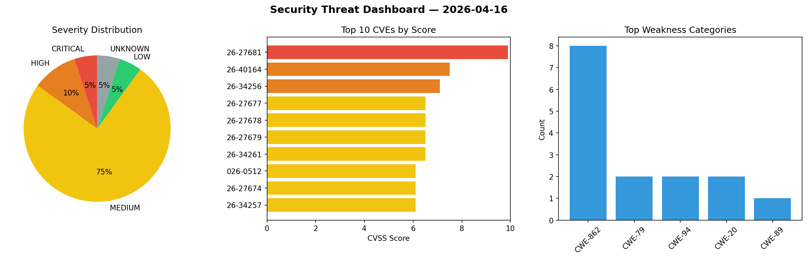
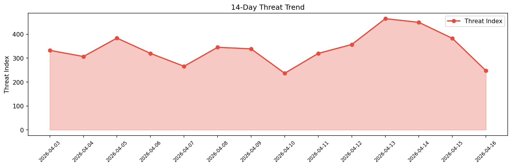

# Security Scan Report — 2026-04-16

**Scan ID:** `5a28ed6bf2` | **CVEs:** 20 | **Threat Index:** 247.4

## Threat Overview

| Metric | Value |
|--------|-------|
| Threat Index | 247.4 |
| Critical CVEs | 1 |
| CRITICAL | 1 |
| HIGH | 2 |
| MEDIUM | 15 |
| LOW | 1 |
| UNKNOWN | 1 |

## Delta vs Yesterday

| Metric | Today | Yesterday | Change |
|--------|-------|-----------|--------|
| total_cves | 20 | 20 | ➡️ 0.0% |
| threat_index | 247.4 | 382.6 | 📉 -35.3% |
| critical_count | 1 | 3 | 📉 -66.7% |

## Top Weakness Categories

| CWE | Count |
|-----|-------|
| CWE-862 | 8 |
| CWE-79 | 2 |
| CWE-94 | 2 |
| CWE-20 | 2 |
| CWE-89 | 1 |

## CVE Details

| CVE ID | Score | Severity | Description |
|--------|-------|----------|-------------|
| CVE-2026-27681 | 9.9 | CRITICAL | Due to insufficient authorization checks in SAP Business Planning and Consolidat... |
| CVE-2026-40164 | 7.5 | HIGH | jq is a command-line JSON processor. Before commit 0c7d133c3c7e37c00b6d46b658a02... |
| CVE-2026-34256 | 7.1 | HIGH | Due to a missing authorization check in SAP ERP and SAP S/4HANA (Private Cloud a... |
| CVE-2026-27677 | 6.5 | MEDIUM | Due to missing authorization checks in the SAP S/4HANA OData Service (Manage Ref... |
| CVE-2026-27678 | 6.5 | MEDIUM | Due to missing authorization checks in the SAP S/4HANA backend OData Service (Ma... |
| CVE-2026-27679 | 6.5 | MEDIUM | Due to missing authorization checks in the SAP S/4HANA frontend OData Service (M... |
| CVE-2026-34261 | 6.5 | MEDIUM | Due to a missing authorization check in SAP Business Analytics and SAP Content M... |
| CVE-2026-0512 | 6.1 | MEDIUM | Due to a Cross-Site Scripting (XSS) vulnerability in the SAP Supplier Relationsh... |
| CVE-2026-27674 | 6.1 | MEDIUM | Due to a Code Injection vulnerability in SAP NetWeaver Application Server Java (... |
| CVE-2026-34257 | 6.1 | MEDIUM | Due to an Open Redirect vulnerability in SAP NetWeaver Application Server ABAP, ... |
| CVE-2026-34069 | 5.3 | MEDIUM | nimiq/core-rs-albatross is a Rust implementation of the Nimiq Proof-of-Stake pro... |
| CVE-2026-34262 | 5.0 | MEDIUM | Information Disclosure Vulnerability in SAP HANA Cockpit and HANA Database Explo... |
| CVE-2026-27673 | 4.9 | MEDIUM | Due to a missing authorization check, SAP S/4HANA (Private Cloud and On-Premise)... |
| CVE-2026-39417 | 4.6 | MEDIUM | MaxKB is an open-source AI assistant for enterprise. Versions 2.7.1 and below co... |
| CVE-2026-27672 | 4.3 | MEDIUM | The Material Master application does not enforce authorization checks for authen... |