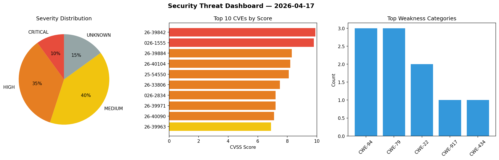
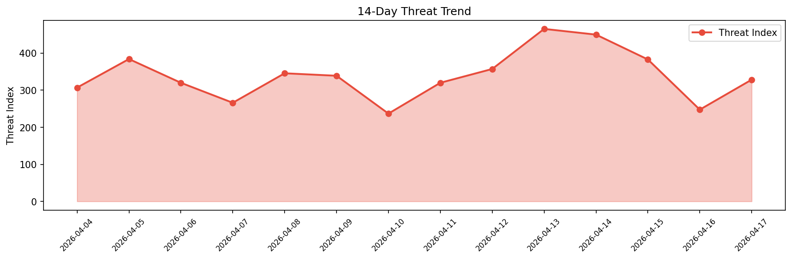

# Security Scan Report — 2026-04-17

**Scan ID:** `9ecc46e570` | **CVEs:** 20 | **Threat Index:** 328.2

## Threat Overview

| Metric | Value |
|--------|-------|
| Threat Index | 328.2 |
| Critical CVEs | 2 |
| CRITICAL | 2 |
| HIGH | 7 |
| MEDIUM | 8 |
| UNKNOWN | 3 |

## Delta vs Yesterday

| Metric | Today | Yesterday | Change |
|--------|-------|-----------|--------|
| total_cves | 20 | 20 | ➡️ 0.0% |
| threat_index | 328.2 | 247.4 | 📈 32.7% |
| critical_count | 2 | 1 | 📈 100.0% |

## Top Weakness Categories

| CWE | Count |
|-----|-------|
| CWE-94 | 3 |
| CWE-79 | 3 |
| CWE-22 | 2 |
| CWE-917 | 1 |
| CWE-434 | 1 |

## CVE Details

| CVE ID | Score | Severity | Description |
|--------|-------|----------|-------------|
| CVE-2026-39842 | 9.9 | CRITICAL | OpenRemote is an open-source IoT platform. Versions 1.21.0 and below contain two... |
| CVE-2026-1555 | 9.8 | CRITICAL | The WebStack theme for WordPress is vulnerable to arbitrary file uploads due to ... |
| CVE-2026-39884 | 8.3 | HIGH | mcp-server-kubernetes is a Model Context Protocol server for Kubernetes cluster ... |
| CVE-2026-40104 | 8.2 | HIGH | XWiki Platform is a generic wiki platform offering runtime services for applicat... |
| CVE-2025-54550 | 8.1 | HIGH | The example example_xcom that was included in airflow documentation implemented ... |
| CVE-2026-33806 | 7.5 | HIGH | Impact:

Fastify applications using schema.body.content for per-content-type bod... |
| CVE-2026-2834 | 7.2 | HIGH | The Age Verification & Identity Verification by Token of Trust plugin for WordPr... |
| CVE-2026-39971 | 7.2 | HIGH | Serendipity is a PHP-powered weblog engine. In versions 2.6-beta2 and below, the... |
| CVE-2026-40090 | 7.1 | HIGH | Zarf is an Airgap Native Packager Manager for Kubernetes. Versions 0.23.0 throug... |
| CVE-2026-39963 | 6.9 | MEDIUM | Serendipity is a PHP-powered weblog engine. In versions 2.6-beta2  and below, th... |
| CVE-2025-15470 | 6.5 | MEDIUM | The Eleganzo theme for WordPress is vulnerable to arbitrary directory deletion d... |
| CVE-2026-40091 | 6.0 | MEDIUM | SpiceDB is an open source database system for creating and managing security-cri... |
| CVE-2026-39984 | 5.5 | MEDIUM | Sigstore Timestamp Authority is a service for issuing RFC 3161 timestamps. Versi... |
| CVE-2026-1509 | 5.4 | MEDIUM | The Avada (Fusion) Builder plugin for WordPress is vulnerable to Arbitrary WordP... |
| CVE-2026-1314 | 5.3 | MEDIUM | The 3D FlipBook – PDF Embedder, PDF Flipbook Viewer, Flipbook Image Gallery plug... |