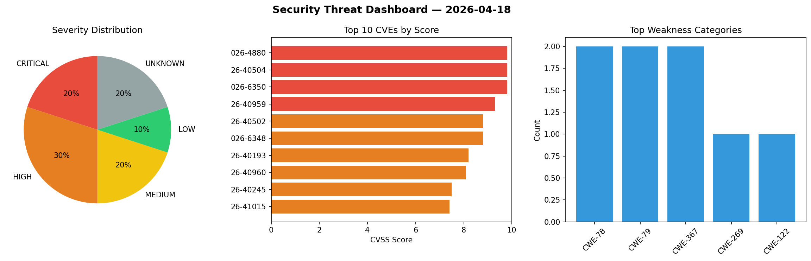
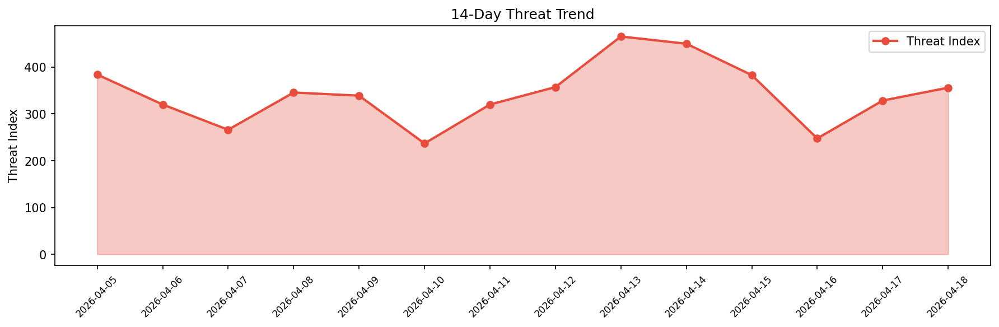

# Security Scan Report — 2026-04-18

**Scan ID:** `179e69826f` | **CVEs:** 20 | **Threat Index:** 355.8

## Threat Overview

| Metric | Value |
|--------|-------|
| Threat Index | 355.8 |
| Critical CVEs | 4 |
| CRITICAL | 4 |
| HIGH | 6 |
| MEDIUM | 4 |
| LOW | 2 |
| UNKNOWN | 4 |

## Delta vs Yesterday

| Metric | Today | Yesterday | Change |
|--------|-------|-----------|--------|
| total_cves | 20 | 20 | ➡️ 0.0% |
| threat_index | 355.8 | 328.2 | 📈 8.4% |
| critical_count | 4 | 2 | 📈 100.0% |

## Top Weakness Categories

| CWE | Count |
|-----|-------|
| CWE-78 | 2 |
| CWE-79 | 2 |
| CWE-367 | 2 |
| CWE-269 | 1 |
| CWE-122 | 1 |

## CVE Details

| CVE ID | Score | Severity | Description |
|--------|-------|----------|-------------|
| CVE-2026-4880 | 9.8 | CRITICAL | The Barcode Scanner (+Mobile App) – Inventory manager, Order fulfillment system,... |
| CVE-2026-40504 | 9.8 | CRITICAL | Creolabs Gravity before 0.9.6 contains a heap buffer overflow vulnerability in t... |
| CVE-2026-6350 | 9.8 | CRITICAL | MailGates/MailAudit developed by Openfind has a Stack-based Buffer Overflow vuln... |
| CVE-2026-40959 | 9.3 | CRITICAL | Luanti 5 before 5.15.2, when LuaJIT is used, allows a Lua sandbox escape via a c... |
| CVE-2026-40502 | 8.8 | HIGH | OpenHarness prior to commit dd1d235 contains a command injection vulnerability t... |
| CVE-2026-6348 | 8.8 | HIGH | WinMatrix agent developed by Simopro Technology has a Missing Authentication vul... |
| CVE-2026-40193 | 8.2 | HIGH | maddy is a composable, all-in-one mail server. Versions prior to 0.9.3 contain a... |
| CVE-2026-40960 | 8.1 | HIGH | Luanti 5 before 5.15.2 sometimes allows unintended access to an insecure environ... |
| CVE-2026-40245 | 7.5 | HIGH | Free5GC is an open-source Linux Foundation project for 5th generation (5G) mobil... |
| CVE-2026-41015 | 7.4 | HIGH | radare2 before 9236f44, when configured on UNIX without SSL, allows command inje... |
| CVE-2026-40503 | 6.5 | MEDIUM | OpenHarness prior to commit dd1d235 contains a path traversal vulnerability that... |
| CVE-2026-3299 | 6.4 | MEDIUM | The WP YouTube Lyte plugin for WordPress is vulnerable to Stored Cross-Site Scri... |
| CVE-2026-3885 | 6.4 | MEDIUM | The WP Shortcodes Plugin — Shortcodes Ultimate plugin for WordPress is vulnerabl... |
| CVE-2026-40962 | 4.9 | MEDIUM | FFmpeg before 8.1 has an integer overflow and resultant out-of-bounds write via ... |
| CVE-2026-40505 | 3.3 | LOW | MuPDF before 1.27 contains an ANSI injection vulnerability in mutool that allows... |