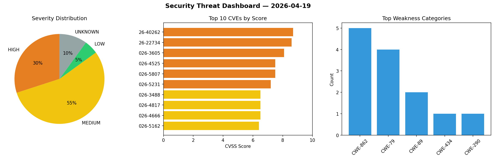
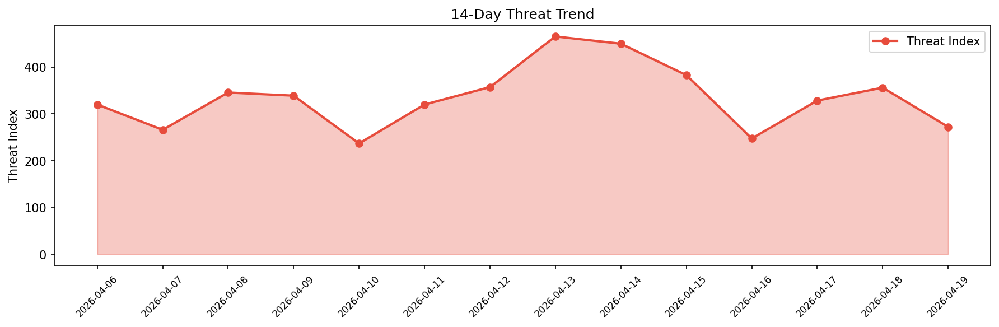

# Security Scan Report — 2026-04-19

**Scan ID:** `36e11e979d` | **CVEs:** 20 | **Threat Index:** 272.1

## Threat Overview

| Metric | Value |
|--------|-------|
| Threat Index | 272.1 |
| Critical CVEs | 0 |
| HIGH | 6 |
| MEDIUM | 11 |
| LOW | 1 |
| UNKNOWN | 2 |

## Delta vs Yesterday

| Metric | Today | Yesterday | Change |
|--------|-------|-----------|--------|
| total_cves | 20 | 20 | ➡️ 0.0% |
| threat_index | 272.1 | 355.8 | 📉 -23.5% |
| critical_count | 0 | 4 | 📉 -100.0% |

## Top Weakness Categories

| CWE | Count |
|-----|-------|
| CWE-862 | 5 |
| CWE-79 | 4 |
| CWE-89 | 2 |
| CWE-434 | 1 |
| CWE-290 | 1 |

## CVE Details

| CVE ID | Score | Severity | Description |
|--------|-------|----------|-------------|
| CVE-2026-40262 | 8.7 | HIGH | Note Mark is an open-source note-taking application. In versions 0.19.1 and prio... |
| CVE-2026-22734 | 8.6 | HIGH | Cloud Foundry UUA is vulnerable to a bypass that allows an attacker to obtain a ... |
| CVE-2026-3605 | 8.1 | HIGH | An authenticated user with access to a kvv2 path through a policy containing a g... |
| CVE-2026-4525 | 7.5 | HIGH | If a Vault auth mount is configured to pass through the "Authorization" header, ... |
| CVE-2026-5807 | 7.5 | HIGH | Vault is vulnerable to a denial-of-service condition where an unauthenticated at... |
| CVE-2026-5231 | 7.2 | HIGH | The WP Statistics plugin for WordPress is vulnerable to Stored Cross-Site Script... |
| CVE-2026-3488 | 6.5 | MEDIUM | The WP Statistics plugin for WordPress is vulnerable to Missing Authorization in... |
| CVE-2026-4817 | 6.5 | MEDIUM | The MasterStudy LMS WordPress Plugin for Online Courses and Education plugin for... |
| CVE-2026-4666 | 6.5 | MEDIUM | The wpForo Forum plugin for WordPress is vulnerable to unauthorized modification... |
| CVE-2026-5162 | 6.4 | MEDIUM | The Royal Addons for Elementor plugin for WordPress is vulnerable to Stored Cros... |
| CVE-2026-40265 | 5.9 | MEDIUM | Note Mark is an open-source note-taking application. In versions 0.19.1 and prio... |
| CVE-2026-5052 | 5.3 | MEDIUM | Vault’s PKI engine’s ACME validation did not reject local targets when issuing h... |
| CVE-2026-5234 | 5.3 | MEDIUM | The LatePoint plugin for WordPress is vulnerable to Insecure Direct Object Refer... |
| CVE-2026-5427 | 5.3 | MEDIUM | The Kubio plugin for WordPress is vulnerable to Arbitrary File Upload in version... |
| CVE-2026-5502 | 5.3 | MEDIUM | The Tutor LMS – eLearning and online course solution plugin for WordPress is vul... |