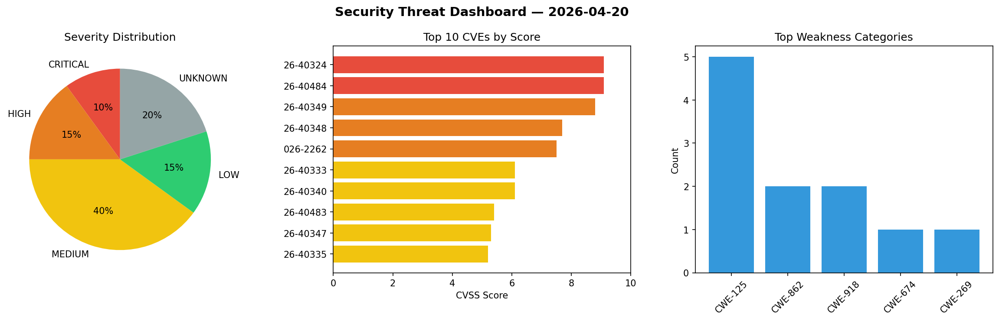
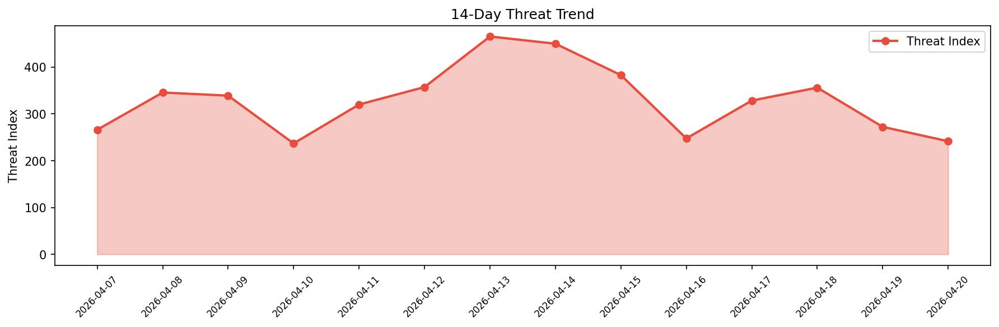

# Security Scan Report — 2026-04-20

**Scan ID:** `1f77efeac8` | **CVEs:** 20 | **Threat Index:** 241.4

## Threat Overview

| Metric | Value |
|--------|-------|
| Threat Index | 241.4 |
| Critical CVEs | 2 |
| CRITICAL | 2 |
| HIGH | 3 |
| MEDIUM | 8 |
| LOW | 3 |
| UNKNOWN | 4 |

## Delta vs Yesterday

| Metric | Today | Yesterday | Change |
|--------|-------|-----------|--------|
| total_cves | 20 | 20 | ➡️ 0.0% |
| threat_index | 241.4 | 272.1 | 📉 -11.3% |
| critical_count | 2 | 0 | ➡️ 0% |

## Top Weakness Categories

| CWE | Count |
|-----|-------|
| CWE-125 | 5 |
| CWE-862 | 2 |
| CWE-918 | 2 |
| CWE-674 | 1 |
| CWE-269 | 1 |

## CVE Details

| CVE ID | Score | Severity | Description |
|--------|-------|----------|-------------|
| CVE-2026-40324 | 9.1 | CRITICAL | Hot Chocolate is an open-source GraphQL server. Prior to versions 12.22.7, 13.9.... |
| CVE-2026-40484 | 9.1 | CRITICAL | ChurchCRM is an open-source church management system. In versions prior to 7.2.0... |
| CVE-2026-40349 | 8.8 | HIGH | Movary is a self hosted web app to track and rate a user's watched movies. Prior... |
| CVE-2026-40348 | 7.7 | HIGH | Movary is a self hosted web app to track and rate a user's watched movies. Prior... |
| CVE-2026-2262 | 7.5 | HIGH | The Easy Appointments plugin for WordPress is vulnerable to Sensitive Informatio... |
| CVE-2026-40333 | 6.1 | MEDIUM | libgphoto2 is a camera access and control library. In versions up to and includi... |
| CVE-2026-40340 | 6.1 | MEDIUM | libgphoto2 is a camera access and control library. Versions up to and including ... |
| CVE-2026-40483 | 5.4 | MEDIUM | ChurchCRM is an open-source church management system. In versions prior to 7.2.0... |
| CVE-2026-40347 | 5.3 | MEDIUM | Python-Multipart is a streaming multipart parser for Python. Versions prior to 0... |
| CVE-2026-40335 | 5.2 | MEDIUM | libgphoto2 is a camera access and control library. Versions up to and including ... |
| CVE-2026-40338 | 5.2 | MEDIUM | libgphoto2 is a camera access and control library. Versions up to and including ... |
| CVE-2026-40339 | 5.2 | MEDIUM | libgphoto2 is a camera access and control library. Versions up to and including ... |
| CVE-2026-40337 | 5.1 | MEDIUM | The Sentry kernel is a high security level micro-kernel implementation made for ... |
| CVE-2026-40334 | 3.5 | LOW | libgphoto2 is a camera access and control library. In versions up to and includi... |
| CVE-2026-40341 | 3.5 | LOW | libgphoto2 is a camera access and control library. In versions up to and includi... |