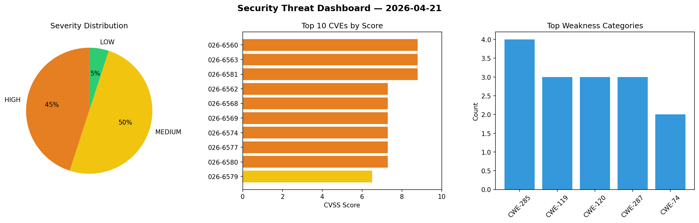
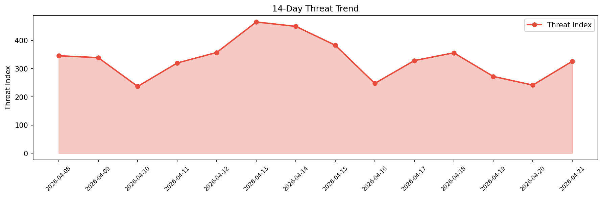

# Security Scan Report — 2026-04-21

**Scan ID:** `cbd6729d4a` | **CVEs:** 20 | **Threat Index:** 325.9

## Threat Overview

| Metric | Value |
|--------|-------|
| Threat Index | 325.9 |
| Critical CVEs | 0 |
| HIGH | 9 |
| MEDIUM | 10 |
| LOW | 1 |

## Delta vs Yesterday

| Metric | Today | Yesterday | Change |
|--------|-------|-----------|--------|
| total_cves | 20 | 20 | ➡️ 0.0% |
| threat_index | 325.9 | 241.4 | 📈 35.0% |
| critical_count | 0 | 2 | 📉 -100.0% |

## Top Weakness Categories

| CWE | Count |
|-----|-------|
| CWE-285 | 4 |
| CWE-119 | 3 |
| CWE-120 | 3 |
| CWE-287 | 3 |
| CWE-74 | 2 |

## CVE Details

| CVE ID | Score | Severity | Description |
|--------|-------|----------|-------------|
| CVE-2026-6560 | 8.8 | HIGH | A security vulnerability has been detected in H3C Magic B0 up to 100R002. This v... |
| CVE-2026-6563 | 8.8 | HIGH | A vulnerability has been found in H3C Magic B1 up to 100R004. The affected eleme... |
| CVE-2026-6581 | 8.8 | HIGH | A vulnerability was detected in H3C Magic B1 up to 100R004. Affected by this vul... |
| CVE-2026-6562 | 7.3 | HIGH | A flaw has been found in dameng100 muucmf 1.9.5.20260309. Impacted is the functi... |
| CVE-2026-6568 | 7.3 | HIGH | A vulnerability was determined in kodcloud KodExplorer up to 4.52. This affects ... |
| CVE-2026-6569 | 7.3 | HIGH | A vulnerability was identified in kodcloud KodExplorer up to 4.52. This impacts ... |
| CVE-2026-6574 | 7.3 | HIGH | A vulnerability has been found in osuuu LightPicture up to 1.2.2. This issue aff... |
| CVE-2026-6577 | 7.3 | HIGH | A vulnerability was identified in liangliangyy DjangoBlog up to 2.1.0.0. The imp... |
| CVE-2026-6580 | 7.3 | HIGH | A security vulnerability has been detected in liangliangyy DjangoBlog up to 2.1.... |
| CVE-2026-6579 | 6.5 | MEDIUM | A weakness has been identified in liangliangyy DjangoBlog up to 2.1.0.0. This im... |
| CVE-2026-0868 | 6.4 | MEDIUM | The EMC – Easily Embed Calendly Scheduling Features plugin for WordPress is vuln... |
| CVE-2026-6571 | 6.3 | MEDIUM | A weakness has been identified in kodcloud KodExplorer up to 4.52. Affected by t... |
| CVE-2026-6573 | 6.3 | MEDIUM | A vulnerability was detected in PHPEMS 11.0. This affects the function temppage ... |
| CVE-2026-6576 | 6.3 | MEDIUM | A vulnerability was determined in liangliangyy DjangoBlog up to 2.1.0.0. The aff... |
| CVE-2026-6572 | 5.6 | MEDIUM | A security vulnerability has been detected in Collabora KodExplorer up to 4.52. ... |