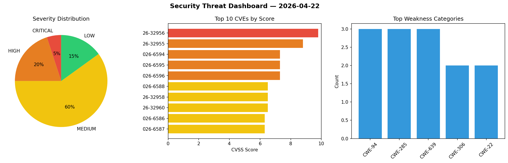
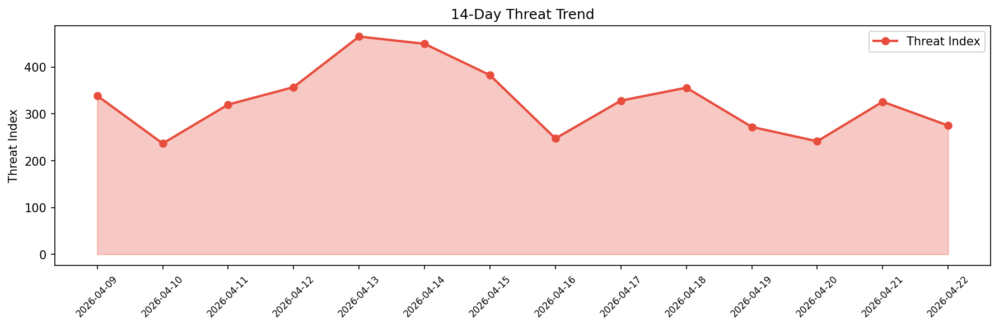

# Security Scan Report — 2026-04-22

**Scan ID:** `af09bcd6db` | **CVEs:** 20 | **Threat Index:** 275.0

## Threat Overview

| Metric | Value |
|--------|-------|
| Threat Index | 275.0 |
| Critical CVEs | 1 |
| CRITICAL | 1 |
| HIGH | 4 |
| MEDIUM | 12 |
| LOW | 3 |

## Delta vs Yesterday

| Metric | Today | Yesterday | Change |
|--------|-------|-----------|--------|
| total_cves | 20 | 20 | ➡️ 0.0% |
| threat_index | 275.0 | 325.9 | 📉 -15.6% |
| critical_count | 1 | 0 | ➡️ 0% |

## Top Weakness Categories

| CWE | Count |
|-----|-------|
| CWE-94 | 3 |
| CWE-285 | 3 |
| CWE-639 | 3 |
| CWE-306 | 2 |
| CWE-22 | 2 |

## CVE Details

| CVE ID | Score | Severity | Description |
|--------|-------|----------|-------------|
| CVE-2026-32956 | 9.8 | CRITICAL | SD-330AC and AMC Manager provided by silex technology, Inc. contain a heap-based... |
| CVE-2026-32955 | 8.8 | HIGH | SD-330AC and AMC Manager provided by silex technology, Inc. contain a stack-base... |
| CVE-2026-6594 | 7.3 | HIGH | A vulnerability was determined in brikcss merge up to 1.3.0. This affects an unk... |
| CVE-2026-6595 | 7.3 | HIGH | A vulnerability was identified in ProjectsAndPrograms School Management System u... |
| CVE-2026-6596 | 7.3 | HIGH | A security flaw has been discovered in langflow-ai langflow up to 1.1.0. This is... |
| CVE-2026-6588 | 6.5 | MEDIUM | A weakness has been identified in serge-chat serge up to 1.4TB. The impacted ele... |
| CVE-2026-32958 | 6.5 | MEDIUM | SD-330AC and AMC Manager provided by silex technology, Inc. use a hard-coded cry... |
| CVE-2026-32960 | 6.5 | MEDIUM | SD-330AC and AMC Manager provided by silex technology, Inc. contain an issue wit... |
| CVE-2026-6586 | 6.3 | MEDIUM | A vulnerability was identified in TransformerOptimus SuperAGI up to 0.0.14. Impa... |
| CVE-2026-6587 | 6.3 | MEDIUM | A security flaw has been discovered in vibrantlabsai RAGAS up to 0.4.3. The affe... |
| CVE-2026-32959 | 5.9 | MEDIUM | SD-330AC and AMC Manager provided by silex technology, Inc. contain an issue wit... |
| CVE-2026-6584 | 5.4 | MEDIUM | A vulnerability was found in TransformerOptimus SuperAGI up to 0.0.14. This vuln... |
| CVE-2026-6585 | 5.4 | MEDIUM | A vulnerability was determined in TransformerOptimus SuperAGI up to 0.0.14. This... |
| CVE-2026-32957 | 5.3 | MEDIUM | SD-330AC and AMC Manager provided by silex technology, Inc. contain a missing au... |
| CVE-2026-6589 | 4.3 | MEDIUM | A security vulnerability has been detected in ComfyUI up to 0.13.0. This affects... |