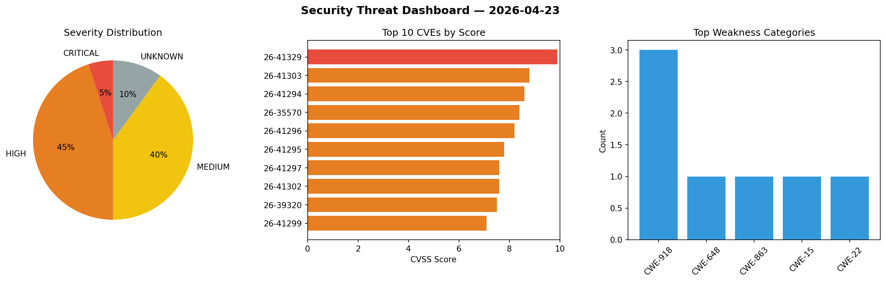
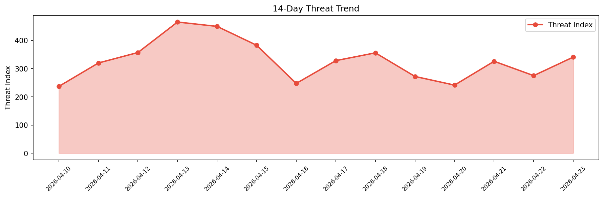

# Security Scan Report — 2026-04-23

**Scan ID:** `d0c8f8717c` | **CVEs:** 20 | **Threat Index:** 340.8

## Threat Overview

| Metric | Value |
|--------|-------|
| Threat Index | 340.8 |
| Critical CVEs | 1 |
| CRITICAL | 1 |
| HIGH | 9 |
| MEDIUM | 8 |
| UNKNOWN | 2 |

## Delta vs Yesterday

| Metric | Today | Yesterday | Change |
|--------|-------|-----------|--------|
| total_cves | 20 | 20 | ➡️ 0.0% |
| threat_index | 340.8 | 275.0 | 📈 23.9% |
| critical_count | 1 | 1 | ➡️ 0.0% |

## Top Weakness Categories

| CWE | Count |
|-----|-------|
| CWE-918 | 3 |
| CWE-648 | 1 |
| CWE-863 | 1 |
| CWE-15 | 1 |
| CWE-22 | 1 |

## CVE Details

| CVE ID | Score | Severity | Description |
|--------|-------|----------|-------------|
| CVE-2026-41329 | 9.9 | CRITICAL | OpenClaw before 2026.3.31 contains a sandbox bypass vulnerability allowing attac... |
| CVE-2026-41303 | 8.8 | HIGH | OpenClaw before 2026.3.28 contains an authorization bypass vulnerability in Disc... |
| CVE-2026-41294 | 8.6 | HIGH | OpenClaw before 2026.3.28 loads the current working directory .env file before t... |
| CVE-2026-35570 | 8.4 | HIGH | OpenClaude is an open-source coding-agent command line interface for cloud and l... |
| CVE-2026-41296 | 8.2 | HIGH | OpenClaw before 2026.3.31 contains a time-of-check-time-of-use race condition in... |
| CVE-2026-41295 | 7.8 | HIGH | OpenClaw before 2026.4.2 contains an improper trust boundary vulnerability allow... |
| CVE-2026-41297 | 7.6 | HIGH | OpenClaw before 2026.3.31 contains a server-side request forgery vulnerability i... |
| CVE-2026-41302 | 7.6 | HIGH | OpenClaw before 2026.3.31 contains a server-side request forgery vulnerability i... |
| CVE-2026-39320 | 7.5 | HIGH | Signal K Server is a server application that runs on a central hub in a boat. Ve... |
| CVE-2026-41299 | 7.1 | HIGH | OpenClaw before 2026.3.28 contains an authorization bypass vulnerability in the ... |
| CVE-2026-41300 | 6.5 | MEDIUM | OpenClaw before 2026.3.31 contains a trust-decline vulnerability that preserves ... |
| CVE-2026-35588 | 6.3 | MEDIUM | Glances is an open-source system cross-platform monitoring tool. Prior to versio... |
| CVE-2026-40045 | 5.7 | MEDIUM | OpenClaw before 2026.4.2 accepts non-loopback cleartext ws:// gateway endpoints ... |
| CVE-2026-41298 | 5.4 | MEDIUM | OpenClaw before 2026.4.2 fails to enforce write scopes on the POST /sessions/:se... |
| CVE-2026-41301 | 5.3 | MEDIUM | OpenClaw versions 2026.3.22 before 2026.3.31 contain a signature verification by... |