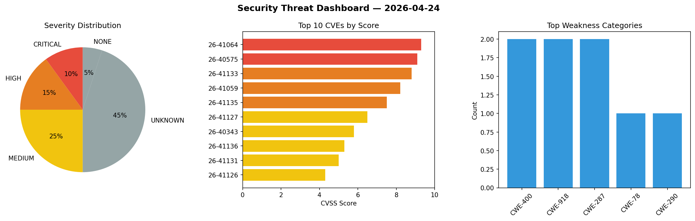
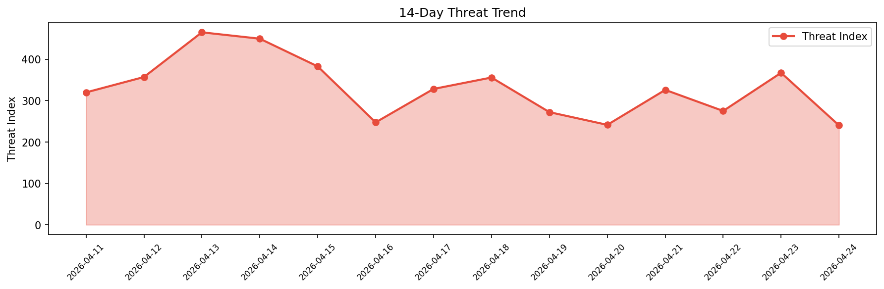

# Security Scan Report — 2026-04-24

**Scan ID:** `c753679a07` | **CVEs:** 20 | **Threat Index:** 240.1

## Threat Overview

| Metric | Value |
|--------|-------|
| Threat Index | 240.1 |
| Critical CVEs | 3 |
| CRITICAL | 3 |
| HIGH | 3 |
| MEDIUM | 5 |
| UNKNOWN | 8 |
| NONE | 1 |

## Delta vs Yesterday

| Metric | Today | Yesterday | Change |
|--------|-------|-----------|--------|
| total_cves | 20 | 20 | ➡️ 0.0% |
| threat_index | 240.1 | 367.2 | 📉 -34.6% |
| critical_count | 3 | 1 | 📈 200.0% |

## Top Weakness Categories

| CWE | Count |
|-----|-------|
| CWE-400 | 2 |
| CWE-918 | 2 |
| CWE-287 | 2 |
| CWE-77 | 1 |
| CWE-78 | 1 |

## CVE Details

| CVE ID | Score | Severity | Description |
|--------|-------|----------|-------------|
| CVE-2026-41304 | 9.8 | CRITICAL | WWBN AVideo is an open source video platform. In versions 29.0 and below, the `c... |
| CVE-2026-41064 | 9.3 | CRITICAL | WWBN AVideo is an open source video platform. In versions up to and including 29... |
| CVE-2026-40575 | 9.1 | CRITICAL | OAuth2 Proxy is a reverse proxy that provides authentication using OAuth2 provid... |
| CVE-2026-41133 | 8.8 | HIGH | pyLoad is a free and open-source download manager written in Python. Versions up... |
| CVE-2026-41059 | 8.2 | HIGH | OAuth2 Proxy is a reverse proxy that provides authentication using OAuth2 provid... |
| CVE-2026-41135 | 7.5 | HIGH | free5GC UDR is the Policy Control Function (PCF) for free5GC, an an open-source ... |
| CVE-2026-41127 | 6.5 | MEDIUM | BigBlueButton is an open-source virtual classroom. Versions prior to 3.0.24 have... |
| CVE-2026-40343 | 5.8 | MEDIUM | free5GC UDR is the user data repository (UDR) for free5GC, an an open-source pro... |
| CVE-2026-41136 | 5.3 | MEDIUM | free5GC AMF provides Access & Mobility Management Function (AMF) for free5GC, an... |
| CVE-2026-41131 | 5.0 | MEDIUM | OpenFGA is an authorization/permission engine built for developers. Prior to ver... |
| CVE-2026-41126 | 4.3 | MEDIUM | BigBlueButton is an open-source virtual classroom. Versions prior to 3.0.24 have... |
| CVE-2026-41128 | 0.0 | UNKNOWN | Craft CMS is a content management system (CMS). In versions 5.6.0 through 5.9.14... |
| CVE-2026-41129 | 0.0 | UNKNOWN | Craft CMS is a content management system (CMS). Versions on the 4.x branch throu... |
| CVE-2026-41130 | 0.0 | UNKNOWN | Craft CMS is a content management system (CMS). In versions on the 4.x branch th... |
| CVE-2026-41144 | 0.0 | NONE | F´ (F Prime) is a framework that enables development and deployment of spaceflig... |