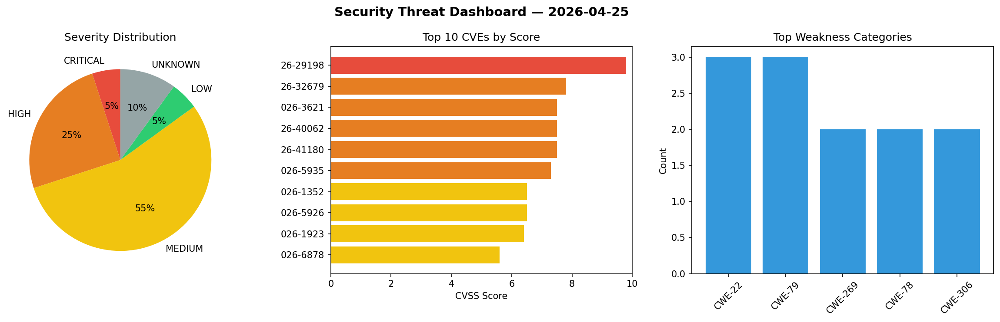
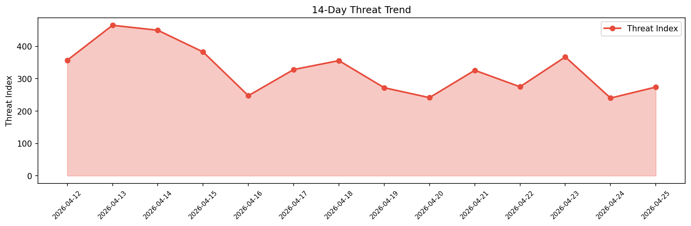

# Security Scan Report — 2026-04-25

**Scan ID:** `a80275aac7` | **CVEs:** 20 | **Threat Index:** 274.1

## Threat Overview

| Metric | Value |
|--------|-------|
| Threat Index | 274.1 |
| Critical CVEs | 1 |
| CRITICAL | 1 |
| HIGH | 5 |
| MEDIUM | 11 |
| LOW | 1 |
| UNKNOWN | 2 |

## Delta vs Yesterday

| Metric | Today | Yesterday | Change |
|--------|-------|-----------|--------|
| total_cves | 20 | 20 | ➡️ 0.0% |
| threat_index | 274.1 | 240.1 | 📈 14.2% |
| critical_count | 1 | 3 | 📉 -66.7% |

## Top Weakness Categories

| CWE | Count |
|-----|-------|
| CWE-22 | 3 |
| CWE-79 | 3 |
| CWE-269 | 2 |
| CWE-78 | 2 |
| CWE-306 | 2 |

## CVE Details

| CVE ID | Score | Severity | Description |
|--------|-------|----------|-------------|
| CVE-2026-29198 | 9.8 | CRITICAL | In Rocket.Chat <8.3.0, <8.2.1, <8.1.2, <8.0.3, <7.13.5, <7.12.6, <7.11.6, and <7... |
| CVE-2026-32679 | 7.8 | HIGH | The installers of LiveOn Meet Client for Windows (Downloader5Installer.exe and D... |
| CVE-2026-3621 | 7.5 | HIGH | IBM WebSphere Application Server - Liberty 17.0.0.3 through 26.0.0.4 IBM WebSphe... |
| CVE-2026-40062 | 7.5 | HIGH | A path Traversal vulnerability exists in Ziostation2 v2.9.8.7 and earlier. A rem... |
| CVE-2026-41180 | 7.5 | HIGH | PsiTransfer is an open source, self-hosted file sharing solution. Prior to versi... |
| CVE-2026-5935 | 7.3 | HIGH | IBM Total Storage Service Console (TSSC) / TS4500 IMC 9.2, 9.3, 9.4, 9.5, 9.6 TS... |
| CVE-2026-1352 | 6.5 | MEDIUM | IBM Db2 11.5.0 through 11.5.9, and 12.1.0 through 12.1.4 for Linux, UNIX and Win... |
| CVE-2026-5926 | 6.5 | MEDIUM | IBM Verify Identity Access Container 11.0 through 11.0.2 and IBM Security Verify... |
| CVE-2026-1923 | 6.4 | MEDIUM | The Social Rocket – Social Sharing Plugin plugin for WordPress is vulnerable to ... |
| CVE-2026-6878 | 5.6 | MEDIUM | A vulnerability was identified in ByteDance verl up to 0.7.0. Affected is the fu... |
| CVE-2025-36074 | 5.5 | MEDIUM | IBM Security Verify Directory (Container) 10.0.0 through 10.0.0.3 IBM Security V... |
| CVE-2026-4918 | 5.5 | MEDIUM | IBM Guardium Data Protection 12.1 is vulnerable to stored cross-site scripting. ... |
| CVE-2026-1274 | 4.9 | MEDIUM | IBM Guardium Data Protection 12.0, 12.1, and 12.2 is vulnerable to a Bypass Busi... |
| CVE-2026-4917 | 4.9 | MEDIUM | IBM Guardium Data Protection 12.1 could allow an administrative user to traverse... |
| CVE-2026-1726 | 4.8 | MEDIUM | IBM Guardium Key Lifecycle Manager 4.1, 4.1.1, 4.2, 4.2.1, 5.0, and 5.1... |