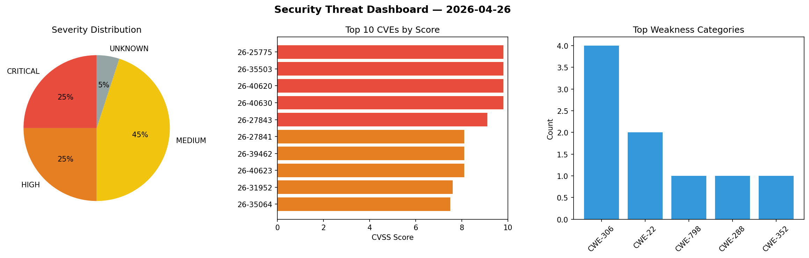
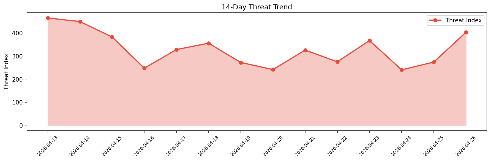

# Security Scan Report — 2026-04-26

**Scan ID:** `903b5fd3e8` | **CVEs:** 20 | **Threat Index:** 403.4

## Threat Overview

| Metric | Value |
|--------|-------|
| Threat Index | 403.4 |
| Critical CVEs | 5 |
| CRITICAL | 5 |
| HIGH | 5 |
| MEDIUM | 9 |
| UNKNOWN | 1 |

## Delta vs Yesterday

| Metric | Today | Yesterday | Change |
|--------|-------|-----------|--------|
| total_cves | 20 | 20 | ➡️ 0.0% |
| threat_index | 403.4 | 274.1 | 📈 47.2% |
| critical_count | 5 | 1 | 📈 400.0% |

## Top Weakness Categories

| CWE | Count |
|-----|-------|
| CWE-306 | 4 |
| CWE-22 | 2 |
| CWE-798 | 1 |
| CWE-288 | 1 |
| CWE-352 | 1 |

## CVE Details

| CVE ID | Score | Severity | Description |
|--------|-------|----------|-------------|
| CVE-2026-25775 | 9.8 | CRITICAL | A vulnerability in SenseLive X3050’s remote management service allows firmware r... |
| CVE-2026-35503 | 9.8 | CRITICAL | A vulnerability in SenseLive X3050’s web management interface allows authenticat... |
| CVE-2026-40620 | 9.8 | CRITICAL | A vulnerability in SenseLive X3050’s embedded management service allows full adm... |
| CVE-2026-40630 | 9.8 | CRITICAL | A vulnerability in 
SenseLive 

X3050’s web management interface allows unauthor... |
| CVE-2026-27843 | 9.1 | CRITICAL | A vulnerability exists in SenseLive X3050's web management interface that allows... |
| CVE-2026-27841 | 8.1 | HIGH | A vulnerability in SenseLive X3050's web management interface allows state-chang... |
| CVE-2026-39462 | 8.1 | HIGH | A vulnerability exists in SenseLive X3050’s web management interface in which pa... |
| CVE-2026-40623 | 8.1 | HIGH | A vulnerability in SenseLive X3050's web management interface allows critical sy... |
| CVE-2026-31952 | 7.6 | HIGH | Xibo is an open source digital signage platform with a web content management sy... |
| CVE-2026-35064 | 7.5 | HIGH | A vulnerability in SenseLive X3050’s management ecosystem allows unauthenticated... |
| CVE-2026-31953 | 6.4 | MEDIUM | Xibo is an open source digital signage platform with a web content management sy... |
| CVE-2026-29050 | 6.1 | MEDIUM | melange allows users to build apk packages using declarative pipelines. Starting... |
| CVE-2026-25720 | 5.4 | MEDIUM | A vulnerability exists in SenseLive

X3050’s web management interface due to imp... |
| CVE-2026-40431 | 5.3 | MEDIUM | A vulnerability exists in SenseLive X3050’s web management interface due to its ... |
| CVE-2026-1789 | 4.9 | MEDIUM | A vulnerability in the browser-based remote management interface may allow an ad... |