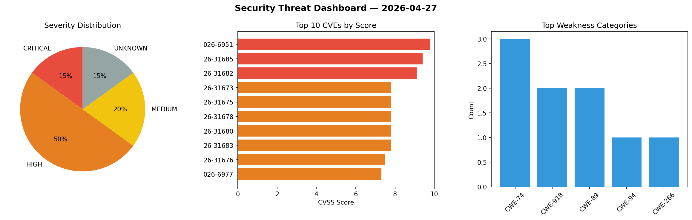
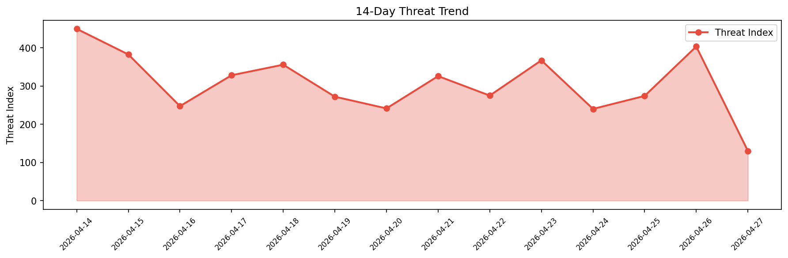

# Security Scan Report — 2026-04-27

**Scan ID:** `e4c37ae28b` | **CVEs:** 20 | **Threat Index:** 386.3

## Threat Overview

| Metric | Value |
|--------|-------|
| Threat Index | 386.3 |
| Critical CVEs | 3 |
| CRITICAL | 3 |
| HIGH | 10 |
| MEDIUM | 4 |
| UNKNOWN | 3 |

## Delta vs Yesterday

| Metric | Today | Yesterday | Change |
|--------|-------|-----------|--------|
| total_cves | 20 | 20 | ➡️ 0.0% |
| threat_index | 386.3 | 403.4 | 📉 -4.2% |
| critical_count | 3 | 5 | 📉 -40.0% |

## Top Weakness Categories

| CWE | Count |
|-----|-------|
| CWE-74 | 3 |
| CWE-918 | 2 |
| CWE-89 | 2 |
| CWE-94 | 1 |
| CWE-266 | 1 |

## CVE Details

| CVE ID | Score | Severity | Description |
|--------|-------|----------|-------------|
| CVE-2026-6951 | 9.8 | CRITICAL | Versions of the package simple-git before 3.36.0 are vulnerable to Remote Code E... |
| CVE-2026-31685 | 9.4 | CRITICAL | In the Linux kernel, the following vulnerability has been resolved:

netfilter: ... |
| CVE-2026-31682 | 9.1 | CRITICAL | In the Linux kernel, the following vulnerability has been resolved:

bridge: br_... |
| CVE-2026-31673 | 7.8 | HIGH | In the Linux kernel, the following vulnerability has been resolved:

af_unix: re... |
| CVE-2026-31675 | 7.8 | HIGH | In the Linux kernel, the following vulnerability has been resolved:

net/sched: ... |
| CVE-2026-31678 | 7.8 | HIGH | In the Linux kernel, the following vulnerability has been resolved:

openvswitch... |
| CVE-2026-31680 | 7.8 | HIGH | In the Linux kernel, the following vulnerability has been resolved:

net: ipv6: ... |
| CVE-2026-31683 | 7.8 | HIGH | In the Linux kernel, the following vulnerability has been resolved:

batman-adv:... |
| CVE-2026-31676 | 7.5 | HIGH | In the Linux kernel, the following vulnerability has been resolved:

rxrpc: only... |
| CVE-2026-6977 | 7.3 | HIGH | A security vulnerability has been detected in vanna-ai vanna up to 2.0.2. The af... |
| CVE-2026-6980 | 7.3 | HIGH | A vulnerability has been found in Divyanshu-hash GitPilot-MCP up to 9ed9f153ba41... |
| CVE-2026-31674 | 7.1 | HIGH | In the Linux kernel, the following vulnerability has been resolved:

netfilter: ... |
| CVE-2026-31679 | 7.1 | HIGH | In the Linux kernel, the following vulnerability has been resolved:

openvswitch... |
| CVE-2026-6979 | 6.3 | MEDIUM | A flaw has been found in devlikeapro WAHA up to 2026.3.4. This affects an unknow... |
| CVE-2026-6981 | 6.3 | MEDIUM | A vulnerability was found in IhateCreatingUserNames2 AiraHub2 up to 3e4b77fd7d48... |